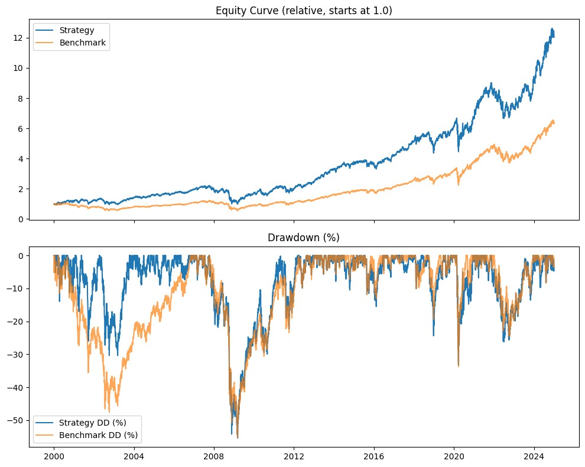
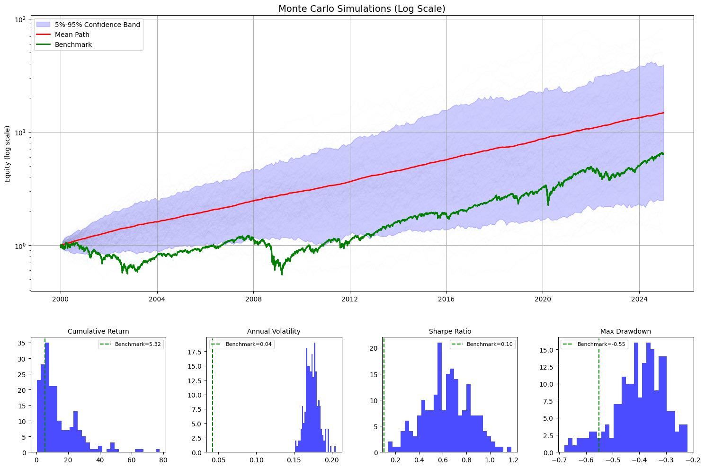
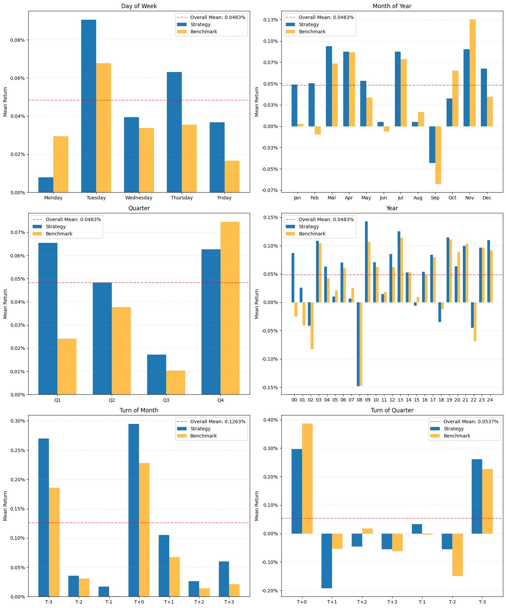

# .gitignore

```
# Byte-compiled / optimized / DLL files
__pycache__/
*.py[cod]
*$py.class

# C extensions
*.so

# IDEs and editors
.vscode/
.idea/

# macOS system files
.DS_Store

# virtual environments
.venv/
venv/
env/
ENV/

# Poetry
poetry.lock


# Coverage reports
htmlcov/
.coverage
.coverage.*

# Jupyter Notebook
.ipynb_checkpoints

# Logs
*.log

# Build artifacts
build/
dist/
*.egg-info/

```

# portwine/__init__.py

```py
from portwine.strategies.base import StrategyBase
from portwine.backtester import Backtester, BenchmarkTypes, benchmark_equal_weight, benchmark_markowitz

```

# portwine/analyzers/__init__.py

```py
# from portwine.analyzers.base import Analyzer
# from portwine.analyzers.equitydrawdown import EquityDrawdownAnalyzer
# from portwine.analyzers.gridequitydrawdown import GridEquityDrawdownAnalyzer
# from portwine.analyzers.montecarlo import MonteCarloAnalyzer
# from portwine.analyzers.seasonality import SeasonalityAnalyzer
# from portwine.analyzers.correlation import CorrelationAnalyzer
# from portwine.analyzers.traintest import TrainTestEquityDrawdownAnalyzer
# from portwine.analyzers.strategycomparison import StrategyComparisonAnalyzer
# from portwine.analyzers.studentttest import StudentsTTestAnalyzer
# from portwine.analyzers.downsidecorrelation import DownsideCorrelationAnalyzer

# portwine/analyzers/__init__.py
from __future__ import annotations

import importlib
import inspect
import pkgutil
from types import ModuleType
from typing import List, Dict, Type

from .base import Analyzer        # <-- the abstract base class for all analyzers


__all__: List[str] = []            # names we re‑export (populated below)
__modules_scanned__: Dict[str, ModuleType] = {}   # cache of imported modules


def _is_concrete_analyzer(obj: object) -> bool:
    """
    True if *obj* is a non‑abstract subclass of ``Analyzer``.
    """
    return (
        inspect.isclass(obj)
        and issubclass(obj, Analyzer)
        and obj is not Analyzer
        and not getattr(obj, "__abstractmethods__", False)
    )


def _eager_scan() -> None:
    """
    Import every sibling module once and hoist its concrete ``Analyzer``
    subclasses into this package’s namespace.
    """
    pkg_prefix = __name__ + "."
    for modinfo in pkgutil.walk_packages(__path__, pkg_prefix):
        if modinfo.ispkg:
            continue                                   # skip nested packages
        module = importlib.import_module(modinfo.name)
        __modules_scanned__[modinfo.name] = module

        for name, obj in inspect.getmembers(module, _is_concrete_analyzer):
            globals()[name] = obj                      # re‑export the class
            __all__.append(name)


_eager_scan()

```

# portwine/analyzers/base.py

```py
class Analyzer:
    def analyze(self, results, *args, **kwargs):
        # Analyze method. Should return some sort of dataframe, etc
        raise NotImplementedError

    def plot(self, results, *args, **kwargs):
        # Optional visualization method
        raise NotImplementedError

```

# portwine/analyzers/bootstrap.py

```py
import numpy as np
import pandas as pd
import matplotlib.pyplot as plt
from portwine.analyzers.base import Analyzer

class BootstrapAnalyzer(Analyzer):
    """
    1) Expects strategy_returns & benchmark_returns of the SAME length.
    2) For each of n_sims, we build a single random list of overlapping-block starts for both
       strategy & benchmark, ensuring eqs_strat[i], eqs_bench[i] reflect the same block indices.
    3) final_returns_strat[i] and final_returns_bench[i] are thus aligned, letting us do a direct
       distribution-of-differences (strat - bench).
    4) The .plot(...) method shows:
       - Top-left: eq paths & mean lines
       - Top-right: horizontally oriented side-by-side histogram of final returns
       - Bottom (spanning 2 columns): CDF of (strategy - benchmark) final returns
    """

    def analyze(self, results, n_sims=1000, n_days=252, block_size=5, seed=42):
        """
        Overlapping block bootstrap with alignment:
          - 'strategy_returns' & 'benchmark_returns' must be same length.
          - For each path, we pick blocks from the same indices for strategy & bench.
        Returns:
          {
            'eqs_strat': (n_sims,n_days),
            'eqs_bench': (n_sims,n_days),
            'final_returns_strat': (n_sims,),
            'final_returns_bench': (n_sims,)
          }
        """
        strat_full = results.get('strategy_returns', pd.Series(dtype=float)).dropna()
        bench_full = results.get('benchmark_returns', pd.Series(dtype=float)).dropna()

        if strat_full.empty or bench_full.empty:
            print("Strategy or benchmark daily returns empty. Aborting.")
            return {}

        if len(strat_full) != len(bench_full):
            print(f"Lengths differ: strategy={len(strat_full)}, bench={len(bench_full)}. Must match.")
            return {}

        L = len(strat_full)
        if L < block_size:
            print(f"Not enough data (L={L}) for block_size={block_size}.")
            return {}

        rng = np.random.default_rng(seed)
        arr_strat = strat_full.values
        arr_bench = bench_full.values
        possible_starts = np.arange(L - block_size + 1)

        eqs_strat = []
        eqs_bench = []

        for _ in range(n_sims):
            path_s = []
            path_b = []
            while len(path_s) < n_days:
                start_i = rng.choice(possible_starts)
                block_s = arr_strat[start_i : start_i + block_size]
                block_b = arr_bench[start_i : start_i + block_size]
                path_s.extend(block_s)
                path_b.extend(block_b)

            path_s = path_s[:n_days]
            path_b = path_b[:n_days]

            eq_s = np.cumprod(1.0 + np.array(path_s))
            eq_b = np.cumprod(1.0 + np.array(path_b))
            eqs_strat.append(eq_s)
            eqs_bench.append(eq_b)

        eqs_strat = np.array(eqs_strat)  # (n_sims, n_days)
        eqs_bench = np.array(eqs_bench)

        final_s = eqs_strat[:, -1] - 1.0
        final_b = eqs_bench[:, -1] - 1.0

        return {
            'eqs_strat': eqs_strat,
            'eqs_bench': eqs_bench,
            'final_returns_strat': final_s,
            'final_returns_bench': final_b
        }

    def plot(self, results, n_sims=1000, n_days=252, block_size=5,
             seed=42, bins=30, alpha_paths=0.08, figsize=(12,10)):
        """
        Creates a 2-row figure:
          Row 0 => 2 columns
             (0,0): eq paths & mean lines (strategy=blue, bench=orange)
             (0,1): horizontally oriented side-by-side histogram of final returns
          Row 1 => single subplot spanning both columns => CDF of (strategy - benchmark)
        """
        data = self.analyze(results, n_sims=n_sims, n_days=n_days,
                            block_size=block_size, seed=seed)
        if not data:
            return

        eqs_s = data['eqs_strat']
        eqs_b = data['eqs_bench']
        final_s = data['final_returns_strat']
        final_b = data['final_returns_bench']

        # Create a figure with a 2x2 grid, but bottom row merges columns
        fig = plt.figure(figsize=figsize)
        gs = fig.add_gridspec(2, 2, height_ratios=[1.0, 0.7])

        ax_eq = fig.add_subplot(gs[0,0])
        ax_hist = fig.add_subplot(gs[0,1])
        ax_cdf = fig.add_subplot(gs[1,:])

        fig.suptitle(
            f"Aligned Overlapping Block Bootstrap\n"
            f"(n_days={n_days}, block_size={block_size}, n_sims={n_sims})",
            fontsize=13
        )

        x_axis = np.arange(n_days)
        # Mean lines
        mean_bench = eqs_b.mean(axis=0)
        mean_strat = eqs_s.mean(axis=0)
        ax_eq.plot(x_axis, mean_bench, color='orange', linewidth=1, label="Benchmark")
        ax_eq.plot(x_axis, mean_strat, color='blue', linewidth=1, label="Strategy")

        ########################################
        # TOP-LEFT => eq paths
        ########################################

        # Plot each path in low alpha
        for i in range(eqs_s.shape[0]):
            ax_eq.plot(x_axis, eqs_b[i], color='orange', alpha=alpha_paths, linewidth=0.5)

        for i in range(eqs_s.shape[0]):
            ax_eq.plot(x_axis, eqs_s[i], color='blue', alpha=alpha_paths, linewidth=0.5)


        ax_eq.set_title("Bootstrap eq Paths + Means (Aligned)")
        ax_eq.set_xlabel("Day index (0..n_days-1)")
        ax_eq.set_ylabel("Equity (start=1)")
        ax_eq.legend(loc='best')
        ax_eq.grid(True)

        ########################################
        # TOP-RIGHT => horizontally oriented histogram
        ########################################
        min_val = min(final_s.min(), final_b.min())
        max_val = max(final_s.max(), final_b.max())
        bin_edges = np.linspace(min_val, max_val, bins+1)

        counts_s, _ = np.histogram(final_s, bins=bin_edges)
        counts_b, _ = np.histogram(final_b, bins=bin_edges)

        # For a horizontal bar chart: x=counts, y=bin center
        bin_centers = 0.5*(bin_edges[:-1] + bin_edges[1:])
        bar_height = bin_edges[1:] - bin_edges[:-1]  # each bin's "height" along the y-axis
        offset = 0.4 * bar_height
        y_strat = bin_centers - offset/2
        y_bench = bin_centers + offset/2

        # Strategy bars
        ax_hist.barh(
            y_strat, counts_s, height=offset,
            color='blue', alpha=1, edgecolor='black',
            label='Strategy'
        )
        # Benchmark bars
        ax_hist.barh(
            y_bench, counts_b, height=offset,
            color='orange', alpha=1, edgecolor='black',
            label='Benchmark'
        )

        ax_hist.set_title("Side-by-Side Final Returns (Horizontal)")
        ax_hist.set_xlabel("Count (#Paths)")
        ax_hist.set_ylabel("Final Return")
        ax_hist.grid(True)
        ax_hist.legend(loc='best')

        ########################################
        # BOTTOM => single subplot for CDF of (final_s - final_b)
        ########################################
        final_diff = final_s - final_b
        sorted_diff = np.sort(final_diff)
        cdf_vals = np.linspace(0, 1, len(sorted_diff))

        frac_above_zero = 100.0 * np.mean(final_diff > 0)

        ax_cdf.plot(sorted_diff, cdf_vals, color='purple', linewidth=2,
                    label="CDF: (Strat - Bench)")
        ax_cdf.axvline(0.0, color='red', linestyle='--',
                       label=f"0 difference\n(Strategy outperforms ~{frac_above_zero:.1f}%)")
        ax_cdf.set_title("Distribution of Differences (CDF)")
        ax_cdf.set_xlabel("(Strategy - Benchmark) Final Return")
        ax_cdf.set_ylabel("Cumulative Probability")
        ax_cdf.legend(loc='best')
        ax_cdf.grid(True)

        plt.tight_layout()
        plt.show()

```

# portwine/analyzers/correlation.py

```py
from portwine.analyzers import Analyzer
import matplotlib.pyplot as plt

class CorrelationAnalyzer(Analyzer):
    """
    Computes and plots correlation among the tickers' daily returns.

    Usage:
      1) correlation_dict = analyzer.analyze(results)
      2) analyzer.plot(results)

    'results' should be the dictionary from the backtester, containing:
        'tickers_returns': DataFrame of daily returns for each ticker
                           (columns = ticker symbols, index = dates)
    """

    def __init__(self, method='pearson'):
        """
        Parameters
        ----------
        method : str
            Correlation method (e.g. 'pearson', 'spearman', 'kendall').
        """
        self.method = method

    def analyze(self, results):
        """
        Generates a correlation matrix of the daily returns among all tickers.

        Parameters
        ----------
        results : dict
            {
              'tickers_returns': DataFrame of daily returns per ticker
              ...
            }

        Returns
        -------
        analysis_dict : dict
            {
              'correlation_matrix': DataFrame (square) of correlations
            }
        """
        tickers_returns = results.get('tickers_returns')
        if tickers_returns is None or tickers_returns.empty:
            print("Error: 'tickers_returns' missing or empty in results.")
            return None

        # Compute correlation
        corr_matrix = tickers_returns.corr(method=self.method)

        return {
            'correlation_matrix': corr_matrix
        }

    def plot(self, results):
        """
        Plots a heatmap of the correlation matrix.

        Parameters
        ----------
        results : dict
            The same dictionary used in 'analyze', containing 'tickers_returns'.
        """
        analysis_dict = self.analyze(results)
        if analysis_dict is None:
            print("No correlation data to plot.")
            return

        corr_matrix = analysis_dict['correlation_matrix']
        if corr_matrix.empty:
            print("Correlation matrix is empty. Nothing to plot.")
            return

        # Plot the correlation matrix as a heatmap
        fig, ax = plt.subplots(figsize=(8, 6))
        cax = ax.matshow(corr_matrix, aspect='auto')
        fig.colorbar(cax)

        # Set tick marks for each ticker
        tickers = corr_matrix.columns
        ax.set_xticks(range(len(tickers)))
        ax.set_yticks(range(len(tickers)))
        ax.set_xticklabels(tickers, rotation=45, ha='left')
        ax.set_yticklabels(tickers)

        ax.set_title("Correlation Matrix", pad=20)
        plt.tight_layout()
        plt.show()

```

# portwine/analyzers/downsidecorrelation.py

```py
import numpy as np
import pandas as pd
import matplotlib.pyplot as plt
from portwine.analyzers import Analyzer

"""
    Gives a clearer picture if tickers are offsetting downside and 'helpfully' uncorrelated.
"""

class DownsideCorrelationAnalyzer(Analyzer):
    """
    For each ticker T in 'tickers_returns':
      1) Identify T < 0 days.
      2) Restrict the DataFrame to just those days.
      3) For each asset (including T):
         - MeanWhenTneg => average return on T<0 days
         - CorrWithTneg => correlation with T's returns on T<0 days
      4) In the plot, each row is a different focal ticker, with 2 subplots:
         - Left: bar chart of MeanWhenTneg (T is one pastel color, others are a different pastel color)
         - Right: bar chart of CorrWithTneg (same palette usage)
      This yields a more visually appealing, non-jarring color scheme.
    """

    def __init__(self):
        pass

    def analyze(self, results):
        """
        1) Retrieve 'tickers_returns' from results.
        2) For each ticker T:
           - filter T < 0 days
           - compute the average return (MeanWhenTneg) and correlation (CorrWithTneg)
             for each asset on those T < 0 days
        3) stats_all: dict { T => DataFrame [nAssets x 2], index=assets,
                             columns=['MeanWhenTneg','CorrWithTneg'] }
        """
        tickers_df = results.get('tickers_returns')
        if tickers_df is None or tickers_df.empty:
            print("Error: 'tickers_returns' missing or empty in results.")
            return None

        if not isinstance(tickers_df.index, pd.DatetimeIndex):
            tickers_df.index = pd.to_datetime(tickers_df.index)

        all_tickers = tickers_df.columns.tolist()
        stats_all = {}

        for focal_ticker in all_tickers:
            focal_series = tickers_df[focal_ticker].dropna()
            if focal_series.empty:
                continue

            # Filter T < 0 days
            negative_mask = (focal_series < 0)
            if not negative_mask.any():
                # No negative days => store empty
                stats_all[focal_ticker] = pd.DataFrame()
                continue

            downside_df = tickers_df.loc[negative_mask]

            # For each asset, compute mean & correlation
            stats_list = []
            for asset in all_tickers:
                sub = downside_df[asset].dropna()
                mean_ret = sub.mean() if len(sub) > 0 else np.nan

                if asset == focal_ticker:
                    corr_val = 1.0  # with itself
                else:
                    corr_val = downside_df[asset].corr(downside_df[focal_ticker])

                stats_list.append({
                    'Asset': asset,
                    'MeanWhenTneg': mean_ret,
                    'CorrWithTneg': corr_val
                })

            focal_stats_df = pd.DataFrame(stats_list).set_index('Asset')
            stats_all[focal_ticker] = focal_stats_df

        return {
            'stats_all': stats_all,
            'tickers_df': tickers_df
        }

    def plot(self, results):
        """
        Produces a figure with:
          - One row per ticker T that had negative days
          - 2 columns =>
             left subplot: bar chart of MeanWhenTneg (focal T is one pastel color, others another)
             right subplot: bar chart of CorrWithTneg
        Includes a figure-level title, with a more visually appealing color palette (Set2).
        """
        analysis_dict = self.analyze(results)
        if not analysis_dict:
            print("No analysis data. Cannot plot.")
            return

        stats_all = analysis_dict['stats_all']
        if not stats_all:
            print("No stats to plot.")
            return

        # Filter out empty data
        real_tickers = [t for t, df in stats_all.items() if not df.empty]
        n_tickers = len(real_tickers)
        if n_tickers == 0:
            print("No tickers had negative days or no data. Nothing to plot.")
            return

        fig_height = 3.0 * n_tickers
        fig, axes = plt.subplots(nrows=n_tickers, ncols=2, figsize=(10, fig_height))

        # Add figure-level title
        fig.suptitle("Downside Correlation Analysis (All Tickers)", fontsize=14)

        # Prepare a pastel palette from "Set2"
        # We'll pick two distinct pastel colors from the colormap:
        palette = plt.colormaps.get_cmap("Set2")
        focal_color = palette(2)   # e.g. pastel green
        other_color = palette(0)   # e.g. pastel orange

        # If only one ticker => shape(2,) => reshape to shape(1,2)
        if n_tickers == 1:
            axes = [axes]

        for row_idx, focal_ticker in enumerate(real_tickers):
            focal_df = stats_all[focal_ticker]
            if focal_df.empty:
                continue

            ax_left = axes[row_idx][0] if n_tickers>1 else axes[0]
            ax_right = axes[row_idx][1] if n_tickers>1 else axes[1]

            # ============ MeanWhenTneg Subplot ============
            df_mean = focal_df.sort_values('MeanWhenTneg', ascending=False)
            x_vals1 = df_mean.index
            y_vals1 = df_mean['MeanWhenTneg'].values

            # We'll color the focal ticker bar in 'focal_color', others in 'other_color'.
            bar_colors_mean = []
            for asset in x_vals1:
                if asset == focal_ticker:
                    bar_colors_mean.append(focal_color)
                else:
                    bar_colors_mean.append(other_color)

            ax_left.bar(x_vals1, y_vals1, color=bar_colors_mean)
            ax_left.axhline(y=0, color='k', linewidth=1)
            ax_left.set_title(f"{focal_ticker} < 0: Mean Return by Asset")
            ax_left.tick_params(axis='x', rotation=45)
            ax_left.grid(True, alpha=0.3)

            # ============ CorrWithTneg Subplot ============
            df_corr = focal_df.sort_values('CorrWithTneg', ascending=False)
            x_vals2 = df_corr.index
            y_vals2 = df_corr['CorrWithTneg'].values

            bar_colors_corr = []
            for asset in x_vals2:
                if asset == focal_ticker:
                    bar_colors_corr.append(focal_color)
                else:
                    bar_colors_corr.append(other_color)

            ax_right.bar(x_vals2, y_vals2, color=bar_colors_corr)
            ax_right.axhline(y=0, color='k', linewidth=1)
            ax_right.set_title(f"{focal_ticker} < 0: Corr by Asset")
            ax_right.tick_params(axis='x', rotation=45)
            ax_right.grid(True, alpha=0.3)

        plt.tight_layout(rect=[0, 0, 1, 0.95])
        plt.show()

```

# portwine/analyzers/drawdownflattener.py

```py
import numpy as np
import pandas as pd
import matplotlib.pyplot as plt
from portwine.analyzers import Analyzer

class DrawdownFlattenAnalyzer(Analyzer):
    """
    An analyzer that post-processes a strategy's daily returns with a one-day shift
    drawdown check. If the prior day's (yesterday's) drawdown is worse than 'max_dd',
    we flatten (scale to zero) today's returns (or partial flatten, if scale_factor>0).

    When you call 'plot(results)', it:
      1) Runs 'analyze(results)' internally to get the protected returns.
      2) Creates a single figure with three rows:
         - (Row 0) Original vs. Flattened equity curves,
         - (Row 1) The original daily drawdown curve (threshold & breach lines),
         - (Row 2) A matplotlib table comparing summary stats for Original vs. Flattened,
                   plus a “Change” column that shows the *percentage difference* for most metrics,
                   but for MaxDrawdown specifically we invert the logic so that “lower is better.”
                   We color the "Change" cell light green if it is "good" or red if it is "bad."
                   We also bold the header row and the first column.
      3) Displays the figure (no console prints).
    """

    def __init__(self, max_dd=0.2, scale_factor=0.0):
        """
        Parameters
        ----------
        max_dd : float
            Fraction of drawdown that triggers flattening (e.g. 0.2 => 20%).
        scale_factor : float
            Fraction of daily returns to keep once threshold is triggered
            (commonly 0.0 => fully flatten, or 0.5 => half exposure, etc.).
        """
        self.max_dd = max_dd
        self.scale_factor = scale_factor

    def analyze(self, results):
        """
        Applies the day-lag drawdown check to daily returns:
          - We look at yesterday's drawdown in the original equity. If it's <= -max_dd,
            we flatten (or scale) today's returns by 'scale_factor'.
          - Once the drawdown recovers above -max_dd, we revert to full exposure the next day.

        Returns a dict or None:
          {
            'original_returns' : pd.Series,
            'flattened_returns': pd.Series,
            'original_equity'  : pd.Series,
            'flattened_equity' : pd.Series,
            'drawdown_series'  : pd.Series (original daily drawdown),
            'breached_dates'   : list of Timestamps
          }
        """
        if 'strategy_returns' not in results:
            return None

        original_returns = results['strategy_returns'].copy().dropna()
        if len(original_returns) < 2:
            return None

        # 1) Original equity & daily drawdown
        original_equity = (1.0 + original_returns).cumprod()
        rolling_peak = original_equity.cummax()
        drawdown_series = (original_equity - rolling_peak) / rolling_peak  # negative or zero

        # 2) Build flattened returns (one-day shift)
        dates = original_returns.index
        flattened_returns = []
        in_drawdown_mode_yesterday = False
        dd_breach_dates = []

        # Day 0 => no prior day => normal
        flattened_returns.append(original_returns.iloc[0])

        # For day i=1..N-1 => check day i-1's drawdown
        for i in range(1, len(dates)):
            today_date = dates[i]
            today_ret = original_returns.iloc[i]
            y_dd = drawdown_series.iloc[i - 1]

            if in_drawdown_mode_yesterday:
                flattened_returns.append(self.scale_factor * today_ret)
            else:
                flattened_returns.append(today_ret)

            # Now decide if we'll be in dd_mode tomorrow
            t_dd = drawdown_series.iloc[i]
            if in_drawdown_mode_yesterday:
                # if recovered above threshold, normal tomorrow
                if t_dd > -self.max_dd:
                    in_drawdown_mode_yesterday = False
            else:
                # was not in dd_mode, check if we trigger threshold now
                if t_dd <= -self.max_dd:
                    in_drawdown_mode_yesterday = True
                    dd_breach_dates.append(today_date)

        flattened_returns = pd.Series(flattened_returns, index=dates)
        flattened_equity = (1.0 + flattened_returns).cumprod()

        return {
            'original_returns':  original_returns,
            'flattened_returns': flattened_returns,
            'original_equity':   original_equity,
            'flattened_equity':  flattened_equity,
            'drawdown_series':   drawdown_series,
            'breached_dates':    dd_breach_dates
        }

    def _compute_stats(self, daily_returns, ann_factor=252):
        """
        Compute summary statistics for a daily returns series:
          - TotalReturn
          - CAGR
          - AnnualVol
          - Sharpe (CAGR-based)
          - MaxDrawdown
        Returns a dict with these keys. If insufficient data, returns NaNs.
        """
        dr = daily_returns.dropna()
        if len(dr) < 2:
            return dict.fromkeys(["TotalReturn","CAGR","AnnualVol","Sharpe","MaxDrawdown"], np.nan)

        # 1) TotalReturn
        total_ret = (1.0 + dr).prod() - 1.0

        # 2) MaxDrawdown
        eq_curve = (1.0 + dr).cumprod()
        roll_max = eq_curve.cummax()
        dd_series = (eq_curve - roll_max) / roll_max
        max_dd = dd_series.min()  # negative or zero

        # 3) CAGR
        n_days = len(dr)
        years = n_days / ann_factor if ann_factor else np.nan
        if years > 0:
            cagr = (1.0 + total_ret)**(1.0 / years) - 1.0
        else:
            cagr = np.nan

        # 4) AnnualVol
        ann_vol = dr.std() * np.sqrt(ann_factor)

        # 5) Sharpe (CAGR-based)
        if ann_vol > 1e-9 and not np.isnan(cagr):
            sharpe = cagr / ann_vol
        else:
            sharpe = np.nan

        return {
            'TotalReturn':  total_ret,
            'CAGR':         cagr,
            'AnnualVol':    ann_vol,
            'Sharpe':       sharpe,
            'MaxDrawdown':  max_dd
        }

    def plot(self, results, ann_factor=252):
        """
        Builds a figure with 3 rows:
          Row 0 => Original vs. Flattened equity,
          Row 1 => Original daily drawdown + threshold & breach lines,
          Row 2 => Table comparing stats for Original vs. Flattened,
                   plus a 'Change' column showing percentage difference for most metrics:
                     diff = (flattened / original -1)*100
                   BUT for MaxDrawdown, we invert logic because "lower is better," so:
                     diff = (orig / flattened -1)*100
                   Then color the cell green if the 'Change' is >0 (improvement), red if <0 (worse).
        """
        ddp_results = self.analyze(results)
        if not ddp_results:
            return  # nothing to plot

        # (A) Unpack data
        orig_eq = ddp_results['original_equity']
        flat_eq = ddp_results['flattened_equity']
        dd_ser  = ddp_results['drawdown_series']
        breach_dates = ddp_results['breached_dates']

        # (B) Create figure with 3 rows
        fig = plt.figure(figsize=(10, 10))
        gs = fig.add_gridspec(3, 1, height_ratios=[2, 1.5, 1])

        # Row 0 => Original vs. Flattened equity
        ax_equity = fig.add_subplot(gs[0, 0])
        ax_equity.plot(orig_eq.index, orig_eq.values, label="Original Equity")
        ax_equity.plot(flat_eq.index, flat_eq.values, label="Flattened Equity", alpha=0.8)
        ax_equity.set_title(
            f"Drawdown Flatten (One-Day Lag)\nmax_dd={self.max_dd:.0%}, scale_factor={self.scale_factor}"
        )
        ax_equity.set_xlabel("Date")
        ax_equity.set_ylabel("Cumulative Return")
        ax_equity.legend(loc="best")
        ax_equity.grid(True)

        # Row 1 => daily drawdown
        ax_dd = fig.add_subplot(gs[1, 0])
        ax_dd.plot(dd_ser.index, dd_ser.values, label="Original Drawdown", color='blue')
        ax_dd.axhline(-self.max_dd, color='red', linestyle='--', alpha=0.7,
                      label=f"Threshold {self.max_dd:.0%}")
        for d in breach_dates:
            ax_dd.axvline(d, color='orange', linestyle='--', alpha=0.5)
        ax_dd.set_title("Daily Drawdown (Original) & Breach Points")
        ax_dd.set_xlabel("Date")
        ax_dd.set_ylabel("Drawdown (fraction)")
        ax_dd.legend(loc="best")
        ax_dd.grid(True)

        # Row 2 => Stats table
        ax_table = fig.add_subplot(gs[2, 0])
        ax_table.axis('off')

        # (C) Compute stats for Original vs. Flattened
        stats_orig = self._compute_stats(ddp_results['original_returns'], ann_factor=ann_factor)
        stats_flat = self._compute_stats(ddp_results['flattened_returns'], ann_factor=ann_factor)

        metrics = ["TotalReturn", "CAGR", "AnnualVol", "Sharpe", "MaxDrawdown"]
        table_header = ["Metric", "Original", "Flattened", "Change"]
        table_data = [table_header]

        # We'll store numeric differences in a dict so we can color the cells
        differences = {}

        def pct_fmt(x):
            return f"{x*100:.2f}%" if pd.notnull(x) else "NaN"

        def ratio_fmt(x):
            return f"{x:.2f}" if pd.notnull(x) else "NaN"

        def pct_diff_for_metric(m, val_orig, val_flat):
            """
            For most metrics, we want: diff = (val_flat / val_orig -1)*100
            But for MaxDrawdown, we invert logic: diff = (val_orig / val_flat -1)*100
            because a lower (more negative) drawdown is actually worse.
            (We interpret negative as less negative => improvement.)
            If either val_orig or val_flat is near zero, or NaN, we return NaN.
            """
            if pd.isnull(val_orig) or pd.isnull(val_flat):
                return np.nan

            # If either original or flattened is extremely small in absolute value,
            # we can't do a safe ratio => NaN
            if abs(val_orig) < 1e-12 or abs(val_flat) < 1e-12:
                return np.nan

            if m == "MaxDrawdown":
                # ratio = (orig / flat -1)*100
                # because "lower absolute drawdown" => improvement
                # note: both are negative or zero, so we must handle that carefully
                # e.g. orig = -0.05, flat=-0.06 => ratio = (-0.05 / -0.06 -1)*100 => +16.7 => red
                # Actually "improvement" means we want the flattened to be less negative, i.e. -0.04 is better than -0.05
                # We define "improvement" as having a more negative number is actually worse, so if flattened is -0.04 vs orig -0.05 => flatten is better => ratio>0 => green
                # => ratio = (orig / flat -1)*100
                return ((val_orig / val_flat) - 1.0)*100.0
            else:
                # ratio = (val_flat / val_orig -1)*100
                return ((val_flat / val_orig) -1.0)*100.0

        # Now build the rows
        row_index = 1  # b/c row 0 is the header
        for m in metrics:
            val_o = stats_orig[m]
            val_f = stats_flat[m]

            # Format Original & Flattened
            if m in ["TotalReturn","CAGR","AnnualVol","MaxDrawdown"]:
                s_orig = pct_fmt(val_o)
                s_flat = pct_fmt(val_f)
            else:  # Sharpe
                s_orig = ratio_fmt(val_o)
                s_flat = ratio_fmt(val_f)

            # Compute difference ratio
            diff_val = pct_diff_for_metric(m, val_o, val_f)
            if pd.notnull(diff_val):
                diff_str = f"{diff_val:.2f}%"
            else:
                diff_str = "NaN"

            table_data.append([m, s_orig, s_flat, diff_str])
            differences[row_index] = (m, diff_val)
            row_index += 1

        # (D) Create the table
        the_table = ax_table.table(
            cellText=table_data,
            loc='center',
            cellLoc='center'
        )
        the_table.set_fontsize(10)
        the_table.scale(1.2, 1.2)

        # (E) Bold the header row (row=0) & the first column (col=0)
        n_rows = len(table_data)
        n_cols = len(table_data[0])

        # Bold the header row
        for col in range(n_cols):
            the_table[(0, col)].set_text_props(weight='bold')

        # Bold the first column
        for row in range(n_rows):
            the_table[(row, 0)].set_text_props(weight='bold')

        # (F) Color the "Change" column (col=3) based on 'differences'
        for row_idx in range(1, n_rows):  # data rows
            metric_name, diff_val = differences.get(row_idx, ("", np.nan))
            cell = the_table[(row_idx, 3)]
            if pd.isnull(diff_val):
                continue

            # If diff_val>0 => improvement => green, else red
            # For MaxDrawdown, we inverted logic above, so a "positive" ratio => means better
            if diff_val > 0:
                cell.set_facecolor("#d6f5d6")  # light green
            elif diff_val < 0:
                cell.set_facecolor("#f7d6d6")  # light red
            # if exactly 0 => no color

        fig.tight_layout()
        plt.show()

```

# portwine/analyzers/edgedecay.py

```py
import numpy as np
import pandas as pd
import matplotlib.pyplot as plt
import statsmodels.api as sm
from portwine.analyzers.base import Analyzer


class EdgeDecayAnalyzer(Analyzer):
    """
    Determines whether a trading strategy's outperformance factor
    (strategy_equity / benchmark_equity) is decaying over time.

    Rolling slope is computed by OLS of ln(outperf)[t0..tN] ~ a + b*x,
    now capturing b (the slope) + p-value. 
    If slope < 0 and p < 0.05 => significant negative slope => edge decay.
    """

    def analyze(self, results, rolling_window=60, alpha=0.05):
        """
        1) Build strategy & benchmark equity curves from daily returns
        2) outperformance(t) = strategy_eq(t) / bench_eq(t)
        3) rolling_slope: slope, p_value, etc. from OLS regression of ln(outperformance)
           on x=[0..window-1], in each rolling window.

        Returns
        -------
        dict:
          {
            'strategy_equity': pd.Series,
            'benchmark_equity': pd.Series,
            'outperformance': pd.Series,
            'rolling_stats': pd.DataFrame with columns=[slope, p_value, significance],
          }
        """
        strat_ret = results.get('strategy_returns', pd.Series(dtype=float)).dropna()
        bench_ret = results.get('benchmark_returns', pd.Series(dtype=float)).dropna()
        if strat_ret.empty or bench_ret.empty:
            print("EdgeDecayAnalyzer: Strategy or benchmark daily returns are empty!")
            return {}

        # Align on common dates
        common_idx = strat_ret.index.intersection(bench_ret.index)
        strat_ret = strat_ret.loc[common_idx].sort_index()
        bench_ret = bench_ret.loc[common_idx].sort_index()
        if len(strat_ret) < rolling_window:
            print(f"Not enough data for rolling_window={rolling_window}.")
            return {}

        # Build equity curves
        strategy_eq = (1.0 + strat_ret).cumprod()
        bench_eq = (1.0 + bench_ret).cumprod()

        # Outperformance = strategy_eq / bench_eq
        bench_eq_clipped = bench_eq.replace(0.0, np.nan).ffill().dropna()
        bench_eq_aligned = bench_eq_clipped.reindex(strategy_eq.index).ffill().fillna(0)
        outperf = strategy_eq / bench_eq_aligned
        outperf = outperf.dropna()
        if len(outperf) < rolling_window:
            print(f"Not enough overlapping equity data for rolling_window={rolling_window}.")
            return {}

        # Compute rolling slope via OLS
        rolling_stats_df = self._rolling_outperf_slope_ols(outperf, rolling_window)

        return {
            'strategy_equity': strategy_eq,
            'benchmark_equity': bench_eq_aligned,
            'outperformance': outperf,
            'rolling_stats': rolling_stats_df
        }

    def plot(self, results, rolling_window=60, alpha=0.05, figsize=(12, 8)):
        """
        Plots:
          1) Outperformance factor (top subplot)
          2) Rolling slope of ln(outperf) (bottom subplot), colored by significance if p< alpha.
          3) Adds a trend line to the rolling slope chart to show overall decay trend.
        """
        data = self.analyze(results, rolling_window=rolling_window, alpha=alpha)
        if not data:
            return

        strat_eq = data['strategy_equity']
        bench_eq = data['benchmark_equity']
        outperf = data['outperformance']
        rolling_stats_df = data['rolling_stats']

        fig, (ax_top, ax_bot) = plt.subplots(nrows=2, ncols=1, figsize=figsize, sharex=True)
        fig.suptitle(
            f"Edge Decay Analysis (rolling_window={rolling_window}, alpha={alpha:.2f})",
            fontsize=13
        )

        # Top subplot: outperformance factor
        ax_top.plot(outperf.index, outperf.values,
                    label="Outperformance = Strategy / Benchmark",
                    color='blue')
        ax_top.axhline(1.0, color='gray', linestyle='--', alpha=0.5)
        ax_top.set_title("Strategy Outperformance Factor")
        ax_top.set_ylabel("Strat / Bench")
        ax_top.grid(True)
        ax_top.legend(loc='best')

        # Fill red/green vs 1.0
        ax_top.fill_between(
            outperf.index, outperf.values, 1.0,
            where=(outperf.values >= 1.0),
            color='green', alpha=0.1
        )
        ax_top.fill_between(
            outperf.index, outperf.values, 1.0,
            where=(outperf.values < 1.0),
            color='red', alpha=0.1
        )

        # Bottom subplot: slope of ln(outperf)
        # We'll color by significance
        slope = rolling_stats_df['slope']
        pval = rolling_stats_df['p_value']
        # We'll treat negative slope as potentially decaying
        # We'll make a line from each point to the next, but change color if p< alpha
        x_vals = slope.index
        slopes_np = slope.values
        pvals_np = pval.values

        # Plot each segment with appropriate coloring
        for i in range(len(x_vals) - 1):
            x_seg = x_vals[i:i + 2]
            y_seg = slopes_np[i:i + 2]
            p_seg = max(pvals_np[i], pvals_np[i + 1])  # if either is < alpha => we'll color it
            if p_seg < alpha:
                color_ = 'red' if y_seg.mean() < 0 else 'green'
            else:
                color_ = 'black'
            ax_bot.plot(x_seg, y_seg, color=color_, linewidth=2)

        # Add trend line through all the rolling slope data points
        if len(x_vals) > 1:
            # Convert dates to numerical format for regression
            x_numeric = np.array([(d - x_vals[0]).total_seconds() for d in x_vals])

            # Fit linear regression on all slope data points
            # Filter out NaN values
            mask = ~np.isnan(slopes_np)
            if np.sum(mask) > 1:  # Need at least 2 points for regression
                X = sm.add_constant(x_numeric[mask])
                model = sm.OLS(slopes_np[mask], X).fit()

                # Calculate trend line values
                trend_x = np.array([x_numeric[mask].min(), x_numeric[mask].max()])
                trend_y = model.params[0] + model.params[1] * trend_x

                # Convert back to datetime for plotting
                trend_dates = [x_vals[0] + pd.Timedelta(seconds=float(tx)) for tx in trend_x]

                # Plot the trend line and add label with slope information
                trend_slope = model.params[1] * 86400  # Convert to daily slope
                trend_pval = model.pvalues[1]
                significance = trend_pval < alpha
                trend_label = f"Overall Trend: {trend_slope:.2e}/day"
                if significance:
                    trend_label += f" (p={trend_pval:.3f})*"
                    trend_color = 'red' if trend_slope < 0 else 'green'
                else:
                    trend_label += f" (p={trend_pval:.3f})"
                    trend_color = 'blue'

                ax_bot.plot(trend_dates, trend_y, color=trend_color, linestyle='-',
                            linewidth=2, label=trend_label)

        ax_bot.axhline(0.0, color='gray', linestyle='--', alpha=0.5,
                       label="Slope=0 => no decay")
        ax_bot.set_title("Rolling Slope of ln(Outperformance) + p-value Sig")
        ax_bot.set_ylabel("Slope (log outperf / day)")
        ax_bot.legend(loc='best')
        ax_bot.grid(True)

        plt.tight_layout()
        plt.show()

    ###########################################################################
    # Internal function with OLS each window to get slope + p_value
    ###########################################################################
    def _rolling_outperf_slope_ols(self, outperf_series, window):
        """
        For each rolling window of length 'window', do:
          y = ln(outperf[t0..tN])
          x = 0..(N-1)
        OLS => y ~ a + b*x => slope = b, pval = p-value of slope.
        Return a DataFrame with columns: slope, p_value
        """
        y_log = np.log(outperf_series.replace([np.inf, -np.inf], np.nan).dropna())
        if len(y_log) < window:
            return pd.DataFrame()

        idx_vals = y_log.index.to_numpy()
        y_vals = y_log.values

        slope_list = []
        pval_list = []
        date_list = []

        x_base = np.arange(window)

        for i in range(window, len(y_vals) + 1):
            seg_y = y_vals[i - window:i]
            seg_dates = idx_vals[i - window:i]
            # OLS => seg_y ~ alpha + slope*x_base
            X = sm.add_constant(x_base)
            try:
                model = sm.OLS(seg_y, X).fit()
                slope_ = model.params[1]
                pval_ = model.pvalues[1]
            except:
                slope_, pval_ = np.nan, np.nan

            slope_list.append(slope_)
            pval_list.append(pval_)
            date_list.append(seg_dates[-1])  # label by the last day in window

        df = pd.DataFrame({
            'slope': slope_list,
            'p_value': pval_list
        }, index=pd.to_datetime(date_list))
        df.index.name = 'date'
        return df
```

# portwine/analyzers/equitydrawdown.py

```py
import numpy as np
import matplotlib.pyplot as plt
from portwine.analyzers.base import Analyzer

class EquityDrawdownAnalyzer(Analyzer):
    """
    Provides common analysis functionality, including drawdown calculation,
    summary stats, and plotting.
    """

    def compute_drawdown(self, equity_series):
        """
        Computes percentage drawdown for a given equity curve.

        Parameters
        ----------
        equity_series : pd.Series
            The cumulative equity values over time (e.g., starting at 1.0).

        Returns
        -------
        drawdown : pd.Series
            The percentage drawdown at each point in time.
        """
        rolling_max = equity_series.cummax()
        drawdown = (equity_series - rolling_max) / rolling_max
        return drawdown

    def analyze_returns(self, daily_returns, ann_factor=252):
        """
        Computes summary statistics from daily returns.

        Parameters
        ----------
        daily_returns : pd.Series
            Daily returns of a strategy or benchmark.
        ann_factor : int
            Annualization factor, typically 252 for daily data.

        Returns
        -------
        stats : dict
            {
                'TotalReturn': ...,
                'CAGR': ...,
                'AnnualVol': ...,
                'Sharpe': ...,
                'MaxDrawdown': ...
            }
        """
        dr = daily_returns.dropna()
        if len(dr) < 2:
            return {}

        total_ret = (1 + dr).prod() - 1.0
        n_days = len(dr)
        years = n_days / ann_factor
        cagr = (1 + total_ret) ** (1 / years) - 1.0

        ann_vol = dr.std() * np.sqrt(ann_factor)
        sharpe = cagr / ann_vol if ann_vol > 1e-9 else 0.0

        eq = (1 + dr).cumprod()
        dd = self.compute_drawdown(eq)
        max_dd = dd.min()

        return {
            'TotalReturn': total_ret,
            'CAGR': cagr,
            'AnnualVol': ann_vol,
            'Sharpe': sharpe,
            'MaxDrawdown': max_dd,
        }

    def analyze(self, results, ann_factor=252):
        strategy_stats = self.analyze_returns(results['strategy_returns'], ann_factor)
        benchmark_stats = self.analyze_returns(results['benchmark_returns'], ann_factor)

        return {
            'strategy_stats': strategy_stats,
            'benchmark_stats': benchmark_stats
        }

    def plot(self, results, benchmark_label="Benchmark"):
        """
        Plots the strategy equity curve (and benchmark if given) plus drawdowns.
        Also prints summary stats.

        Parameters
        ----------
        results : dict
            Results from the backtest. Will have signals_df, tickers_returns,
            strategy_returns, benchmark_returns, which are all Pandas DataFrames

        benchmark_label : str
            Label to use for benchmark in plot legend and summary stats.
        """
        fig, (ax1, ax2) = plt.subplots(nrows=2, ncols=1, figsize=(10, 8), sharex=True)

        strategy_equity_curve = (1.0 + results['strategy_returns']).cumprod()
        benchmark_equity_curve = (1.0 + results['benchmark_returns']).cumprod()

        # Plot equity curves with specified colors and line widths
        ax1.plot(
            strategy_equity_curve.index,
            strategy_equity_curve.values,
            label="Strategy",
            color='mediumblue',   # deeper blue
            linewidth=1,         # a bit thicker
            alpha=0.6
        )
        ax1.plot(
            benchmark_equity_curve.index,
            benchmark_equity_curve.values,
            label=benchmark_label,
            color='black',      # black
            linewidth=0.5,         # a bit thinner
            alpha=0.5
        )
        ax1.set_title("Equity Curve (relative, starts at 1.0)")
        ax1.legend(loc='best')
        ax1.grid(True)

        # Fill between the strategy and benchmark lines
        ax1.fill_between(
            strategy_equity_curve.index,
            strategy_equity_curve.values,
            benchmark_equity_curve.values,
            where=(strategy_equity_curve.values >= benchmark_equity_curve.values),
            interpolate=True,
            color='green',
            alpha=0.1
        )
        ax1.fill_between(
            strategy_equity_curve.index,
            strategy_equity_curve.values,
            benchmark_equity_curve.values,
            where=(strategy_equity_curve.values < benchmark_equity_curve.values),
            interpolate=True,
            color='red',
            alpha=0.1
        )

        # Plot drawdowns
        strat_dd = self.compute_drawdown(strategy_equity_curve) * 100.0
        bm_dd = self.compute_drawdown(benchmark_equity_curve) * 100.0

        ax2.plot(
            strat_dd.index,
            strat_dd.values,
            label="Strategy DD (%)",
            color='mediumblue',   # deeper blue
            linewidth=1,         # a bit thicker
            alpha=0.6
        )
        ax2.plot(
            bm_dd.index,
            bm_dd.values,
            label=f"{benchmark_label} DD (%)",
            color='black',      # black
            linewidth=0.5,         # a bit thinner
            alpha=0.5
        )
        ax2.set_title("Drawdown (%)")
        ax2.legend(loc='best')
        ax2.grid(True)

        # Fill between drawdown lines: red where strategy is below, green where strategy is above
        ax2.fill_between(
            strat_dd.index,
            strat_dd.values,
            bm_dd.values,
            where=(strat_dd.values <= bm_dd.values),
            interpolate=True,
            color='red',
            alpha=0.1
        )
        ax2.fill_between(
            strat_dd.index,
            strat_dd.values,
            bm_dd.values,
            where=(strat_dd.values > bm_dd.values),
            interpolate=True,
            color='green',
            alpha=0.1
        )

        plt.tight_layout()
        plt.show()

    def generate_report(self, results, ann_factor=252, benchmark_label="Benchmark"):
        stats = self.analyze(results, ann_factor)

        strategy_stats = stats['strategy_stats']
        benchmark_stats = stats['benchmark_stats']

        print("\n=== Strategy Summary ===")
        for k, v in strategy_stats.items():
            if k in ["CAGR", "AnnualVol", "MaxDrawdown"]:
                print(f"{k}: {v:.2%}")
            elif k == "Sharpe":
                print(f"{k}: {v:.2f}")
            else:
                print(f"{k}: {v:.2%}")

        print(f"\n=== {benchmark_label} Summary ===")
        for k, v in benchmark_stats.items():
            if k in ["CAGR", "AnnualVol", "MaxDrawdown"]:
                print(f"{k}: {v:.2%}")
            elif k == "Sharpe":
                print(f"{k}: {v:.2f}")
            else:
                print(f"{k}: {v:.2%}")

        # Now show a comparison: percentage difference (Strategy vs. Benchmark).
        print("\n=== Strategy vs. Benchmark (Percentage Difference) ===")
        for k in strategy_stats.keys():
            strat_val = strategy_stats.get(k, None)
            bench_val = benchmark_stats.get(k, None)
            if strat_val is None or bench_val is None:
                print(f"{k}: N/A (missing data)")
                continue

            if isinstance(strat_val, (int, float)) and isinstance(bench_val, (int, float)):
                if abs(bench_val) > 1e-15:
                    diff = (strat_val - bench_val) / abs(bench_val)
                    print_val = f"{diff * 100:.2f}%"
                else:
                    print_val = "N/A (benchmark ~= 0)"
            else:
                print_val = "N/A (non-numeric)"

            print(f"{k}: {print_val}")

```

# portwine/analyzers/montecarlo.py

```py
import pandas as pd
import numpy as np
import matplotlib.pyplot as plt
from portwine.analyzers.base import Analyzer

class MonteCarloAnalyzer(Analyzer):
    """
    Runs Monte Carlo simulations on a strategy's returns (with replacement).
    Allows plotting of all paths plus confidence bands (5%-95%) and a mean path,
    on a log scale. Can also plot a benchmark curve for comparison.
    """

    def __init__(self, frequency='ME'):
        assert frequency in ['ME', 'D'], 'Only supports ME (monthly) or D (daily) frequencies'
        self.frequency = frequency
        self.ann_factor = 12 if frequency == 'ME' else 252

    def _compute_drawdown(self, equity):
        rolling_max = equity.cummax()
        dd = (equity - rolling_max) / rolling_max
        return dd

    def _convert_to_monthly(self, daily_returns):
        if not isinstance(daily_returns.index, pd.DatetimeIndex):
            daily_returns.index = pd.to_datetime(daily_returns.index)
        monthly = daily_returns.resample('ME').apply(lambda x: (1 + x).prod() - 1)
        return monthly

    def analyze(self, returns):
        if len(returns) < 2:
            return {
                'CumulativeReturn': np.nan,
                'AnnVol': np.nan,
                'Sharpe': np.nan,
                'MaxDrawdown': np.nan
            }

        cumret = (1 + returns).prod() - 1.0
        vol = returns.std() * np.sqrt(self.ann_factor)
        mean_ret = returns.mean()
        sharpe = (mean_ret / returns.std()) * np.sqrt(self.ann_factor) if returns.std() != 0 else np.nan

        equity = (1 + returns).cumprod()
        dd = self._compute_drawdown(equity)
        max_dd = dd.min()

        return {
            'CumulativeReturn': cumret,
            'AnnVol': vol,
            'Sharpe': sharpe,
            'MaxDrawdown': max_dd
        }

    def mc_with_replacement(self, ret_series, n_sims=100, random_seed=42):
        """
        Example method that bootstraps returns and avoids the repeated insert.
        """
        np.random.seed(random_seed)
        returns_array = ret_series.values
        n = len(returns_array)

        all_equities = []  # We'll store each path's equity Series or array here
        sim_stats = []

        for _ in range(n_sims):
            indices = np.random.choice(range(n), size=n, replace=True)
            sampled = returns_array[indices]
            sim_returns = pd.Series(sampled, index=ret_series.index)
            eq = (1 + sim_returns).cumprod()
            # Instead of adding a column to a DataFrame in each iteration,
            # we collect each path for now:
            all_equities.append(eq)
            sim_stats.append(self.analyze(sim_returns))

        # Now, combine them all at once. For example:
        #   1) convert each path to a DataFrame with a single column
        #   2) pd.concat them horizontally (axis=1)
        sim_equity = pd.concat(
            [path.to_frame(name=f"Sim_{i}") for i, path in enumerate(all_equities)],
            axis=1
        )

        orig_stats = self.analyze(ret_series)
        return {
            'simulated_stats': sim_stats,
            'simulated_equity_curves': sim_equity,
            'original_stats': orig_stats
        }

        # return sim_equity

    def get_periodic_returns(self, results):
        """
        Extract or compute the returns to feed into the Monte Carlo simulations.

        By default, tries monthly if freq='ME'. If you already have monthly
        or daily in 'strategy_daily_returns', you can keep or transform them.

        Parameters
        ----------
        results : dict
            Dictionary from the backtester with keys:
            {
                'strategy_daily_returns': pd.Series (index=dates),
                'equity_curve': pd.Series,
                ...
            }
        freq : str
            Frequency to convert daily returns (e.g. 'ME' for monthly).
            If None, uses daily returns as is.

        Returns
        -------
        pd.Series
            Returns at the desired frequency.
        """
        daily = results.get('strategy_returns', pd.Series(dtype=float))
        if daily.empty:
            print("No strategy_daily_returns found in results.")
            return pd.Series(dtype=float)

        if self.frequency == 'ME':
            return self._convert_to_monthly(daily)
        else:
            # Return daily as is
            return daily

    def plot(self, results, title="Monte Carlo Simulations (Log Scale)", figsize=(15, 10)):
        """
        Plots all visualizations on a single figure with 5 subplots:
        - Main plot: Simulated equity paths in black with very low alpha,
          along with a 5%-95% confidence band in shaded area, plus a mean path,
          on a log scale, optionally with a benchmark.
        - Four smaller plots: Histograms showing the distribution of performance metrics:
          - Cumulative Return
          - Annual Vol
          - Sharpe
          - Max Drawdown
          and, if 'benchmark_returns' is provided, a vertical line to compare
          the benchmark's metric in each histogram.

        Parameters
        ----------
        results : dict
            {
                'benchmark_returns': DataFrame or Series with benchmark returns
            }
        title : str
            Chart title.
        """
        # Generate the simulation data
        periodic_returns = self.get_periodic_returns(results)
        mc_results = self.mc_with_replacement(periodic_returns, n_sims=200)

        sim_equity = mc_results['simulated_equity_curves']
        if sim_equity.empty:
            print("No simulation equity curves to plot.")
            return

        # Create a single figure with GridSpec for layout control
        fig = plt.figure(figsize=figsize)
        gs = fig.add_gridspec(3, 4)  # 3 rows, 4 columns grid

        # Main equity curve plot takes up the top 2 rows
        ax_main = fig.add_subplot(gs[0:2, :])

        # Plot all paths in black, alpha=0.01
        ax_main.plot(sim_equity.index, sim_equity.values,
                     color='black', alpha=0.01, linewidth=0.8)

        # Confidence bands
        lo5 = sim_equity.quantile(0.05, axis=1)
        hi95 = sim_equity.quantile(0.95, axis=1)
        mean_path = sim_equity.mean(axis=1)

        ax_main.fill_between(sim_equity.index, lo5, hi95,
                             color='blue', alpha=0.2,
                             label='5%-95% Confidence Band')
        ax_main.plot(mean_path.index, mean_path.values,
                     color='red', linewidth=2, label='Mean Path')

        benchmark_equity = None
        if 'benchmark_returns' in results and results['benchmark_returns'] is not None:
            benchmark_equity = (1 + results['benchmark_returns']).cumprod()

        # Plot benchmark if provided
        if benchmark_equity is not None and not benchmark_equity.empty:
            ax_main.plot(benchmark_equity.index, benchmark_equity.values,
                         color='green', linewidth=2, label='Benchmark')

        # Log scale
        ax_main.set_yscale('log')
        ax_main.set_title(title, fontsize=14)
        ax_main.set_ylabel("Equity (log scale)")
        ax_main.legend(loc='best')
        ax_main.grid(True)

        # Get performance stats for histograms
        simulated_stats = mc_results.get('simulated_stats', [])
        if not simulated_stats:
            # If we have no performance stats, there's nothing more to plot
            plt.tight_layout()
            plt.show()
            return

        # Prepare data for histograms
        cumulative_returns = [d['CumulativeReturn'] for d in simulated_stats]
        ann_vols = [d['AnnVol'] for d in simulated_stats]
        sharpes = [d['Sharpe'] for d in simulated_stats]
        max_dds = [d['MaxDrawdown'] for d in simulated_stats]

        # If benchmark_returns is provided, compute same stats
        benchmark_stats = {}
        if 'benchmark_returns' in results and results['benchmark_returns'] is not None and not results[
            'benchmark_returns'].empty:
            benchmark_stats = self.analyze(results['benchmark_returns'])

        # Create the 4 histogram subplots in the bottom row
        axes = [
            fig.add_subplot(gs[2, 0]),  # Cumulative Return
            fig.add_subplot(gs[2, 1]),  # Annual Vol
            fig.add_subplot(gs[2, 2]),  # Sharpe
            fig.add_subplot(gs[2, 3])  # Max Drawdown
        ]

        # 1) Cumulative Return
        axes[0].hist(cumulative_returns, bins=30, color='blue', alpha=0.7)
        axes[0].set_title("Cumulative Return", fontsize=10)
        if 'CumulativeReturn' in benchmark_stats and not np.isnan(benchmark_stats['CumulativeReturn']):
            cr_bench = benchmark_stats['CumulativeReturn']
            axes[0].axvline(cr_bench, color='green', linestyle='--',
                            label=f"Benchmark={cr_bench:.2f}")
            axes[0].legend(fontsize=8)

        # 2) Annual Vol
        axes[1].hist(ann_vols, bins=30, color='blue', alpha=0.7)
        axes[1].set_title("Annual Volatility", fontsize=10)
        if 'AnnVol' in benchmark_stats and not np.isnan(benchmark_stats['AnnVol']):
            av_bench = benchmark_stats['AnnVol']
            axes[1].axvline(av_bench, color='green', linestyle='--',
                            label=f"Benchmark={av_bench:.2f}")
            axes[1].legend(fontsize=8)

        # 3) Sharpe
        axes[2].hist(sharpes, bins=30, color='blue', alpha=0.7)
        axes[2].set_title("Sharpe Ratio", fontsize=10)
        if 'Sharpe' in benchmark_stats and not np.isnan(benchmark_stats['Sharpe']):
            sh_bench = benchmark_stats['Sharpe']
            axes[2].axvline(sh_bench, color='green', linestyle='--',
                            label=f"Benchmark={sh_bench:.2f}")
            axes[2].legend(fontsize=8)

        # 4) Max Drawdown
        axes[3].hist(max_dds, bins=30, color='blue', alpha=0.7)
        axes[3].set_title("Max Drawdown", fontsize=10)
        if 'MaxDrawdown' in benchmark_stats and not np.isnan(benchmark_stats['MaxDrawdown']):
            dd_bench = benchmark_stats['MaxDrawdown']
            axes[3].axvline(dd_bench, color='green', linestyle='--',
                            label=f"Benchmark={dd_bench:.2f}")
            axes[3].legend(fontsize=8)

        # Adjust layout to ensure all elements fit well
        plt.tight_layout()
        plt.subplots_adjust(hspace=0.4, wspace=0.3)
        plt.show()

```

# portwine/analyzers/optimalleverage.py

```py
import pandas as pd
import numpy as np
import matplotlib.pyplot as plt
from portwine.analyzers.base import Analyzer


def calculate_integral_drawdown(equity_series):
    """
    Calculate the integrated drawdown (area under the absolute drawdown curve)
    for a given equity series.

    Parameters
    ----------
    equity_series : pd.Series
        The cumulative equity curve.

    Returns
    -------
    float
        Integrated drawdown.
    """
    rolling_max = equity_series.cummax()
    drawdown = (equity_series - rolling_max) / rolling_max
    abs_dd = -drawdown.clip(upper=0)
    if isinstance(equity_series.index, pd.DatetimeIndex):
        # Use days difference for integration.
        x = (equity_series.index - equity_series.index[0]).days
        integral = np.trapezoid(abs_dd, x=x)
    else:
        integral = np.trapezoid(abs_dd, dx=1)
    return integral


def leveraged_integral_drawdown(strategy_returns, leverage=1.0):
    """
    Computes the integrated drawdown for a strategy after applying the leverage multiplier.

    Parameters
    ----------
    strategy_returns : pd.Series
        Daily strategy returns.
    leverage : float
        The leverage multiplier.

    Returns
    -------
    float
        Integrated drawdown for the leveraged equity curve.
    """
    leveraged_returns = strategy_returns * leverage
    equity_curve = (1 + leveraged_returns).cumprod()
    return calculate_integral_drawdown(equity_curve)


class OptimalLeverageAnalyzer(Analyzer):
    """
    This Analyzer produces a three-panel figure:

      Panel 1: Equity Curves
         - Plots the benchmark equity curve and the leveraged strategy equity curve (using the optimal leverage)
           in a style similar to the EquityDrawdownAnalyzer.

      Panel 2: Drawdown
         - Plots the percentage drawdown curves.
           **Important:** The drawdown is now computed from the leveraged strategy equity curve,
           so you can see the effect of applying leverage.

      Panel 3: Integrated Drawdown vs. Leverage
         - Plots the integrated drawdown of the strategy as a function of leverage (using a grid search)
           along with a horizontal line for the benchmark integrated drawdown.
         - The x-axis for this panel is the leverage multiplier (not linked to dates).
    """

    def __init__(self, start_leverage=1.0, end_leverage=3.0, step=0.01, benchmark_label="Benchmark"):
        self.start_leverage = start_leverage
        self.end_leverage = end_leverage
        self.step = step
        self.benchmark_label = benchmark_label

    def compute_drawdown(self, equity_series):
        """
        Computes the percentage drawdown of an equity series.

        Parameters
        ----------
        equity_series : pd.Series
            The cumulative equity curve.

        Returns
        -------
        pd.Series
            The percentage drawdown.
        """
        rolling_max = equity_series.cummax()
        drawdown = (equity_series - rolling_max) / rolling_max
        return drawdown

    def _grid_search_leverage(self, strategy_returns, benchmark_returns):
        """
        Computes integrated drawdown for the leveraged strategy over a grid of leverage values,
        and compares it with the benchmark integrated drawdown.

        Returns
        -------
        dict
            Contains:
              - 'leverage_values': np.array of leverage multipliers.
              - 'leveraged_ids': array of integrated drawdown for each leverage.
              - 'benchmark_id': Integrated drawdown for the benchmark.
              - 'optimal_leverage': The leverage value that minimizes the difference.
              - 'optimal_strategy_id': The integrated drawdown at the optimal leverage.
        """
        # Benchmark equity curve and integrated drawdown.
        benchmark_equity = (1 + benchmark_returns).cumprod()
        benchmark_id = calculate_integral_drawdown(benchmark_equity)

        leverage_values = np.arange(self.start_leverage, self.end_leverage + self.step, self.step)
        leveraged_ids = []
        for L in leverage_values:
            L_returns = strategy_returns * L
            equity_curve = (1 + L_returns).cumprod()
            L_id = calculate_integral_drawdown(equity_curve)
            leveraged_ids.append(L_id)
        leveraged_ids = np.array(leveraged_ids)

        diffs = np.abs(leveraged_ids - benchmark_id)
        opt_index = np.argmin(diffs)
        optimal_leverage = leverage_values[opt_index]
        optimal_strategy_id = leveraged_ids[opt_index]

        return {
            'leverage_values': leverage_values,
            'leveraged_ids': leveraged_ids,
            'benchmark_id': benchmark_id,
            'optimal_leverage': optimal_leverage,
            'optimal_strategy_id': optimal_strategy_id
        }

    def analyze(self, results, ann_factor=252):
        # This Analyzer mainly works in the plotting routine.
        return results

    def plot(self, results, **kwargs):
        """
        Produces a three-panel figure.

        Panel 1: Equity Curves (date x-axis)
          - Plots the benchmark equity curve and the leveraged strategy equity curve (using optimal leverage).

        Panel 2: Drawdown (date x-axis)
          - Plots the percentage drawdown curves computed from the leveraged strategy equity curve.
          - (For reference, benchmark drawdown is also plotted.)

        Panel 3: Integrated Drawdown vs. Leverage (leverage x-axis)
          - Plots the integrated drawdown for the leveraged strategy for a grid of leverage values, along with a horizontal line for the benchmark.
          - The optimal leverage is highlighted.

        Returns
        -------
        matplotlib.figure.Figure
            The generated figure.
        """
        strategy_returns = results.get('strategy_returns')
        benchmark_returns = results.get('benchmark_returns')
        if strategy_returns is None or benchmark_returns is None:
            raise ValueError("Results must contain both 'strategy_returns' and 'benchmark_returns'.")

        # Compute equity curves.
        # For Panel 1, we'll show the benchmark and the leveraged strategy (using optimal leverage).
        grid_res = self._grid_search_leverage(strategy_returns, benchmark_returns)
        optimal_leverage = grid_res['optimal_leverage']
        leveraged_returns = strategy_returns * optimal_leverage
        leveraged_equity = (1 + leveraged_returns).cumprod()
        benchmark_equity = (1 + benchmark_returns).cumprod()

        # Compute drawdown curves.
        # Panel 2: Drawdown from the leveraged strategy equity curve.
        leveraged_dd = self.compute_drawdown(leveraged_equity) * 100.0
        benchmark_dd = self.compute_drawdown(benchmark_equity) * 100.0

        # Create three separate panels (do not share x-axis across all).
        fig, (ax1, ax2, ax3) = plt.subplots(nrows=3, ncols=1, figsize=(12, 12), sharex=False)

        # Panel 1: Equity Curves (date x-axis)
        ax1.plot(benchmark_equity.index, benchmark_equity.values,
                 label=self.benchmark_label, color='black', linewidth=0.5, alpha=0.5)
        ax1.plot(leveraged_equity.index, leveraged_equity.values,
                 label=f"Strategy (Leveraged: {optimal_leverage:.2f}x)", linestyle='-.', color='darkorange',
                 linewidth=1.5, alpha=0.8)
        ax1.set_title("Equity Curves (Relative, starts at 1.0)")
        ax1.legend(loc="best")
        ax1.grid(True)
        ax1.fill_between(benchmark_equity.index, leveraged_equity.values, benchmark_equity.values,
                         where=(leveraged_equity.values >= benchmark_equity.values),
                         interpolate=True, color='green', alpha=0.1)
        ax1.fill_between(benchmark_equity.index, leveraged_equity.values, benchmark_equity.values,
                         where=(leveraged_equity.values < benchmark_equity.values),
                         interpolate=True, color='red', alpha=0.1)

        # Panel 2: Drawdown Curves (date x-axis) for leveraged strategy.
        ax2.plot(leveraged_equity.index, leveraged_dd,
                 label="Strategy Drawdown (%)", color='darkorange', linewidth=1.5, alpha=0.8)
        ax2.plot(benchmark_equity.index, benchmark_dd,
                 label=f"{self.benchmark_label} Drawdown (%)", color='black', linewidth=0.5, alpha=0.5)
        ax2.set_title("Drawdown (%) (Leveraged Strategy)")
        ax2.legend(loc="best")
        ax2.grid(True)
        ax2.fill_between(leveraged_equity.index, leveraged_dd, benchmark_dd,
                         where=(leveraged_dd <= benchmark_dd),
                         interpolate=True, color='red', alpha=0.1)
        ax2.fill_between(leveraged_equity.index, leveraged_dd, benchmark_dd,
                         where=(leveraged_dd > benchmark_dd),
                         interpolate=True, color='green', alpha=0.1)

        # Panel 3: Integrated Drawdown vs. Leverage (leverage x-axis, independent axis)
        ax3.plot(grid_res['leverage_values'], grid_res['leveraged_ids'],
                 label="Strategy Integrated Drawdown", color='blue', linewidth=2)
        ax3.axhline(grid_res['benchmark_id'], color='red', linestyle="--", linewidth=2,
                    label="Benchmark Integrated Drawdown")
        ax3.plot(grid_res['optimal_leverage'], grid_res['optimal_strategy_id'],
                 marker='o', markersize=8, color='black',
                 label=f"Optimal Leverage: {grid_res['optimal_leverage']:.2f}x")
        ax3.set_title("Integrated Drawdown vs Leverage")
        ax3.set_xlabel("Leverage")
        ax3.set_ylabel("Integrated Drawdown")
        ax3.legend(loc="best")
        ax3.grid(True)

        plt.tight_layout()
        plt.show()
        return fig

```

# portwine/analyzers/performanceattribution.py

```py
import matplotlib.pyplot as plt
from portwine.analyzers import Analyzer

class PerformanceAttributionAnalyzer(Analyzer):
    """
    This analyzer shows how each ticker contributes to the portfolio's performance,
    given:
      - signals_df (the daily portfolio weights for each ticker),
      - tickers_returns (each ticker's daily returns).
    """

    def __init__(self):
        pass

    def analyze(self, results):
        """
        Given a results dict with:
          {
            'signals_df':      DataFrame of daily weights per ticker,
            'tickers_returns': DataFrame of daily returns per ticker,
            'strategy_returns': Series of daily strategy returns (optional),
            'benchmark_returns': Series of daily benchmark returns (optional)
          }

        We compute:
          - daily_contrib:  DataFrame of daily return contributions per ticker
          - cumulative_contrib: DataFrame of the cumulative sum of these contributions
          - final_contrib:  final sum (scalar) of each ticker's contribution to total PnL

        Returns an attribution dict:
          {
            'daily_contrib':        DataFrame,
            'cumulative_contrib':   DataFrame,
            'final_contrib':        Series
          }
        """
        signals_df = results.get('signals_df')
        tickers_returns = results.get('tickers_returns')

        if signals_df is None or tickers_returns is None:
            print("Error: 'signals_df' or 'tickers_returns' missing in results.")
            return None

        # Align indexes & columns to ensure multiplication is valid
        signals_df, tickers_returns = signals_df.align(tickers_returns, join='inner', axis=1)
        signals_df, tickers_returns = signals_df.align(tickers_returns, join='inner', axis=0)

        daily_contrib = signals_df * tickers_returns
        daily_contrib = daily_contrib.fillna(0.0)
        cumulative_contrib = daily_contrib.cumsum()
        final_contrib = daily_contrib.sum(axis=0)

        return {
            'daily_contrib':      daily_contrib,
            'cumulative_contrib': cumulative_contrib,
            'final_contrib':      final_contrib
        }

    def plot(self, results):
        """
        Plots both:
          1) Cumulative contribution per ticker over time
          2) Final total contribution per ticker
        as a single figure with two subplots.
        """
        attribution = self.analyze(results)
        if attribution is None:
            print("No attribution data to plot.")
            return

        cumulative_contrib = attribution['cumulative_contrib']
        final_contrib = attribution['final_contrib']

        if cumulative_contrib.empty or final_contrib.empty:
            print("Attribution data is empty. Nothing to plot.")
            return

        tickers = cumulative_contrib.columns.tolist()

        # Create one figure with two subplots stacked vertically
        fig, (ax1, ax2) = plt.subplots(nrows=2, ncols=1, figsize=(12, 8))

        # 1) Line chart: Cumulative contribution over time
        for tkr in tickers:
            ax1.plot(cumulative_contrib.index, cumulative_contrib[tkr], label=tkr)
        ax1.set_title("Cumulative Contribution per Ticker")
        ax1.set_xlabel("Date")
        ax1.set_ylabel("Cumulative Contribution (fraction of initial capital)")
        ax1.legend(loc='best')
        ax1.grid(True)

        # 2) Bar chart: Final total contribution
        final_contrib.plot(kind='bar', ax=ax2, alpha=0.7)
        ax2.set_title("Final Total Contribution by Ticker")
        ax2.set_xlabel("Ticker")
        ax2.set_ylabel("Total Contribution")
        ax2.grid(axis='y', linestyle='--', alpha=0.5)

        plt.tight_layout()
        plt.show()

```

# portwine/analyzers/positionsizing.py

```py
import numpy as np
import pandas as pd
import matplotlib.pyplot as plt
from portwine.analyzers import Analyzer

class PositionSizingAnalyzer(Analyzer):
    """
    A single class that:
      - Sweeps position sizes from position_size_start up to max_position_size in steps,
      - Computes performance metrics (CAGR, Sharpe, Sortino, etc.) at each step,
      - Selects the best position size under the chosen objective,
      - Produces a single combined plot including:
         1) Top: Equity curve (best levered) vs. benchmark
         2) Middle row: position size vs. objective, position size vs. max drawdown
         3) Bottom row: summary table comparing unlevered vs. best levered stats
    """

    def __init__(self):
        """No parameters stored at init.  All are passed to analyze(...) or plot(...)."""
        pass

    def _compute_stats(self, daily_returns, ann_factor=252):
        """
        Compute performance metrics for a given daily returns Series:
          - TotalReturn, CAGR, AnnualVol, Sharpe, MaxDrawdown, Sortino, Calmar, UlcerIndex, UPI.
        """
        dr = daily_returns.dropna()
        if len(dr) < 2:
            return {
                'TotalReturn':  np.nan,
                'CAGR':         np.nan,
                'AnnualVol':    np.nan,
                'Sharpe':       np.nan,
                'MaxDrawdown':  np.nan,
                'Sortino':      np.nan,
                'Calmar':       np.nan,
                'UlcerIndex':   np.nan,
                'UPI':          np.nan
            }

        # 1) Total Return
        total_ret = (1.0 + dr).prod() - 1.0

        # 2) CAGR
        n_days = len(dr)
        years = n_days / ann_factor
        if years > 0 and (1.0 + total_ret) > 1e-12:
            try:
                cagr = (1.0 + total_ret) ** (1.0 / years) - 1.0
            except:
                cagr = np.nan
        else:
            cagr = np.nan

        # 3) AnnualVol
        ann_vol = dr.std() * np.sqrt(ann_factor)

        # 4) Sharpe (CAGR / annual_vol)
        if ann_vol > 1e-9 and not np.isnan(cagr):
            sharpe = cagr / ann_vol
        else:
            sharpe = np.nan

        # 5) Equity curve for drawdown calculations
        equity_curve = (1.0 + dr).cumprod()
        rolling_max = equity_curve.cummax()
        drawdown_series = (equity_curve - rolling_max) / rolling_max
        max_drawdown = drawdown_series.min()  # negative or zero

        # 6) Sortino
        negative_returns = dr[dr < 0]
        if len(negative_returns) > 0:
            downside_vol = negative_returns.std() * np.sqrt(ann_factor)
            if downside_vol > 1e-9 and not np.isnan(cagr):
                sortino = cagr / downside_vol
            else:
                sortino = np.nan
        else:
            sortino = np.nan

        # 7) Calmar (CAGR / abs(MaxDrawdown))
        calmar = np.nan
        if not np.isnan(cagr):
            dd_abs = abs(max_drawdown)
            if dd_abs > 1e-9:
                calmar = cagr / dd_abs

        # 8) Ulcer Index
        ulcer_index = np.sqrt(np.mean(drawdown_series**2))

        # 9) UPI (CAGR / UlcerIndex)
        upi = np.nan
        if ulcer_index > 1e-9 and not np.isnan(cagr):
            upi = cagr / ulcer_index

        return {
            'TotalReturn':  total_ret,
            'CAGR':         cagr,
            'AnnualVol':    ann_vol,
            'Sharpe':       sharpe,
            'MaxDrawdown':  max_drawdown,
            'Sortino':      sortino,
            'Calmar':       calmar,
            'UlcerIndex':   ulcer_index,
            'UPI':          upi
        }

    def analyze(self,
                results,
                position_size_start=0.1,
                position_size_step=0.1,
                max_position_size=10.0,
                objective='sharpe',
                stop_drawdown_threshold=1.0,
                ann_factor=252):
        """
        Sweep position size from position_size_start to max_position_size in increments,
        compute stats, and pick the best under the chosen objective.

        Returns
        -------
        {
           'best_size': float,
           'best_stats': dict,
           'all_stats': pd.DataFrame  # indexed by position_size
        }
        """
        if 'strategy_returns' not in results:
            print("No 'strategy_returns' found in results.")
            return None

        strategy_returns = results['strategy_returns'].dropna()
        if strategy_returns.empty:
            print("Strategy returns is empty.")
            return None

        records = []
        current_size = position_size_start
        objective = objective.lower().strip()

        while current_size <= max_position_size + 1e-9:
            scaled_ret = strategy_returns * current_size
            stats = self._compute_stats(scaled_ret, ann_factor)
            row = {
                'position_size': current_size,
                **stats
            }
            records.append(row)

            # If max drawdown <= -stop_drawdown_threshold => stop
            if stats['MaxDrawdown'] <= -stop_drawdown_threshold:
                break

            current_size += position_size_step

        df_stats = pd.DataFrame(records).set_index('position_size')
        if df_stats.empty:
            print("No valid position sizes tested.")
            return None

        # Identify best row
        objective_col_map = {
            'sharpe':       'Sharpe',
            'sortino':      'Sortino',
            'cagr':         'CAGR',
            'max_drawdown': 'MaxDrawdown',
            'calmar':       'Calmar',
            'upi':          'UPI'
        }
        col_name = objective_col_map.get(objective, 'Sharpe')

        if objective == 'max_drawdown':
            # We want the "least negative" => idxmax
            best_idx = df_stats[col_name].idxmax()
        else:
            best_idx = df_stats[col_name].idxmax()

        best_size = float(best_idx)
        best_stats = df_stats.loc[best_size].to_dict()

        return {
            'best_size':  best_size,
            'best_stats': best_stats,
            'all_stats':  df_stats
        }

    def plot(self,
             results,
             position_size_start=0.1,
             position_size_step=0.1,
             max_position_size=10.0,
             objective='sharpe',
             stop_drawdown_threshold=1.0,
             ann_factor=252):
        """
        Runs analyze(...) with the user-provided parameters, then
        produces a single figure with:
         - (Top) Best equity vs. benchmark
         - (Middle-Left) position_size vs. objective
         - (Middle-Right) position_size vs. max drawdown
         - (Bottom) summary table comparing unlevered vs best levered stats
        """

        # 1) Analyze
        analysis_results = self.analyze(
            results=results,
            position_size_start=position_size_start,
            position_size_step=position_size_step,
            max_position_size=max_position_size,
            objective=objective,
            stop_drawdown_threshold=stop_drawdown_threshold,
            ann_factor=ann_factor
        )
        if not analysis_results:
            print("No analysis results; cannot plot.")
            return

        if 'strategy_returns' not in results:
            print("No 'strategy_returns' in results; cannot plot.")
            return

        df_stats = analysis_results.get('all_stats')
        if df_stats is None or df_stats.empty:
            print("No stats DataFrame; nothing to plot.")
            return

        # 2) Prepare data for top equity plot
        best_size = analysis_results['best_size']
        strategy_returns = results['strategy_returns'].dropna()
        scaled_returns = strategy_returns * best_size
        equity_curve = (1.0 + scaled_returns).cumprod()

        # Possibly benchmark
        benchmark = results.get('benchmark_returns')
        bm_ec = None
        if benchmark is not None and not benchmark.empty:
            bm_ec = (1.0 + benchmark.fillna(0.0)).cumprod()

        # 3) Layout with 4 rows: top for equity, 2 for mid subplots, 1 for table
        # We'll reduce the bottom row's ratio so the table doesn't get huge space
        fig = plt.figure(figsize=(12, 10))
        grid_ratios = [2,1,1,0.8]  # less space for table row => 0.8
        gs = fig.add_gridspec(nrows=4, ncols=2, height_ratios=grid_ratios)

        # (A) Top row => equity
        ax_equity = fig.add_subplot(gs[0, :])
        ax_equity.plot(equity_curve.index, equity_curve.values,
                       label=f"Strategy x{best_size:.2f}")
        if bm_ec is not None:
            ax_equity.plot(bm_ec.index, bm_ec.values, label="Benchmark", alpha=0.7)

        ax_equity.set_title("Position Sizing Analysis: Best Strategy vs. Benchmark")
        ax_equity.set_xlabel("Date")
        ax_equity.set_ylabel("Cumulative Return")
        ax_equity.legend(loc="best")
        ax_equity.grid(True)

        # (B) Middle row => objective, dd
        ax_obj = fig.add_subplot(gs[1, 0])
        ax_dd = fig.add_subplot(gs[1, 1])

        # objective col
        objective_col_map = {
            'sharpe':       'Sharpe',
            'sortino':      'Sortino',
            'cagr':         'CAGR',
            'max_drawdown': 'MaxDrawdown',
            'calmar':       'Calmar',
            'upi':          'UPI'
        }
        col_name = objective_col_map.get(objective, 'Sharpe')

        ax_obj.plot(df_stats.index, df_stats[col_name], marker='o', linestyle='-')
        ax_obj.set_title(f"Position Size vs. {col_name}")
        ax_obj.set_xlabel("Position Size")
        ax_obj.set_ylabel(col_name)
        ax_obj.grid(True)

        ax_dd.plot(df_stats.index, df_stats['MaxDrawdown'], marker='o', linestyle='-', color='red')
        ax_dd.set_title("Position Size vs. Max Drawdown")
        ax_dd.set_xlabel("Position Size")
        ax_dd.set_ylabel("Max Drawdown")
        ax_dd.grid(True)

        # (C) We'll do an additional subplot row for any expansions, or skip it.
        # Let's put the table in row=3 (the 4th row).
        ax_table = fig.add_subplot(gs[2:, :])  # spans row=2..3 => 2 rows
        ax_table.axis('off')

        # 4) Build the table comparing unlevered vs. best levered
        unlevered_stats = self._compute_stats(strategy_returns, ann_factor)
        levered_stats = self._compute_stats(scaled_returns, ann_factor)

        show_metrics = [
            ("TotalReturn",   "Total Return",  True),
            ("CAGR",          "CAGR",          True),
            ("Sharpe",        "Sharpe",        False),
            ("Sortino",       "Sortino",       False),
            ("MaxDrawdown",   "Max Drawdown",  True),
            ("Calmar",        "Calmar",        False),
            ("UlcerIndex",    "Ulcer Index",   False),
            ("UPI",           "UPI",           False)
        ]
        table_data = []
        col_labels = ["Metric", "Unlevered (1×)", f"Levered (x{best_size:.2f})", "Diff %"]

        for (key, label, is_percent) in show_metrics:
            unlev_val = unlevered_stats[key]
            lev_val   = levered_stats[key]

            if is_percent:
                unlev_str = f"{unlev_val:.2%}" if pd.notnull(unlev_val) else "NaN"
                lev_str   = f"{lev_val:.2%}"   if pd.notnull(lev_val)   else "NaN"
                # Diff ratio
                if pd.notnull(unlev_val) and abs(unlev_val) > 1e-12:
                    diff_ratio = (lev_val - unlev_val) / abs(unlev_val)
                else:
                    diff_ratio = np.nan
                diff_str = f"{diff_ratio:.2%}" if pd.notnull(diff_ratio) else "NaN"
            else:
                unlev_str = f"{unlev_val:.3f}" if pd.notnull(unlev_val) else "NaN"
                lev_str   = f"{lev_val:.3f}"   if pd.notnull(lev_val)   else "NaN"
                if pd.notnull(unlev_val) and abs(unlev_val) > 1e-12:
                    diff_ratio = (lev_val - unlev_val) / abs(unlev_val)
                else:
                    diff_ratio = np.nan
                diff_str = f"{diff_ratio:.2%}" if pd.notnull(diff_ratio) else "NaN"

            table_data.append([label, unlev_str, lev_str, diff_str])

        tbl = ax_table.table(
            cellText=table_data,
            colLabels=col_labels,
            cellLoc='center',
            # loc='center'
            loc='upper center'
        )
        tbl.auto_set_font_size(False)
        tbl.set_fontsize(9)
        tbl.scale(1, 1.2)

        # color the last column if parseable
        n_data_rows = len(table_data)
        diff_col_idx = len(col_labels) - 1
        for row_i in range(n_data_rows):
            cell = tbl[(row_i+1, diff_col_idx)]  # data rows start at 1
            raw_str = table_data[row_i][3].strip('%')
            try:
                val = float(raw_str)/100
                if val > 0:
                    cell.set_facecolor('#d8f3dc')  # light green
                elif val < 0:
                    cell.set_facecolor('#ffccd5')  # light red
            except:
                pass

        # Tweak layout: we've already used GridSpec with row ratio,
        # but let's further reduce vertical gaps:
        fig.tight_layout()
        # or a small manual subplots_adjust
        plt.subplots_adjust(hspace=0.3)

        plt.show()

```

# portwine/analyzers/riskcontribution.py

```py
import numpy as np
import pandas as pd
import matplotlib.pyplot as plt
from portwine.analyzers import Analyzer

class RiskContributionAnalyzer(Analyzer):
    """
    Analyzes each ticker's contribution to overall portfolio risk (variance)
    under a rolling covariance approach. Useful for observing whether
    the portfolio approximates a 'risk parity' distribution or if some
    tickers dominate risk.

    Requirements:
      - signals_df: DataFrame of daily portfolio weights, [dates x tickers]
      - tickers_returns: DataFrame of daily returns for each ticker, [dates x tickers]
      - We compute a rolling covariance matrix using the previous 'cov_window' days
        for each date. Then for that date:
           portfolio_variance = w^T * Sigma * w
           ARC_i = w_i * (Sigma * w)_i      (absolute risk contribution)
           PRC_i = ARC_i / sum_j( ARC_j )   (percentage risk contribution)
      - Summation of ARC_i across all tickers = portfolio variance
      - Summation of PRC_i across all tickers = 1.0 (100%)
    """

    def __init__(self, cov_window=60):
        """
        Parameters
        ----------
        cov_window : int
            Number of past days used to estimate the rolling covariance matrix.
        """
        self.cov_window = cov_window

    def analyze(self, results):
        """
        Compute rolling risk contributions (absolute and percentage) for each ticker.

        Parameters
        ----------
        results : dict
            {
              'signals_df': DataFrame of daily portfolio weights,
              'tickers_returns': DataFrame of daily ticker returns,
              ...
            }

        Returns
        -------
        risk_dict : dict
            {
              'abs_risk_contrib': DataFrame of shape [dates x tickers],
                  where entry (t, i) is ARC_i(t),
              'pct_risk_contrib': DataFrame of shape [dates x tickers],
                  where entry (t, i) is PRC_i(t),
              'portfolio_vol': Series of shape [dates,],
                  daily portfolio volatility (annualized if desired),
              'portfolio_variance': Series of shape [dates,],
                  daily portfolio variance,
            }
        """
        signals_df = results.get('signals_df')
        tickers_returns = results.get('tickers_returns')
        if signals_df is None or tickers_returns is None:
            print("Error: signals_df or tickers_returns missing.")
            return None

        # Align columns & rows
        # We want signals_df and tickers_returns to have the same tickers & date index
        signals_df, tickers_returns = signals_df.align(
            tickers_returns, join='inner', axis=1
        )
        signals_df, tickers_returns = signals_df.align(
            tickers_returns, join='inner', axis=0
        )

        # We'll create DataFrames to store absolute & percentage risk contributions
        abs_risk_contrib = pd.DataFrame(index=signals_df.index, columns=signals_df.columns, dtype=float)
        pct_risk_contrib = pd.DataFrame(index=signals_df.index, columns=signals_df.columns, dtype=float)
        portfolio_variance = pd.Series(index=signals_df.index, dtype=float)
        portfolio_vol = pd.Series(index=signals_df.index, dtype=float)

        tickers = signals_df.columns.tolist()

        # We'll iterate through the dates, but skip the first 'cov_window' because we
        # need enough lookback to compute the covariance matrix.
        for i in range(self.cov_window, len(signals_df)):
            current_date = signals_df.index[i]
            # We'll look back cov_window days (excluding current_date).
            start_idx = i - self.cov_window
            window_slice = tickers_returns.iloc[start_idx:i]

            # Estimate covariance matrix from the last 'cov_window' days of returns
            Sigma = window_slice.cov()  # shape [N x N] for N tickers

            # Get the weight vector at current_date
            w = signals_df.loc[current_date].values  # shape [N,]

            # If there are any NaNs in weights, fill with 0
            w = np.nan_to_num(w)

            # portfolio variance = w^T * Sigma * w
            port_var = float(np.dot(w, Sigma.dot(w)))
            portfolio_variance.loc[current_date] = port_var

            # absolute risk contribution ARC_i = w_i * (Sigma*w)_i
            # We'll do it in vectorized form:
            Sigma_w = Sigma.dot(w)  # shape [N,]
            arc = w * Sigma_w  # shape [N,]

            abs_risk_contrib.loc[current_date] = arc

            # percentage risk contribution prc_i = arc_i / sum_j(arc_j)
            sum_arc = arc.sum()
            if abs(sum_arc) < 1e-12:
                # If portfolio variance is ~0, set PRC to 0
                pct_risk_contrib.loc[current_date] = 0.0
            else:
                pct_risk_contrib.loc[current_date] = arc / sum_arc

            # If you'd like daily *annualized* volatility, do something like:
            # daily vol = sqrt(port_var), annual vol = sqrt(port_var * 252)
            # For simplicity, let's keep it daily:
            daily_vol = np.sqrt(port_var)
            portfolio_vol.loc[current_date] = daily_vol

        risk_dict = {
            'abs_risk_contrib': abs_risk_contrib,
            'pct_risk_contrib': pct_risk_contrib,
            'portfolio_variance': portfolio_variance,
            'portfolio_vol': portfolio_vol
        }
        return risk_dict

    def plot(self,
             results,
             plot_type='pct',
             snapshot='last_valid',
             rolling_window=30,
             title="Risk Contribution Over Time"):
        """
        Plot either absolute or percentage risk contributions over time
        as a stacked area chart, plus a bar chart "snapshot" at a chosen date or
        averaged over a chosen window.

        Parameters
        ----------
        risk_dict : dict
            Output of self.analyze(), with keys:
                'abs_risk_contrib': DataFrame [dates x tickers]
                'pct_risk_contrib': DataFrame [dates x tickers]
                'portfolio_variance': Series [dates,]
                'portfolio_vol': Series [dates,]
        plot_type : str
            Either 'pct' (percentage) or 'abs' (absolute) risk contribution
        snapshot : str or pd.Timestamp or 'last_valid' or None
            Controls which date(s) to show in the final bar chart:
              - 'last_valid' (default): use the last date with non-NaN data
              - a date string like "2021-12-31" or a pd.Timestamp
              - None => skip the snapshot bar chart
        average_window : int or None
            If provided (e.g. 30), we compute an average of the last N days
            leading up to `snapshot` rather than a single date.
        title : str
            Chart title for the stacked area chart.
        """

        risk_dict = self.analyze(results)

        if risk_dict is None:
            print("No risk data to plot.")
            return

        if plot_type.lower() == 'pct':
            df_risk_contrib = risk_dict['pct_risk_contrib']
            y_label = "Percentage Risk Contribution"
        else:
            df_risk_contrib = risk_dict['abs_risk_contrib']
            y_label = "Absolute Risk Contribution"

        if df_risk_contrib is None or df_risk_contrib.empty:
            print("Risk contribution data is empty.")
            return

        # 1) Stacked area chart for entire timeseries
        fig, ax = plt.subplots(figsize=(10, 6))
        df_risk_contrib.plot.area(ax=ax, linewidth=0, alpha=0.8)
        ax.set_title(title)
        ax.set_ylabel(y_label)
        ax.set_xlabel("Date")
        ax.grid(True)
        # plt.tight_layout()
        # plt.show()

        # 2) If snapshot is None, skip the bar chart
        if snapshot is None:
            return

        # We'll define a helper function to get a valid end_date if needed
        def get_valid_end_date(df, snap):
            """
            If 'snap' == 'last_valid', return the last non-NaN date in df.
            If snap is a string or timestamp, parse and find the closest date <= snap.
            Otherwise, return None if invalid.
            """
            if snap == 'last_valid':
                valid_df = df.dropna(how='all')
                if valid_df.empty:
                    return None
                return valid_df.index[-1]  # a Timestamp
            else:
                # attempt parse
                snap_date = pd.to_datetime(snap)
                # find the closest date in df_risk_contrib <= snap_date
                valid_dates = df.index[df.index <= snap_date]
                if len(valid_dates) == 0:
                    return None
                return valid_dates[-1]

        if rolling_window and rolling_window > 1:
            # We want an average over the last N days up to 'snapshot'.
            end_date = get_valid_end_date(df_risk_contrib, snapshot)
            if end_date is None:
                print(f"No valid dates found for snapshot='{snapshot}'. Skipping bar chart.")
                return

            all_dates = df_risk_contrib.index
            end_idx = all_dates.get_loc(end_date)
            start_idx = max(0, end_idx - (rolling_window - 1))
            window_dates = all_dates[start_idx:end_idx + 1]

            final_vec = df_risk_contrib.loc[window_dates].mean(axis=0)
            bar_title = f"Average {y_label} over last {rolling_window} days (ending {end_date.date()})"

        else:
            # Single date snapshot
            end_date = get_valid_end_date(df_risk_contrib, snapshot)
            if end_date is None:
                print(f"No valid dates found for snapshot='{snapshot}'. Skipping bar chart.")
                return

            final_vec = df_risk_contrib.loc[end_date]
            bar_title = f"{y_label} at {end_date.date()}"

        # We simply use the rolling mean. This will produce some NaNs for the first
        # rolling_window - 1 points. We can drop them or let them remain.
        df_rolling = df_risk_contrib.rolling(rolling_window).mean()

        # If you prefer to skip the leading NaNs, you can do df_rolling = df_rolling.dropna(...)
        # For demonstration, let's keep them.

        fig2, ax2 = plt.subplots(figsize=(10, 6))
        df_rolling.plot.area(ax=ax2, linewidth=0, alpha=0.8)
        ax2.set_title(f"Rolling {rolling_window}-day Mean of {y_label}")
        ax2.set_ylabel(y_label)
        ax2.set_xlabel("Date")
        ax2.grid(True)

        fig3, ax3 = plt.subplots(figsize=(8, 5))
        final_vec.plot(kind='bar', ax=ax3, color='blue', alpha=0.7)
        ax3.set_title(bar_title)
        ax3.set_ylabel(y_label)
        ax3.set_xlabel("Tickers")
        ax3.grid(axis='y', linestyle='--', alpha=0.5)

        plt.tight_layout()
        plt.show()

```

# portwine/analyzers/seasonality.py

```py
import pandas as pd
import numpy as np
import matplotlib.pyplot as plt
import calendar
from scipy import stats
from statsmodels.stats.multitest import multipletests
from portwine.analyzers.base import Analyzer

class SeasonalityAnalyzer(Analyzer):
    """
    A Seasonality Analyzer that:
      1) Adds time-based features (day_of_week, month, quarter, year, etc.)
         and special "turn-of" indicators for month and quarter (±3 days).
      2) Uses a generic seasonality analysis method to handle day_of_week,
         month, quarter, year, or any other time grouping.
      3) Plots each grouping in a temporal (natural) order on the x-axis
         (e.g., Monday->Sunday, Jan->Dec, Q1->Q4, ascending years, etc.).
    """

    def analyze(self, results, significance_level=0.05, benchmark_comparison=True):
        """
        Performs seasonality analysis on strategy & optional benchmark returns.

        Parameters
        ----------
        results : dict
            Backtester results dict with keys:
                'strategy_returns': pd.Series
                'benchmark_returns': pd.Series (optional)
        significance_level : float
            Alpha level for statistical tests (default: 0.05).
        benchmark_comparison : bool
            Whether to compare strategy against benchmark.

        Returns
        -------
        analysis_results : dict
            {
                'day_of_week': { 'stats': DataFrame, ... },
                'month_of_year': { ... },
                'quarter': { ... },
                'year': { ... },
                'turn_of_month': { ... },
                'turn_of_quarter': { ... }
            }
        """
        strategy_returns = results.get('strategy_returns', pd.Series(dtype=float))
        benchmark_returns = (results.get('benchmark_returns', pd.Series(dtype=float))
                             if benchmark_comparison else None)

        # Ensure DatetimeIndex
        if not isinstance(strategy_returns.index, pd.DatetimeIndex):
            strategy_returns.index = pd.to_datetime(strategy_returns.index)
        if benchmark_returns is not None and not isinstance(benchmark_returns.index, pd.DatetimeIndex):
            benchmark_returns.index = pd.to_datetime(benchmark_returns.index)

        # Build DataFrames with features
        strat_df = self._add_time_features(strategy_returns)
        bench_df = self._add_time_features(benchmark_returns) if benchmark_returns is not None else None

        # We define a dictionary mapping each "analysis label" to the column & optional display name
        time_periods = {
            'day_of_week': {'group_col': 'day_of_week', 'display_col': 'day_name'},
            'month_of_year': {'group_col': 'month', 'display_col': 'month_name'},
            'quarter': {'group_col': 'quarter', 'display_col': None},
            'year': {'group_col': 'year', 'display_col': None},
        }

        analysis_results = {}

        # Generic analysis for day_of_week, month_of_year, quarter, year
        for label, info in time_periods.items():
            analysis_results[label] = self._analyze_seasonality(
                df=strat_df,
                column=info['group_col'],
                display_name_column=info['display_col'],
                benchmark_df=bench_df,
                alpha=significance_level
            )

        # Turn-of-month and turn-of-quarter
        analysis_results['turn_of_month'] = self._analyze_turn(
            strat_df, bench_df, prefix='tom', alpha=significance_level
        )
        analysis_results['turn_of_quarter'] = self._analyze_turn(
            strat_df, bench_df, prefix='toq', alpha=significance_level
        )

        return analysis_results

    def plot(self, results, analysis_results=None, figsize=(15, 18)):
        """
        Plot each seasonal grouping in subplots, with a temporal or natural ordering on the x-axis.

        Parameters
        ----------
        results : dict
            Backtester results dict (see analyze).
        analysis_results : dict, optional
            Results from analyze() method (will be computed if None).
        figsize : tuple
            Size of the entire figure.
        """
        if analysis_results is None:
            analysis_results = self.analyze(results)

        fig, axes = plt.subplots(nrows=3, ncols=2, figsize=figsize)

        # For each row/col, we define a label & chart title
        subplot_map = [
            ('day_of_week', (0, 0), "Day of Week"),
            ('month_of_year', (0, 1), "Month of Year"),
            ('quarter', (1, 0), "Quarter"),
            ('year', (1, 1), "Year"),
            ('turn_of_month', (2, 0), "Turn of Month"),
            ('turn_of_quarter', (2, 1), "Turn of Quarter")
        ]

        for key, (r, c), title in subplot_map:
            ax = axes[r][c]
            self._plot_seasonality(analysis_results.get(key), title=title, ax=ax)

        plt.tight_layout()
        plt.show()

    def generate_report(self, results, analysis_results=None, alpha=0.05):
        """
        Generate a text report summarizing the analysis.

        Parameters
        ----------
        results : dict
            Backtester results dict (see analyze).
        analysis_results : dict, optional
            Results from analyze() method (will be computed if None).
        alpha : float
            Significance level (default: 0.05).

        Returns
        -------
        str
            Multi-line text report.
        """
        if analysis_results is None:
            analysis_results = self.analyze(results, significance_level=alpha)

        lines = []
        lines.append("=== SEASONALITY ANALYSIS REPORT ===\n")

        strat_ret = results.get('strategy_returns', pd.Series(dtype=float))
        if not strat_ret.empty:
            lines.append(f"Overall Mean Return: {strat_ret.mean():.4%}")
            lines.append(f"Overall Positive Days: {(strat_ret > 0).mean():.2%}")
            lines.append(f"Total Days Analyzed: {len(strat_ret)}")
        lines.append("")

        label_map = {
            'day_of_week': "DAY OF WEEK",
            'month_of_year': "MONTH OF YEAR",
            'quarter': "QUARTER",
            'year': "YEAR",
            'turn_of_month': "TURN OF MONTH",
            'turn_of_quarter': "TURN OF QUARTER"
        }

        for key, title in label_map.items():
            lines.append(f"=== {title} ANALYSIS ===")
            result_dict = analysis_results.get(key)
            lines.extend(self._format_seasonality_report(result_dict, label_name=title))
            lines.append("")

        return "\n".join(lines)

    ###########################################################################
    # Internals
    ###########################################################################
    def _add_time_features(self, returns_series):
        """
        Adds standard time-based features to a returns Series (day, month, quarter, etc.)
        Also adds flags for turn-of-month and turn-of-quarter from T-3 to T+3.
        """
        if returns_series is None or returns_series.empty:
            return None

        df = pd.DataFrame({'returns': returns_series})

        # Basic time features
        df['day_of_week'] = df.index.dayofweek  # 0=Monday
        df['day_name'] = df.index.day_name()
        df['day'] = df.index.day
        df['month'] = df.index.month
        df['month_name'] = df.index.month_name()
        df['quarter'] = df.index.quarter
        df['year'] = df.index.year

        # Reorder categories for day_of_week and month_name
        # so plots can follow chronological order if we choose to map them
        day_order = ['Monday', 'Tuesday', 'Wednesday', 'Thursday', 'Friday', 'Saturday', 'Sunday']
        df['day_name'] = pd.Categorical(df['day_name'], categories=day_order, ordered=True)

        month_order = [calendar.month_name[i] for i in range(1, 13)]
        df['month_name'] = pd.Categorical(df['month_name'], categories=month_order, ordered=True)

        # Mark turn-of-month and turn-of-quarter
        self._mark_turn(df, prefix='tom', period_months=range(1, 13))  # All months
        self._mark_turn(df, prefix='toq', period_months=[1, 4, 7, 10])  # Quarter start months
        return df

    def _mark_turn(self, df, prefix, period_months, day_range=range(-3, 4)):
        """
        Mark turn-of-month or turn-of-quarter:
          prefix='tom' or 'toq'
          period_months: which months define a "turn" (1..12 or [1,4,7,10])
          day_range: e.g. -3..+3
        """
        # Identify the 'first day' of each relevant month
        is_start = df.index.month.isin(period_months) & (df.index.day == 1)

        for offset in day_range:
            col_name = f"{prefix}_{offset}"
            df[col_name] = False
            for idx in df.index[is_start]:
                shifted_idx = idx + pd.Timedelta(days=offset)
                if shifted_idx in df.index:
                    df.loc[shifted_idx, col_name] = True

    def _analyze_turn(self, strategy_df, benchmark_df, prefix='tom', alpha=0.05):
        """
        Analyze returns around turn-of-month (tom) or turn-of-quarter (toq) ±3 days
        by grouping them into a single factor column (e.g. 'tom_day').
        """
        if strategy_df is None or strategy_df.empty:
            return None

        offset_labels = {
            f'{prefix}_-3': 'T-3',
            f'{prefix}_-2': 'T-2',
            f'{prefix}_-1': 'T-1',
            f'{prefix}_0': 'T+0',
            f'{prefix}_1': 'T+1',
            f'{prefix}_2': 'T+2',
            f'{prefix}_3': 'T+3'
        }

        strat_frames = []
        bench_frames = []

        for col, label in offset_labels.items():
            if col in strategy_df.columns:
                subset_strat = strategy_df.loc[strategy_df[col], :].copy()
                if not subset_strat.empty:
                    subset_strat[f'{prefix}_day'] = label
                    strat_frames.append(subset_strat)

            if benchmark_df is not None and not benchmark_df.empty and col in benchmark_df.columns:
                subset_bench = benchmark_df.loc[benchmark_df[col], :].copy()
                if not subset_bench.empty:
                    subset_bench[f'{prefix}_day'] = label
                    bench_frames.append(subset_bench)

        if not strat_frames:
            return None

        df_strat_all = pd.concat(strat_frames)
        df_bench_all = pd.concat(bench_frames) if bench_frames else None

        return self._analyze_seasonality(
            df_strat_all,
            column=f'{prefix}_day',
            benchmark_df=df_bench_all,
            alpha=alpha
        )

    def _analyze_seasonality(self,
                             df,
                             column,
                             value_column='returns',
                             benchmark_df=None,
                             alpha=0.05,
                             display_name_column=None):
        """
        Generic seasonality analysis for a given column (e.g., 'day_of_week', 'month', etc.).
        Groups by that column, computes means, medians, stats, t-tests, etc.
        Optionally compares strategy vs. benchmark if benchmark_df is provided.
        """
        if df is None or df.empty:
            return None

        grouped = df.groupby(column)[value_column]
        stats_df = pd.DataFrame({
            'mean': grouped.mean(),
            'median': grouped.median(),
            'std': grouped.std(),
            'count': grouped.count(),
            'positive_pct': grouped.apply(lambda x: (x > 0).mean()),
            'cumulative': grouped.apply(lambda x: (1 + x).prod() - 1),
        })

        # Overall stats
        overall_mean = df[value_column].mean()
        overall_std = df[value_column].std()
        overall_n = len(df)

        # T-tests: group vs. non-group
        t_stats, p_values = [], []
        for group_val in stats_df.index:
            group_data = df.loc[df[column] == group_val, value_column]
            non_group_data = df.loc[df[column] != group_val, value_column]
            t_stat, p_val = stats.ttest_ind(group_data, non_group_data, equal_var=False)
            t_stats.append(t_stat)
            p_values.append(p_val)

        stats_df['t_stat'] = t_stats
        stats_df['p_value'] = p_values
        stats_df['significant'] = stats_df['p_value'] < alpha
        # Effect size
        stats_df['effect_size'] = (stats_df['mean'] - overall_mean) / (overall_std if overall_std != 0 else 1e-9)

        # Multiple testing correction
        _, corr_pvals, _, _ = multipletests(stats_df['p_value'].values, alpha=alpha, method='fdr_bh')
        stats_df['corrected_p_value'] = corr_pvals
        stats_df['significant_corrected'] = stats_df['corrected_p_value'] < alpha

        # If benchmark is provided
        if benchmark_df is not None and not benchmark_df.empty:
            bm_grouped = benchmark_df.groupby(column)[value_column]
            bm_stats = pd.DataFrame({
                'benchmark_mean': bm_grouped.mean(),
                'benchmark_median': bm_grouped.median(),
                'benchmark_cumulative': bm_grouped.apply(lambda x: (1 + x).prod() - 1)
            })
            stats_df = stats_df.merge(bm_stats, left_index=True, right_index=True, how='left')

            # Strategy vs. Benchmark t-test within each group
            strat_vs_bm_t, strat_vs_bm_p = [], []
            for group_val in stats_df.index:
                strat_grp = df.loc[df[column] == group_val, value_column]
                bm_grp = benchmark_df.loc[benchmark_df[column] == group_val, value_column]
                if not strat_grp.empty and not bm_grp.empty:
                    t_stat, p_val = stats.ttest_ind(strat_grp, bm_grp, equal_var=False)
                else:
                    t_stat, p_val = np.nan, np.nan
                strat_vs_bm_t.append(t_stat)
                strat_vs_bm_p.append(p_val)

            stats_df['strat_vs_bm_t'] = strat_vs_bm_t
            stats_df['strat_vs_bm_p'] = strat_vs_bm_p
            stats_df['strat_vs_bm_significant'] = stats_df['strat_vs_bm_p'] < alpha

            # Correct these p-values
            finite_mask = stats_df['strat_vs_bm_p'].notnull()
            if finite_mask.sum() > 0:
                _, corr_bm_pvals, _, _ = multipletests(
                    stats_df.loc[finite_mask, 'strat_vs_bm_p'].values,
                    alpha=alpha, method='fdr_bh'
                )
                stats_df['strat_vs_bm_corrected_p'] = np.nan
                stats_df.loc[finite_mask, 'strat_vs_bm_corrected_p'] = corr_bm_pvals
                stats_df['strat_vs_bm_significant_corrected'] = (
                        stats_df['strat_vs_bm_corrected_p'] < alpha
                )

        # Remap to display names if requested
        if display_name_column and display_name_column in df.columns:
            # Build a map from numeric group_val -> display_name (like day_of_week -> Monday, etc.)
            unique_map = df[[column, display_name_column]].drop_duplicates()
            mapper = dict(zip(unique_map[column], unique_map[display_name_column]))
            # Re-map index to display
            new_index = []
            for val in stats_df.index:
                new_index.append(mapper[val] if val in mapper else val)
            stats_df.index = new_index

        # No longer automatically sorting by 'mean' descending.
        # Instead, we keep the natural/temporal order in the final plot step.

        return {
            'stats': stats_df,
            'overall_mean': overall_mean,
            'overall_std': overall_std,
            'overall_n': overall_n
        }

    def _plot_seasonality(self, seasonality_result, title, ax):
        """
        Plot a bar chart of the mean returns for each group in their temporal/natural order.
        If a benchmark is present, show it alongside strategy bars.
        """
        if seasonality_result is None:
            ax.text(0.5, 0.5, "No data available",
                    horizontalalignment='center', verticalalignment='center')
            ax.set_title(title)
            return

        df_stats = seasonality_result['stats'].copy()
        if df_stats.empty:
            ax.text(0.5, 0.5, "No data available",
                    horizontalalignment='center', verticalalignment='center')
            ax.set_title(title)
            return

        # Reorder the index in a temporal manner depending on 'title'
        df_stats = self._reorder_index_temporally(df_stats, title)

        x_labels = df_stats.index
        x_pos = np.arange(len(x_labels))
        mean_vals = df_stats['mean'].values
        has_benchmark = ('benchmark_mean' in df_stats.columns)

        width = 0.35 if has_benchmark else 0.5

        # Plot strategy bars
        bars_strat = ax.bar(
            x_pos - (width / 2 if has_benchmark else 0),
            mean_vals,
            width=width,
            label='Strategy'
        )

        # Color code significant bars
        if 'significant_corrected' in df_stats.columns:
            for i, sig in enumerate(df_stats['significant_corrected']):
                if sig:
                    bars_strat[i].set_color('green')
                    bars_strat[i].set_alpha(0.7)

        # Plot benchmark bars if available
        if has_benchmark:
            bench_vals = df_stats['benchmark_mean'].values
            bars_bench = ax.bar(
                x_pos + width / 2,
                bench_vals,
                width=width,
                label='Benchmark',
                color='orange',
                alpha=0.7
            )

        # Plot an overall mean line
        overall_mean = seasonality_result['overall_mean']
        ax.axhline(y=overall_mean, color='r', linestyle='--', alpha=0.5,
                   label=f'Overall Mean: {overall_mean:.4%}')

        ax.set_title(title)
        ax.set_xticks(x_pos)
        ax.set_xticklabels(x_labels, rotation=0)
        ax.set_ylabel('Mean Return')
        ax.yaxis.set_major_formatter(plt.FuncFormatter(lambda y, _: f'{y:.2%}'))
        ax.grid(axis='y', linestyle='--', alpha=0.3)
        ax.legend()

    def _reorder_index_temporally(self, df_stats, title):
        """
        Reorder df_stats.index in a natural or temporal way based on the chart title:
          - Day of Week: Monday->Sunday
          - Month of Year: use abbreviated month names (Jan->Dec)
          - Quarter: map numeric to Q1..Q4 or reorder Q1..Q4
          - Year: use the last two digits (e.g., 2021 -> 21)
          - Turn of Month or Quarter: T-3..T+3
        Only drop rows if their 'mean' is truly NaN, preserving partial data.
        """
        if df_stats is None or df_stats.empty:
            return df_stats

        idx_list = list(df_stats.index)

        # 1) Day of Week
        if "Day of Week" in title:
            day_order = ['Monday', 'Tuesday', 'Wednesday', 'Thursday', 'Friday', 'Saturday', 'Sunday']
            sorted_order = [d for d in day_order if d in idx_list]
            df_stats = df_stats.reindex(sorted_order)
            df_stats = df_stats.dropna(subset=["mean"])
            return df_stats

        # 2) Month of Year
        if "Month of Year" in title:
            # The DataFrame index currently has full month names like "January", "February", ...
            # We reorder them, then rename them to abbreviated forms.
            full_to_abbrev = {
                "January": "Jan", "February": "Feb", "March": "Mar",
                "April": "Apr", "May": "May", "June": "Jun",
                "July": "Jul", "August": "Aug", "September": "Sep",
                "October": "Oct", "November": "Nov", "December": "Dec"
            }

            month_order = list(full_to_abbrev.keys())  # [January, February, ..., December]
            # Reindex in chronological order
            sorted_order = [m for m in month_order if m in idx_list]
            df_stats = df_stats.reindex(sorted_order)
            df_stats = df_stats.dropna(subset=["mean"])

            # Now rename to abbreviations
            new_index = []
            for m in df_stats.index:
                if m in full_to_abbrev:
                    new_index.append(full_to_abbrev[m])
                else:
                    new_index.append(m)  # fallback if something unrecognized
            df_stats.index = new_index

            return df_stats

        # 3) Quarter
        if "Quarter" in title:
            # We might see numeric 1..4 or strings "Q1","Q2", etc.
            def is_qstring(x):
                return isinstance(x, str) and len(x) == 2 and x.upper().startswith("Q")

            string_items = [x for x in idx_list if isinstance(x, str)]
            all_qstrings = all(is_qstring(s) for s in string_items) and len(string_items) == len(idx_list)

            if all_qstrings:
                quarter_order = ["Q1", "Q2", "Q3", "Q4"]
                sorted_order = [q for q in quarter_order if q in idx_list]
                df_stats = df_stats.reindex(sorted_order)
                df_stats = df_stats.dropna(subset=["mean"])
                return df_stats

            # Otherwise parse numerics
            numeric_map = {}
            for item in idx_list:
                try:
                    numeric_map[item] = int(item)  # e.g. 1..4
                except:
                    numeric_map[item] = None

            valid_items = [k for k, v in numeric_map.items() if v in [1, 2, 3, 4]]
            valid_items.sort(key=lambda x: numeric_map[x])

            if valid_items:
                df_stats = df_stats.loc[valid_items]
                new_index = []
                for old in valid_items:
                    q_num = numeric_map[old]
                    new_index.append(f"Q{q_num}")
                df_stats.index = new_index
                df_stats = df_stats.dropna(subset=["mean"])
                return df_stats

            # Fallback: just drop rows that are NaN in mean
            df_stats = df_stats.dropna(subset=["mean"])
            return df_stats

        # 4) Year
        if "Year" in title:
            # We parse each index item as int => then sort ascending => rename to last two digits
            numeric_map = {}
            for item in idx_list:
                try:
                    numeric_map[item] = int(item)
                except:
                    numeric_map[item] = None

            valid_items = [k for k, v in numeric_map.items() if v is not None]
            # Sort ascending by parsed year
            valid_items.sort(key=lambda x: numeric_map[x])

            if valid_items:
                df_stats = df_stats.loc[valid_items]
                # rename to last two digits
                new_index = []
                for old in valid_items:
                    y = numeric_map[old]
                    # last two digits
                    y2 = y % 100
                    new_index.append(f"{y2:02d}")  # e.g. "21", "22"
                df_stats.index = new_index

            df_stats = df_stats.dropna(subset=["mean"])
            return df_stats

        # 5) Turn of Month / Quarter
        if "Turn of Month" in title or "Turn of Quarter" in title:
            turn_order = ["T-3", "T-2", "T-1", "T+0", "T+1", "T+2", "T+3"]
            sorted_order = [d for d in turn_order if d in idx_list]
            df_stats = df_stats.reindex(sorted_order)
            df_stats = df_stats.dropna(subset=["mean"])
            return df_stats

        # Otherwise, return as is
        df_stats = df_stats.dropna(subset=["mean"])
        return df_stats

    def _format_seasonality_report(self, seasonality_result, label_name):
        """
        Return a list of lines describing the seasonality results for a given period.
        """
        if (seasonality_result is None
                or 'stats' not in seasonality_result
                or seasonality_result['stats'].empty):
            return ["No data available.\n"]

        df_stats = seasonality_result['stats']

        lines = []
        lines.append(f"--- {label_name} ---")

        # We won't reorder the DataFrame here,
        # because the user specifically wanted temporal ordering in the plot,
        # not necessarily for the table. But we can do it here if desired:
        # For textual best/worst we might want them by "mean" descending:
        sorted_df = df_stats.sort_values('mean', ascending=False)

        # Best & worst
        best_idx = sorted_df.index[0]
        worst_idx = sorted_df.index[-1]
        best_val = sorted_df.iloc[0]['mean']
        worst_val = sorted_df.iloc[-1]['mean']

        lines.append(f"Best {label_name}: {best_idx} ({best_val:.4%})")
        lines.append(f"Worst {label_name}: {worst_idx} ({worst_val:.4%})\n")

        # Table header
        header = (f"{label_name:<15s} | {'Mean':>7s} | {'Median':>7s} | "
                  f"{'Win %':>5s} | {'Count':>5s} | {'Signif?'} ")
        lines.append(header)
        lines.append("-" * len(header))

        for idx, row in sorted_df.iterrows():
            is_sig = '*' if row.get('significant_corrected', False) else ''
            lines.append(
                f"{str(idx):<15s} | "
                f"{row['mean']:>7.2%} | "
                f"{row['median']:>7.2%} | "
                f"{row['positive_pct']:>5.2%} | "
                f"{int(row['count']):>5d} | {is_sig}"
            )

        lines.append("")
        lines.append("* indicates statistical significance (after FDR correction)")
        return lines

```

# portwine/analyzers/shock.py

```py
import math
import pandas as pd
import numpy as np
import matplotlib.pyplot as plt
from matplotlib.gridspec import GridSpec
from matplotlib import colormaps
from portwine.analyzers.base import Analyzer

DEFAULT_SHOCK_PERIODS = {
    "Dot-Com Bubble Crash": ("2000-03-24", "2002-10-09"),
    "9/11 Aftermath": ("2001-09-10", "2001-09-21"),
    "Global Financial Crisis": ("2007-10-09", "2009-03-09"),
    "European Debt Crisis": ("2011-05-02", "2011-10-04"),
    "2015-2016 Correction": ("2015-08-10", "2016-02-11"),
    "Volmageddon": ("2018-01-26", "2018-02-09"),
    "COVID Crash": ("2020-02-20", "2020-03-23"),
    "2022 Rate Hike Selloff": ("2022-01-03", "2022-06-16")
}


class ShockAnalyzer(Analyzer):
    """
    Dynamically lays out the figure so we don't have large empty spaces
    if only a few stress periods remain.
    """

    def __init__(self, stress_periods=DEFAULT_SHOCK_PERIODS):
        """
        Parameters
        ----------
        stress_periods : dict or None
            {
              "Dot-Com Bubble": ("2000-03-24", "2002-10-09"),
              ...
            }
            If None/empty, no stress shading or subplots/table.
        """
        self.stress_periods = stress_periods if stress_periods else {}

    def analyze(self, results):
        strat_rets = results.get('strategy_returns')
        if strat_rets is None or strat_rets.empty:
            print("Error: 'strategy_returns' missing or empty.")
            return None

        # Strategy
        strat_eq = (1.0 + strat_rets).cumprod()
        strat_dd = self._compute_drawdown(strat_eq)
        strat_mdd = strat_dd.min()
        strategy_data = {
            'equity_curve': strat_eq,
            'drawdown_series': strat_dd,
            'max_drawdown': strat_mdd
        }

        # Benchmark
        bm_rets = results.get('benchmark_returns')
        benchmark_data = None
        if bm_rets is not None and not bm_rets.empty:
            if isinstance(bm_rets, pd.DataFrame) and bm_rets.shape[1] == 1:
                bm_rets = bm_rets.iloc[:, 0]
            bm_eq = (1.0 + bm_rets).cumprod()
            bm_dd = self._compute_drawdown(bm_eq)
            bm_mdd = bm_dd.min()

            benchmark_data = {
                'equity_curve': bm_eq,
                'drawdown_series': bm_dd,
                'max_drawdown': bm_mdd
            }

        if not self.stress_periods:
            return {
                'strategy': strategy_data,
                'benchmark': benchmark_data,
                'period_slices': {},
                'stress_df': None
            }

        # Build slices + summary stats
        period_slices = {}
        stress_records = []

        s_idx = strat_eq.index
        b_idx = benchmark_data['equity_curve'].index if benchmark_data else None

        for pname, (start_str, end_str) in self.stress_periods.items():
            start_dt = pd.to_datetime(start_str)
            end_dt = pd.to_datetime(end_str)

            # MODIFIED: Find overlapping data rather than requiring full coverage
            actual_start = max(s_idx.min(), start_dt)
            actual_end = min(s_idx.max(), end_dt)

            # Check if we have at least some data in this period
            if actual_end < actual_start or actual_start > end_dt or actual_end < start_dt:
                # No overlap with the data we have
                continue

            # Get the data slice for this (possibly partial) crisis period
            s_sub = strat_eq.loc[(strat_eq.index >= actual_start) & (strat_eq.index <= actual_end)]
            if len(s_sub) < 2:
                continue

            # Add flag to indicate if this is a partial period
            is_partial = (actual_start > start_dt) or (actual_end < end_dt)
            partial_label = " (Partial)" if is_partial else ""

            sub_dd = self._compute_drawdown(s_sub)
            sub_ret = (s_sub.iloc[-1] / s_sub.iloc[0]) - 1.0
            sub_mdd = sub_dd.min()

            # Possibly do benchmark
            bm_ret, bm_mdd_val = np.nan, np.nan
            b_sub = None
            if benchmark_data:
                bm_start = max(b_idx.min(), start_dt)
                bm_end = min(b_idx.max(), end_dt)

                if bm_end >= bm_start:  # If there's some overlap
                    b_eq_full = benchmark_data['equity_curve']
                    b_sub = b_eq_full.loc[(b_eq_full.index >= bm_start) & (b_eq_full.index <= bm_end)]
                    if len(b_sub) > 1:
                        bm_dd_sub = self._compute_drawdown(b_sub)
                        bm_mdd_val = bm_dd_sub.min()
                        bm_ret = (b_sub.iloc[-1] / b_sub.iloc[0]) - 1.0

            display_name = pname + partial_label
            period_slices[display_name] = {'s_sub': s_sub, 'b_sub': b_sub}
            stress_records.append({
                'Period': display_name,
                'Start': actual_start,
                'End': actual_end,
                'Strategy_TotalRet': sub_ret,
                'Strategy_MaxDD': sub_mdd,
                'Benchmark_TotalRet': bm_ret,
                'Benchmark_MaxDD': bm_mdd_val,
                'IsPartial': is_partial,
                'OriginalStart': start_dt,
                'OriginalEnd': end_dt
            })

        if not stress_records:
            stress_df = None
        else:
            stress_df = pd.DataFrame(stress_records).set_index('Period')

        return {
            'strategy': strategy_data,
            'benchmark': benchmark_data,
            'period_slices': period_slices,
            'stress_df': stress_df
        }

    def plot(self, results):
        adict = self.analyze(results)
        if adict is None:
            print("No analysis data to plot.")
            return

        strat = adict['strategy']
        bench = adict['benchmark']
        period_slices = adict['period_slices']
        stress_df = adict['stress_df']

        # Data
        strat_eq = strat['equity_curve']
        strat_dd = strat['drawdown_series'] * 100.0
        has_bm = (bench is not None)
        bm_eq = bench['equity_curve'] * 1 if has_bm else None
        bm_dd = (bench['drawdown_series'] * 100.0) if has_bm else None

        # Which events remain
        events_list = list(period_slices.items())  # [(name, {s_sub, b_sub}), ...]
        # Limit to 8 if you want
        displayed_events = min(8, len(events_list))
        events_list = events_list[:displayed_events]

        # If none, we just do eq+dd
        # # subplots_rows = math.ceil(displayed_events / 2)
        subplots_rows = int(math.ceil(displayed_events / 2.0))
        # total rows = 2 (eq+dd) + subplots_rows + 1 (table)
        # If no events at all, skip the subplots entirely but still do 1 row for the table
        # so the table can show "no stress events"? We'll do a check if stress_df is None
        # or empty

        # If no events, subplots_rows=0 => total_rows=2+0+1=3
        # But if stress_df is also None, we might skip the table row?
        have_table = (stress_df is not None and not stress_df.empty)

        total_rows = 2 + subplots_rows
        if have_table:
            total_rows += 1

        # Create figure
        fig = plt.figure(figsize=(14, 4 * (total_rows)), constrained_layout=True)
        gs = GridSpec(nrows=total_rows, ncols=2, figure=fig)
        cmap = colormaps.get_cmap("tab10")

        # Row 0: equity
        ax_eq = fig.add_subplot(gs[0, :])
        ax_eq.plot(strat_eq.index, strat_eq.values, label="Strategy")
        if has_bm:
            ax_eq.plot(bm_eq.index, bm_eq.values, label="Benchmark", alpha=0.7)
        ax_eq.set_title("Economic Stress Equity Curve")
        ax_eq.legend(loc='best')
        ax_eq.tick_params(axis='x', rotation=45)

        # shading only for those events we actually kept
        if stress_df is not None:
            for i, pname in enumerate(stress_df.index):
                row_data = stress_df.loc[pname]

                # MODIFIED: Instead of stacking, use conditional approach
                color = cmap(i % 10)

                if 'OriginalStart' in row_data and 'OriginalEnd' in row_data and pd.notnull(row_data['OriginalStart']):
                    start_dt = row_data['OriginalStart']
                    end_dt = row_data['OriginalEnd']
                    actual_start = row_data['Start']
                    actual_end = row_data['End']

                    # For partial periods, don't stack spans
                    if row_data.get('IsPartial', False):
                        # Add light shading only for parts we don't have data for
                        if start_dt < actual_start:
                            ax_eq.axvspan(start_dt, actual_start, color=color, alpha=0.05)
                        if actual_end < end_dt:
                            ax_eq.axvspan(actual_end, end_dt, color=color, alpha=0.05)

                        # Add normal shading only for the part we have data for
                        ax_eq.axvspan(actual_start, actual_end, color=color, alpha=0.1)
                    else:
                        # For complete periods, just add normal shading
                        ax_eq.axvspan(start_dt, end_dt, color=color, alpha=0.1)
                else:
                    # Fallback to actual dates if original not available
                    start_dt = row_data['Start']
                    end_dt = row_data['End']
                    ax_eq.axvspan(start_dt, end_dt, color=color, alpha=0.1)

            # Add legend entries for each unique event
            handles, labels = ax_eq.get_legend_handles_labels()
            event_handles = []
            event_labels = []

            for i, pname in enumerate(stress_df.index):
                color = cmap(i % 10)
                # Remove " (Partial)" from legend
                clean_name = pname.replace(" (Partial)", "")

                # Use consistent alpha for legend that matches what's shown for complete periods
                event_handles.append(plt.Rectangle((0, 0), 1, 1, fc=color, alpha=0.1))
                event_labels.append(clean_name)

            all_handles = handles + event_handles
            all_labels = labels + event_labels
            ax_eq.legend(all_handles, all_labels, loc='best')

        # Row 1: dd
        ax_dd = fig.add_subplot(gs[1, :])
        ax_dd.plot(strat_dd.index, strat_dd.values, label="Strategy DD (%)")
        if has_bm:
            ax_dd.plot(bm_dd.index, bm_dd.values, label="Benchmark DD (%)", alpha=0.7)
        ax_dd.set_title("Drawdown (%)")
        ax_dd.legend(loc='best')
        ax_dd.tick_params(axis='x', rotation=45)

        if stress_df is not None:
            for i, pname in enumerate(stress_df.index):
                row_data = stress_df.loc[pname]

                # MODIFIED: Instead of stacking, use conditional approach
                color = cmap(i % 10)

                if 'OriginalStart' in row_data and 'OriginalEnd' in row_data and pd.notnull(row_data['OriginalStart']):
                    start_dt = row_data['OriginalStart']
                    end_dt = row_data['OriginalEnd']
                    actual_start = row_data['Start']
                    actual_end = row_data['End']

                    # For partial periods, don't stack spans
                    if row_data.get('IsPartial', False):
                        # Add light shading only for parts we don't have data for
                        if start_dt < actual_start:
                            ax_dd.axvspan(start_dt, actual_start, color=color, alpha=0.05)
                        if actual_end < end_dt:
                            ax_dd.axvspan(actual_end, end_dt, color=color, alpha=0.05)

                        # Add normal shading only for the part we have data for
                        ax_dd.axvspan(actual_start, actual_end, color=color, alpha=0.1)
                    else:
                        # For complete periods, just add normal shading
                        ax_dd.axvspan(start_dt, end_dt, color=color, alpha=0.1)
                else:
                    # Fallback to actual dates if original not available
                    start_dt = row_data['Start']
                    end_dt = row_data['End']
                    ax_dd.axvspan(start_dt, end_dt, color=color, alpha=0.1)

        # Subplots for each event
        for i, (pname, subdict) in enumerate(events_list):
            row_idx = 2 + (i // 2)
            col_idx = i % 2
            ax_stress = fig.add_subplot(gs[row_idx, col_idx])

            s_sub = subdict['s_sub']
            b_sub = subdict['b_sub']
            if len(s_sub) < 2:
                ax_stress.text(0.5, 0.5, f"No data: {pname}",
                               ha='center', va='center', transform=ax_stress.transAxes)
                ax_stress.set_title(pname)
                ax_stress.tick_params(axis='x', rotation=45)
                continue

            base_val = s_sub.iloc[0]
            s_norm = s_sub / base_val
            ax_stress.plot(s_norm.index, s_norm.values, label="Strategy")
            if has_bm and b_sub is not None and len(b_sub) >= 2:
                b0 = b_sub.iloc[0]
                b_norm = b_sub / b0
                ax_stress.plot(b_norm.index, b_norm.values, label="Benchmark", alpha=0.7)

            start_date = s_sub.index[0].strftime("%Y-%m-%d")
            end_date = s_sub.index[-1].strftime("%Y-%m-%d")
            ax_stress.set_title(f"{pname}: ({start_date} to {end_date})")
            ax_stress.legend(loc='best')
            ax_stress.grid(True)
            ax_stress.tick_params(axis='x', rotation=45)

        # If we have a table, put it in the last row
        if have_table:
            # table row = 2 + subplots_rows
            table_row = 2 + subplots_rows
            ax_table = fig.add_subplot(gs[table_row, :])
            ax_table.axis('off')

            headers = ["Period", "Duration", "Strategy Return", "Strategy Max DD"]
            if has_bm:
                headers.extend(["Benchmark Return", "Benchmark Max DD", "Relative Perf"])

            table_data = []
            for idx, row_data in stress_df.iterrows():
                start_dt = row_data['Start']
                end_dt = row_data['End']
                duration_days = (end_dt - start_dt).days if pd.notnull(start_dt) and pd.notnull(end_dt) else 0
                s_ret = row_data['Strategy_TotalRet']
                s_mdd = row_data['Strategy_MaxDD']

                line = [
                    idx,
                    f"{duration_days} days",
                    f"{s_ret:.2%}",
                    f"{s_mdd:.2%}",
                ]

                if has_bm:
                    bm_ret = row_data['Benchmark_TotalRet']
                    bm_dd_val = row_data['Benchmark_MaxDD']
                    outperf = (s_ret - bm_ret)
                    line.append(f"{bm_ret:.2%}")
                    line.append(f"{bm_dd_val:.2%}")
                    line.append(f"{outperf:.2%}")

                table_data.append(line)

            tbl = ax_table.table(
                cellText=table_data,
                colLabels=headers,
                loc='center',
                cellLoc='center'
            )
            tbl.auto_set_font_size(False)
            tbl.set_fontsize(9)
            tbl.scale(1, 1.2)

            # color the "Relative Perf"
            if has_bm:
                col_idx = len(headers) - 1
                for i, row_vals in enumerate(table_data):
                    cell = tbl[(i + 1, col_idx)]
                    raw_str = row_vals[col_idx].strip('%')
                    try:
                        val = float(raw_str) / 100
                        if val > 0:
                            cell.set_facecolor('#d8f3dc')
                        elif val < 0:
                            cell.set_facecolor('#ffccd5')
                    except:
                        pass

        plt.show()

    # -------------------------
    # Helper
    # -------------------------
    def _compute_drawdown(self, equity_series):
        roll_max = equity_series.cummax()
        return (equity_series - roll_max) / roll_max
```

# portwine/analyzers/tickerrisk.py

```py
import numpy as np
import pandas as pd
import matplotlib.pyplot as plt
from portwine.analyzers.base import Analyzer
from tqdm import tqdm


class TickerRiskAnalyzer(Analyzer):
    """
    This analyzer:
      1) Computes per-ticker risk metrics (Sharpe, Sortino, MaxDD, AnnualVol) for each
         ticker in 'tickers_returns' from the full backtest results.
      2) For each ticker in the original strategy, re-runs the backtest with that ticker excluded,
         comparing the new portfolio stats (Sharpe, total return, maxDD, etc.) to the full portfolio.
      3) Produces a plot with:
         - A single Equity Curve subplot (top row) showing the “Full” portfolio plus each “Exclude Ticker X”
           portfolio in the same figure, with consistent colors.
         - Bar charts for:
            * Per-ticker Sharpe
            * Per-ticker Sortino
            * Sharpe difference (Exclude - Full)
            * MaxDD difference (Exclude - Full)
         Each ticker uses the same color across the equity curve and bar charts,
         so it’s easier to follow.

    Usage:
      analyzer = TickerRiskAnalyzer(backtester, strategy)
      # run full backtest => results
      analyzer.plot(results)
    """

    def __init__(self, backtester, original_strategy, ann_factor=252):
        """
        Parameters
        ----------
        backtester : object
            A backtester instance that can run_backtest(strategy=...).
        original_strategy : StrategyBase
            The original strategy used in the full run. We'll clone it, excluding each ticker.
        ann_factor : int
            Annualization factor (252 for daily, 12 for monthly, etc.)
        """
        self.backtester = backtester
        self.original_strategy = original_strategy
        self.ann_factor = ann_factor

        # Pre-assign colors to each ticker in the original strategy for consistency.
        # We'll use a tab10 palette by default (10 distinct colors).
        # If user has more than 10 tickers, it cycles through again.
        self.tickers = list(self.original_strategy.tickers)
        cmap = plt.colormaps.get_cmap("tab10")  # Matplotlib >=3.7 approach
        self.color_map = {}
        for i, tkr in enumerate(self.tickers):
            self.color_map[tkr] = cmap(i % 10)

        # We'll use black for the "Full Strategy" curve.
        self.full_strategy_color = "black"

    def analyze(self, results, verbose=False):
        """
        1) Per-ticker metrics from results['tickers_returns'].
        2) Re-run the strategy for each ticker excluded => gather stats & equity curve.
        3) Return a dict with:
           - per_ticker_metrics (DataFrame)
           - portfolio_comparison (DataFrame or None)
           - full_equity_curve (Series)
           - excluded_equity_curves ({ticker: Series})
        """
        # --- Per-Ticker Metrics ---
        tickers_returns = results.get('tickers_returns')
        if tickers_returns is None or tickers_returns.empty:
            print("Error: 'tickers_returns' missing or empty in results.")
            return None

        # Build table of Sharpe, Sortino, MaxDD, AnnualVol for each ticker
        ticker_stats_list = []

        for tkr in tickers_returns.columns:
            dr = tickers_returns[tkr].dropna()
            if len(dr) < 2:
                continue
            stats = self._compute_per_ticker_stats(dr)
            stats['Ticker'] = tkr
            ticker_stats_list.append(stats)

        if ticker_stats_list:
            per_ticker_metrics = pd.DataFrame(ticker_stats_list).set_index('Ticker')
        else:
            per_ticker_metrics = pd.DataFrame(
                columns=['Sharpe', 'Sortino', 'MaxDD', 'AnnualVol']
            )

        # --- Full portfolio stats & equity curve ---
        full_strat_returns = results.get('strategy_returns', pd.Series(dtype=float))
        full_equity_curve = None
        full_stats = None
        if not full_strat_returns.empty:
            full_equity_curve = (1 + full_strat_returns).cumprod()
            full_stats = self._compute_portfolio_stats(full_strat_returns)

        # --- Excluding Ticker Comparisons ---
        portfolio_comparison = None
        excluded_equity_curves = {}
        if full_stats is not None:
            comp_rows = []

            if verbose:
                ticker_iter = tqdm(self.tickers, desc="Analyzing...")
            else:
                ticker_iter = self.tickers

            # For each ticker in the original strategy, remove it, re-run
            for tkr in ticker_iter:
                excl_result = self._run_excluding_ticker(tkr)
                if excl_result is None:
                    continue
                # Gather new equity and stats
                daily_excl_returns = excl_result.get('strategy_returns', pd.Series(dtype=float))
                if daily_excl_returns.empty:
                    continue

                eq_excl = (1 + daily_excl_returns).cumprod()
                excluded_equity_curves[tkr] = eq_excl  # store for plot

                excl_stats = self._compute_portfolio_stats(daily_excl_returns)
                row = {
                    'TickerExcluded': tkr,
                    'Full_TotalRet': full_stats['TotalRet'],
                    'Full_AnnualVol': full_stats['AnnualVol'],
                    'Full_Sharpe': full_stats['Sharpe'],
                    'Full_MaxDD': full_stats['MaxDrawdown'],
                    'Excl_TotalRet': excl_stats['TotalRet'],
                    'Excl_AnnualVol': excl_stats['AnnualVol'],
                    'Excl_Sharpe': excl_stats['Sharpe'],
                    'Excl_MaxDD': excl_stats['MaxDrawdown'],
                    'Sharpe_Diff': excl_stats['Sharpe'] - full_stats['Sharpe'],
                    'MaxDD_Diff': excl_stats['MaxDrawdown'] - full_stats['MaxDrawdown']
                }
                comp_rows.append(row)

            if comp_rows:
                portfolio_comparison = pd.DataFrame(comp_rows).set_index('TickerExcluded')

        return {
            'per_ticker_metrics': per_ticker_metrics,
            'portfolio_comparison': portfolio_comparison,
            'full_equity_curve': full_equity_curve,
            'excluded_equity_curves': excluded_equity_curves
        }

    def plot(self, results, verbose=False):
        """
        1) Calls analyze(results).
        2) Produces a figure with 3 rows, 2 columns => total 5 subplots:

           Row 0 (cols=0..1 merged): Equity curves
             - "Full" in black
             - "Exclude Ticker X" in color_map[X]

           Row 1, col=0: Per-ticker Sharpe
           Row 1, col=1: Per-ticker Sortino

           Row 2, col=0: Sharpe_Diff (Exclude - Full)
           Row 2, col=1: MaxDD_Diff  (Exclude - Full)
        3) The color used for each ticker’s bars/lines is consistent across the subplots.
        4) Grids are added to each axis, for improved readability.
        """
        analysis_dict = self.analyze(results, verbose=verbose)
        if not analysis_dict:
            print("No analysis results to plot.")
            return

        per_ticker = analysis_dict['per_ticker_metrics']
        port_comp = analysis_dict['portfolio_comparison']
        full_eq = analysis_dict['full_equity_curve']
        excl_eq_map = analysis_dict['excluded_equity_curves']

        # if everything is empty, no data
        if (per_ticker.empty and not port_comp) and (full_eq is None or full_eq.empty):
            print("No metrics or equity data to plot.")
            return

        fig = plt.figure(figsize=(12, 12))
        gs = fig.add_gridspec(nrows=3, ncols=2, hspace=0.4, wspace=0.3)

        # === Row 0 => merged columns => equity
        ax_eq = fig.add_subplot(gs[0, :])
        if full_eq is not None and not full_eq.empty:
            ax_eq.plot(full_eq.index, full_eq.values, label="Full Strategy",
                       color=self.full_strategy_color, linewidth=2)
        if excl_eq_map:
            for tkr, eq_ser in excl_eq_map.items():
                clr = self.color_map.get(tkr, "gray")
                ax_eq.plot(eq_ser.index, eq_ser.values,
                           label=f"Excl {tkr}",
                           color=clr, alpha=0.85)
        ax_eq.set_title("Equity Curves: Full vs. Excluding Ticker")
        ax_eq.legend(loc='best')
        ax_eq.tick_params(axis='x', rotation=45)
        ax_eq.grid(True, alpha=0.3)

        # === Row 1, col=0 => Per-ticker Sharpe
        ax_sharpe = fig.add_subplot(gs[1, 0])
        if not per_ticker.empty:
            df_sharpe = per_ticker.sort_values('Sharpe', ascending=False)
            xvals = df_sharpe.index
            height = df_sharpe['Sharpe']
            # color each bar by the ticker's assigned color
            bar_colors = [self.color_map.get(t, "gray") for t in xvals]
            ax_sharpe.bar(xvals, height, color=bar_colors)
            ax_sharpe.set_title("Per-Ticker Sharpe")
            ax_sharpe.tick_params(axis='x', rotation=45)
            ax_sharpe.grid(True, alpha=0.3)
        else:
            ax_sharpe.text(0.5, 0.5, "No per-ticker data",
                           ha='center', va='center')
            ax_sharpe.grid(True, alpha=0.3)

        # === Row 1, col=1 => Per-ticker Sortino
        ax_sortino = fig.add_subplot(gs[1, 1])
        if not per_ticker.empty:
            df_sortino = per_ticker.sort_values('Sortino', ascending=False)
            xvals = df_sortino.index
            height = df_sortino['Sortino']
            bar_colors = [self.color_map.get(t, "gray") for t in xvals]
            ax_sortino.bar(xvals, height, color=bar_colors)
            ax_sortino.set_title("Per-Ticker Sortino")
            ax_sortino.tick_params(axis='x', rotation=45)
            ax_sortino.grid(True, alpha=0.3)
        else:
            ax_sortino.text(0.5, 0.5, "No per-ticker data",
                            ha='center', va='center')
            ax_sortino.grid(True, alpha=0.3)

        # === Row 2, col=0 => Sharpe_Diff
        ax_diff_sharpe = fig.add_subplot(gs[2, 0])
        if port_comp is not None and not port_comp.empty:
            df_sh = port_comp.sort_values('Sharpe_Diff', ascending=False)
            xvals = df_sh.index
            height = df_sh['Sharpe_Diff']
            bar_colors = [self.color_map.get(t, "gray") for t in xvals]
            ax_diff_sharpe.bar(xvals, height, color=bar_colors)
            ax_diff_sharpe.axhline(y=0, color='k', linewidth=1)
            ax_diff_sharpe.set_title("Change in Sharpe (Exclude - Full)")
            ax_diff_sharpe.tick_params(axis='x', rotation=45)
            ax_diff_sharpe.grid(True, alpha=0.3)
        else:
            ax_diff_sharpe.text(0.5, 0.5, "No exclude-ticker data",
                                ha='center', va='center')
            ax_diff_sharpe.axhline(y=0, color='k', linewidth=1)
            ax_diff_sharpe.grid(True, alpha=0.3)

        # === Row 2, col=1 => MaxDD_Diff
        ax_diff_maxdd = fig.add_subplot(gs[2, 1])
        if port_comp is not None and not port_comp.empty:
            df_md = port_comp.sort_values('MaxDD_Diff', ascending=False)
            xvals = df_md.index
            height = df_md['MaxDD_Diff']
            bar_colors = [self.color_map.get(t, "gray") for t in xvals]
            ax_diff_maxdd.bar(xvals, height, color=bar_colors)
            ax_diff_maxdd.axhline(y=0, color='k', linewidth=1)
            ax_diff_maxdd.set_title("Change in MaxDD (Exclude - Full)")
            ax_diff_maxdd.tick_params(axis='x', rotation=45)
            ax_diff_maxdd.grid(True, alpha=0.3)
        else:
            ax_diff_maxdd.text(0.5, 0.5, "No exclude-ticker data",
                               ha='center', va='center')
            ax_diff_maxdd.axhline(y=0, color='k', linewidth=1)
            ax_diff_maxdd.grid(True, alpha=0.3)

        plt.show()

    # -------------------------------------------------------------------
    # Internal Helpers
    # -------------------------------------------------------------------
    def _compute_per_ticker_stats(self, daily_returns):
        """
        For a single ticker's daily returns: Sharpe, Sortino, MaxDD, AnnualVol
        """
        if daily_returns is None or daily_returns.empty:
            return {'Sharpe': np.nan, 'Sortino': np.nan, 'MaxDD': np.nan, 'AnnualVol': np.nan}
        dr = daily_returns.dropna()
        if len(dr) < 2:
            return {'Sharpe': np.nan, 'Sortino': np.nan, 'MaxDD': np.nan, 'AnnualVol': np.nan}

        ann_factor = self.ann_factor
        avg_ret = dr.mean()
        std_ret = dr.std()
        ann_ret = avg_ret * ann_factor
        ann_vol = std_ret * np.sqrt(ann_factor)
        sharpe = ann_ret / ann_vol if ann_vol > 1e-9 else np.nan

        neg = dr[dr < 0]
        neg_std = neg.std()
        if neg_std is None or np.isnan(neg_std) or neg_std < 1e-9:
            sortino = np.nan
        else:
            sortino = ann_ret / (neg_std * np.sqrt(ann_factor))

        eq = (1 + dr).cumprod()
        maxdd = self._compute_drawdown(eq).min()

        return {
            'Sharpe': sharpe,
            'Sortino': sortino,
            'MaxDD': maxdd,
            'AnnualVol': ann_vol
        }

    def _compute_portfolio_stats(self, daily_returns):
        """
        For the portfolio's daily returns: total ret, annual vol, Sharpe, maxDD
        """
        if daily_returns is None or daily_returns.empty:
            return None
        dr = daily_returns.dropna()
        if len(dr) < 2:
            return None

        ann_factor = self.ann_factor
        tot_ret = (1 + dr).prod() - 1.0
        ann_vol = dr.std() * np.sqrt(ann_factor)
        ann_ret = dr.mean() * ann_factor
        sharpe = ann_ret / ann_vol if ann_vol > 1e-9 else np.nan

        eq = (1 + dr).cumprod()
        maxdd = self._compute_drawdown(eq).min()

        return {
            'TotalRet': tot_ret,
            'AnnualVol': ann_vol,
            'Sharpe': sharpe,
            'MaxDrawdown': maxdd
        }

    def _compute_drawdown(self, equity_series):
        roll_max = equity_series.cummax()
        dd = (equity_series - roll_max) / roll_max
        return dd

    def _run_excluding_ticker(self, tkr):
        """
        1) Clone the strategy minus 'tkr'.
        2) run_backtest => gather the results.
        """
        new_strat = self._clone_strategy_excluding(tkr)
        if not new_strat.tickers:
            return None
        return self.backtester.run_backtest(strategy=new_strat)

    def _clone_strategy_excluding(self, tkr_excl):
        """
        Produce a new Strategy object with 'tkr_excl' removed from original_strategy.tickers
        using a simple approach. Adjust as needed for your environment.
        """
        old_list = list(self.original_strategy.tickers)
        if tkr_excl in old_list:
            old_list.remove(tkr_excl)

        if len(old_list) < 1:
            return None  # no point in re-running with zero tickers

        # create new strategy instance
        StrategyClass = self.original_strategy.__class__
        new_strategy = StrategyClass(old_list)
        return new_strategy

```

# portwine/analyzers/traintest.py

```py
import numpy as np
import pandas as pd
import matplotlib.pyplot as plt
from matplotlib.gridspec import GridSpec
from portwine.analyzers.base import Analyzer


class TrainTestEquityDrawdownAnalyzer(Analyzer):
    """
    A train/test analyzer that plots:
      - (Row 0) Strategy & benchmark equity curves with a vertical line marking
                the boundary between train & test sets.
      - (Row 1) Drawdown curves for strategy & benchmark with the same vertical line.
      - (Row 2) two columns:
          * Left: Overlaid histogram of train vs. test daily returns.
          * Right: Summary stats table for [CAGR, Vol, Sharpe, MaxDD, Calmar, Sortino].
            Columns = [Metric, Train, Test, Diff, Overfit Ratio].

    Specifics:
      1) Diff column:
         - For CAGR, Vol, MaxDD, Calmar: show the simple difference (test minus train) as a percentage.
           * Exception: For MaxDD, the difference is computed as the difference in absolute values.
         - For Sharpe and Sortino: show the simple difference as a raw value.
      2) Overfit Ratio:
         - For MaxDD => ratio = abs(testVal) / abs(trainVal).
         - For everything else => ratio = abs(trainVal) / abs(testVal).
         - The ratio is always positive.
         - Color coding: if ratio <= 1.1 => green; if <= 1.25 => yellow; else red.
      3) Extra metrics: Calmar, Sortino.
    """

    def _compute_drawdown(self, equity_series):
        """
        Computes drawdown from peak as a fraction (range: 0 to -1).
        Example: -0.20 => -20% drawdown from the peak.
        """
        rolling_max = equity_series.cummax()
        dd = (equity_series - rolling_max) / rolling_max
        return dd

    def _compute_summary_stats(self, daily_returns):
        """
        Returns a dict with:
          'CAGR'
          'Vol'
          'Sharpe'
          'MaxDD'   (negative, e.g. -0.25 => -25%)
          'Calmar'  (CAGR / abs(MaxDD))
          'Sortino' (annualized mean / annualized downside stdev)
        """
        if len(daily_returns) < 2:
            return {}

        dr = daily_returns.dropna()
        if dr.empty:
            return {}

        ann_factor = 252.0
        eq = (1.0 + dr).cumprod()
        end_val = eq.iloc[-1]
        n_days = len(dr)
        years = n_days / ann_factor

        # CAGR
        if years > 0 and end_val > 0:
            cagr_ = end_val ** (1.0 / years) - 1.0
        else:
            cagr_ = np.nan

        # Volatility
        std_ = dr.std()
        vol_ = std_ * np.sqrt(ann_factor) if std_ > 1e-9 else np.nan

        # Sharpe Ratio
        if vol_ and vol_ > 1e-9:
            sharpe_ = cagr_ / vol_
        else:
            sharpe_ = np.nan

        # Maximum Drawdown (negative)
        dd = self._compute_drawdown(eq)
        max_dd_ = dd.min()  # negative

        # Calmar Ratio = CAGR / |MaxDD|
        if max_dd_ is not None and max_dd_ != 0 and not np.isnan(max_dd_):
            calmar_ = cagr_ / abs(max_dd_)
        else:
            calmar_ = np.nan

        # Sortino Ratio: annualized return / annualized downside volatility
        downside = dr[dr < 0]
        if len(downside) < 2:
            sortino_ = np.nan
        else:
            downside_std_annual = downside.std() * np.sqrt(ann_factor)
            ann_mean = dr.mean() * ann_factor
            if downside_std_annual > 1e-9:
                sortino_ = ann_mean / downside_std_annual
            else:
                sortino_ = np.nan

        return {
            "CAGR": cagr_,
            "Vol": vol_,
            "Sharpe": sharpe_,
            "MaxDD": max_dd_,
            "Calmar": calmar_,
            "Sortino": sortino_
        }

    def plot(self, results, split=0.7, benchmark_label="Benchmark"):
        """
        Creates the figure with 3 rows x 2 columns.
        """
        strategy_returns = results.get("strategy_returns", pd.Series(dtype=float))
        if strategy_returns.empty:
            print("No strategy returns found in results.")
            return

        benchmark_returns = results.get("benchmark_returns", pd.Series(dtype=float))

        # Equity curves
        strat_equity = (1.0 + strategy_returns).cumprod()
        bench_equity = None
        if not benchmark_returns.empty:
            bench_equity = (1.0 + benchmark_returns).cumprod()

        # Split train/test by date
        all_dates = strategy_returns.index.unique().sort_values()
        n = len(all_dates)
        if n < 2:
            print("Not enough data to plot.")
            return

        split_idx = int(n * split)
        if split_idx < 1:
            print("Train set is empty. Increase 'split'.")
            return
        if split_idx >= n:
            print("Test set is empty. Decrease 'split'.")
            return

        train_dates = all_dates[:split_idx]
        test_dates = all_dates[split_idx:]
        split_date = train_dates[-1]

        # Split returns
        strat_train = strategy_returns.loc[train_dates]
        strat_test = strategy_returns.loc[test_dates]

        # Compute summary stats for train and test returns
        train_stats = self._compute_summary_stats(strat_train)
        test_stats = self._compute_summary_stats(strat_test)

        # Layout the figure
        fig = plt.figure(figsize=(12, 10))
        gs = GridSpec(nrows=3, ncols=2, figure=fig, height_ratios=[2, 2, 2])

        # Row 0: Equity curves
        ax_eq = fig.add_subplot(gs[0, :])
        ax_eq.plot(strat_equity.index, strat_equity.values, label="Strategy")
        if bench_equity is not None:
            ax_eq.plot(bench_equity.index, bench_equity.values, label=benchmark_label, alpha=0.7)
        ax_eq.set_title("Equity Curve")
        ax_eq.legend(loc="best")
        ax_eq.axvline(x=split_date, color="gray", linestyle="--", alpha=0.8)

        # Row 1: Drawdowns
        ax_dd = fig.add_subplot(gs[1, :])
        strat_dd = self._compute_drawdown(strat_equity) * 100.0
        ax_dd.plot(strat_dd.index, strat_dd.values, label="Strategy DD (%)")
        if bench_equity is not None:
            bench_dd = self._compute_drawdown(bench_equity) * 100.0
            ax_dd.plot(bench_dd.index, bench_dd.values, label=f"{benchmark_label} DD (%)", alpha=0.7)
        ax_dd.set_title("Drawdown (%)")
        ax_dd.legend(loc="best")
        ax_dd.axvline(x=split_date, color="gray", linestyle="--", alpha=0.8)

        # Row 2, Left: Histogram of daily returns (train vs. test)
        ax_hist = fig.add_subplot(gs[2, 0])
        ax_hist.hist(strat_train, bins=30, alpha=0.5, label="Train")
        ax_hist.hist(strat_test, bins=30, alpha=0.5, label="Test")
        ax_hist.set_title("Train vs. Test Daily Returns")
        ax_hist.legend(loc="best")

        # Row 2, Right: Summary stats table
        ax_table = fig.add_subplot(gs[2, 1])
        ax_table.axis("off")
        ax_table.set_title("Train vs. Test Stats", pad=10)

        row_labels = ["CAGR", "Vol", "Sharpe", "MaxDD", "Calmar", "Sortino"]
        col_labels = ["Metric", "Train", "Test", "Diff", "Overfit Ratio"]
        cell_text = []
        diff_list = []
        ratio_list = []

        def fmt_val(metric, val):
            if pd.isna(val):
                return "NaN"
            if metric in ["CAGR", "Vol", "MaxDD", "Calmar"]:
                return f"{val:,.2%}"
            elif metric in ["Sharpe", "Sortino"]:
                return f"{val:,.2f}"
            else:
                return f"{val:.4f}"

        for metric in row_labels:
            train_val = train_stats.get(metric, np.nan)
            test_val = test_stats.get(metric, np.nan)

            # Compute diff: use test - train for all metrics except MaxDD.
            if pd.isna(train_val) or pd.isna(test_val):
                diff_val = np.nan
            else:
                if metric == "MaxDD":
                    # Use difference in absolute values so that a worse drawdown is positive.
                    diff_val = abs(test_val) - abs(train_val)
                else:
                    diff_val = test_val - train_val

            # Compute Overfit Ratio (always positive).
            if (
                pd.isna(train_val)
                or pd.isna(test_val)
                or abs(train_val) < 1e-12
                or abs(test_val) < 1e-12
            ):
                ratio_val = np.nan
            else:
                if metric == "MaxDD":
                    ratio_val = abs(test_val) / abs(train_val)
                else:
                    ratio_val = abs(train_val) / abs(test_val)

            train_str = fmt_val(metric, train_val)
            test_str = fmt_val(metric, test_val)
            if pd.isna(diff_val):
                diff_str = "NaN"
            else:
                if metric in ["CAGR", "Vol", "MaxDD", "Calmar"]:
                    diff_str = f"{diff_val:,.2%}"
                elif metric in ["Sharpe", "Sortino"]:
                    diff_str = f"{diff_val:,.2f}"
                else:
                    diff_str = f"{diff_val:.4f}"

            ratio_str = "NaN" if pd.isna(ratio_val) else f"{ratio_val:,.2f}"

            cell_text.append([metric, train_str, test_str, diff_str, ratio_str])
            diff_list.append((metric, diff_val))
            ratio_list.append((metric, ratio_val))

        tbl = ax_table.table(
            cellText=cell_text,
            colLabels=col_labels,
            cellLoc="center",
            loc="center"
        )
        tbl.auto_set_font_size(False)
        tbl.set_fontsize(10)

        # Bold header row.
        for col_idx in range(len(col_labels)):
            hdr_cell = tbl[(0, col_idx)]
            hdr_cell.get_text().set_weight("bold")

        # Bold first column.
        for row_idx in range(1, len(row_labels) + 1):
            metric_cell = tbl[(row_idx, 0)]
            metric_cell.get_text().set_weight("bold")

        # Color the Diff column (column 3).
        diff_col_idx = 3
        for i, (metric, diff_val) in enumerate(diff_list, start=1):
            if metric == "Vol" or pd.isna(diff_val):
                continue
            diff_cell = tbl.get_celld()[(i, diff_col_idx)]
            if metric == "MaxDD":
                # For MaxDD diff: positive diff (i.e. a larger absolute drawdown in test) should be red.
                if diff_val > 0:
                    diff_cell.set_facecolor("lightcoral")
                else:
                    diff_cell.set_facecolor("lightgreen")
            else:
                if diff_val > 0:
                    diff_cell.set_facecolor("lightgreen")
                else:
                    diff_cell.set_facecolor("lightcoral")

        # Color the Overfit Ratio column (column 4), skipping Vol.
        ratio_col_idx = 4
        for i, (metric, ratio_val) in enumerate(ratio_list, start=1):
            if metric == "Vol" or pd.isna(ratio_val):
                continue
            ratio_cell = tbl.get_celld()[(i, ratio_col_idx)]
            if ratio_val <= 1.1:
                ratio_cell.set_facecolor("lightgreen")
            elif ratio_val <= 1.25:
                ratio_cell.set_facecolor("lightyellow")
            else:
                ratio_cell.set_facecolor("lightcoral")

        plt.tight_layout()
        plt.show()

```

# portwine/analyzers/walkforward.py

```py
"""
Walk Forward Optimization analysis tools.

This module provides visualization and analytical tools for examining
walk-forward optimization results.
"""

import pandas as pd
import numpy as np
import matplotlib.pyplot as plt


class WalkForwardAnalyzer:
    """
    Analyzer for walk-forward optimization results.

    This analyzer provides tools to visualize and analyze the performance of
    walk-forward optimization results, including equity curves, drawdowns,
    parameter evolution, and performance metrics.
    """

    def analyze(self, results):
        """
        Analyze walk-forward optimization results.

        Parameters
        ----------
        results : dict
            Results from a WalkForwardOptimizer.optimize() call.

        Returns
        -------
        dict
            Analysis metrics
        """
        # Extract test periods data
        test_periods = results.get('test_periods', {})
        if not test_periods:
            return {"error": "No test periods found in results"}

        # Combine all test period returns for overall analysis
        all_returns = []
        for period_key, period_data in test_periods.items():
            if ('results' in period_data and period_data['results'] and
                    'strategy_returns' in period_data['results']):
                period_returns = period_data['results']['strategy_returns']
                if not period_returns.empty:
                    all_returns.append(period_returns)

        # Only concatenate if we have returns to work with
        combined_returns = pd.Series(dtype=float)
        if all_returns:
            combined_returns = pd.concat(all_returns)

        # Sort combined returns by date
        if not combined_returns.empty:
            combined_returns = combined_returns.sort_index()

        # Calculate performance metrics
        metrics = self._calculate_performance_metrics(combined_returns)

        # Extract parameter evolution data
        param_evolution = self._extract_parameter_evolution(test_periods)

        # Extract period transitions
        period_transitions = self._extract_period_transitions(test_periods)

        # Store analysis results
        analysis_results = {
            'combined_returns': combined_returns,
            'metrics': metrics,
            'param_evolution': param_evolution,
            'period_transitions': period_transitions
        }

        return analysis_results

    def _extract_period_transitions(self, test_periods):
        """Extract transition dates between test periods."""
        transitions = []

        # Convert to list and sort by start date
        periods_list = [(period_key, period_data) for period_key, period_data in test_periods.items()]
        sorted_periods = sorted(periods_list, key=lambda x: x[1]['start_date'])

        # Extract start and end dates
        for _, period_data in sorted_periods:
            transitions.append(period_data['start_date'])
            transitions.append(period_data['end_date'])

        # Remove duplicates and sort
        return sorted(list(set(transitions)))

    def _calculate_performance_metrics(self, returns):
        """Calculate comprehensive performance metrics."""
        if returns.empty or len(returns) < 10:
            return {}

        # Annual factor for daily returns
        ann_factor = 252.0

        # Basic metrics
        mean_return = returns.mean() * ann_factor
        std_return = returns.std() * np.sqrt(ann_factor)
        sharpe = mean_return / std_return if std_return > 1e-8 else 0.0
        total_return = (1 + returns).prod() - 1
        win_rate = (returns > 0).mean()

        # Drawdown calculations
        equity_curve = (1 + returns).cumprod()
        running_max = equity_curve.cummax()
        drawdown = (equity_curve / running_max - 1)
        max_drawdown = drawdown.min()

        # Calmar ratio (annualized return / max drawdown)
        calmar = (mean_return / abs(max_drawdown)) if max_drawdown < 0 else float('inf')

        # Recovery metrics
        underwater_periods = (drawdown < 0).sum()
        underwater_pct = underwater_periods / len(returns) if len(returns) > 0 else 0

        # Monthly returns
        monthly_returns = returns.resample('ME').apply(lambda x: (1 + x).prod() - 1)
        monthly_win_rate = (monthly_returns > 0).mean()

        # Return all metrics
        return {
            'ann_return': mean_return,
            'ann_volatility': std_return,
            'sharpe_ratio': sharpe,
            'total_return': total_return,
            'win_rate': win_rate,
            'max_drawdown': max_drawdown,
            'calmar_ratio': calmar,
            'underwater_pct': underwater_pct,
            'monthly_win_rate': monthly_win_rate
        }

    def _extract_parameter_evolution(self, test_periods):
        """Extract parameter evolution data across test periods."""
        if not test_periods:
            return {}

        # Convert test periods to a DataFrame for easier analysis
        periods_data = []
        for period_key, period_data in test_periods.items():
            row = {
                'period': period_key,
                'start_date': period_data['start_date'],
                'end_date': period_data['end_date'],
                'step': period_data.get('step', None)  # Add step information
            }

            # Extract parameters (excluding tickers which would be lists)
            if 'best_params' in period_data:
                for param, value in period_data['best_params'].items():
                    if param != 'tickers':
                        row[f'param_{param}'] = value

            # Add basic metrics if available
            if ('results' in period_data and period_data['results'] and
                    'strategy_returns' in period_data['results']):
                returns = period_data['results']['strategy_returns']
                if len(returns) >= 5:  # Minimum for meaningful metrics
                    row['sharpe'] = (returns.mean() / returns.std()) * np.sqrt(252) if returns.std() != 0 else 0
                    row['total_return'] = (1 + returns).prod() - 1

            periods_data.append(row)

        if periods_data:
            df = pd.DataFrame(periods_data)
            # Sort by step if available, otherwise by period start date
            if 'step' in df.columns and df['step'].notna().all():
                df = df.sort_values('step')
            else:
                df = df.sort_values('start_date')
            return df.set_index('period')
        else:
            return {}

    def plot(self, results, figsize=(15, 12)):
        """
        Plot walk-forward optimization results.

        Parameters
        ----------
        results : dict
            Results from WalkForwardOptimizer.optimize()
        figsize : tuple
            Figure size (width, height)
        """
        # First analyze the results
        analysis = self.analyze(results)

        if 'error' in analysis:
            print(f"Error: {analysis['error']}")
            return

        combined_returns = analysis['combined_returns']
        param_evolution = analysis['param_evolution']
        metrics = analysis['metrics']
        period_transitions = analysis['period_transitions']

        if combined_returns.empty:
            print("No returns data to plot.")
            return

        # Extract configuration
        optimizer_type = results.get('optimizer_type', 'walk_forward')
        anchored = results.get('anchored', False)

        # Create the figure with 3 rows
        fig = plt.figure(figsize=figsize)
        gs = fig.add_gridspec(3, 1, height_ratios=[2, 1, 1])

        # Add vertical lines for period transitions (pastel yellow)
        transition_color = 'lightgrey'  # Pastel yellow

        ax1 = fig.add_subplot(gs[0])
        equity_curve = (1 + combined_returns).cumprod()
        for date in period_transitions:
            if date in equity_curve.index:
                ax1.axvline(date, color=transition_color, linestyle='--', alpha=0.7)

        # Equity curve with transition markers
        ax1.plot(equity_curve.index, equity_curve.values, label='Strategy')

        # Add benchmark if available in any test period
        all_benchmark_returns = []
        for period_key, period_data in results['test_periods'].items():
            if ('results' in period_data and period_data['results'] and
                    'benchmark_returns' in period_data['results']):
                period_benchmark = period_data['results']['benchmark_returns']
                if not period_benchmark.empty:
                    all_benchmark_returns.append(period_benchmark)

        benchmark_returns = pd.Series(dtype=float)
        if all_benchmark_returns:
            benchmark_returns = pd.concat(all_benchmark_returns)

        if not benchmark_returns.empty:
            benchmark_returns = benchmark_returns.sort_index()
            benchmark_equity = (1 + benchmark_returns).cumprod()
            ax1.plot(benchmark_equity.index, benchmark_equity.values, label='Benchmark', alpha=0.7)

        title_type = f"{'Anchored' if anchored else 'Sliding'} Walk-Forward" if optimizer_type == 'walk_forward' else optimizer_type.replace(
            '_', ' ').title()
        ax1.set_title(f'Out-of-Sample Equity Curve ({title_type})')
        ax1.set_ylabel('Cumulative Return')
        ax1.legend()

        ax2 = fig.add_subplot(gs[1])
        drawdown = (equity_curve / equity_curve.cummax() - 1)

        # Add vertical lines for period transitions in drawdown chart
        for date in period_transitions:
            if date in drawdown.index:
                ax2.axvline(date, color=transition_color, linestyle='--', alpha=0.7)

        # Drawdowns (full width)
        ax2.fill_between(drawdown.index, 0, drawdown.values, color='red', alpha=0.3)
        ax2.plot(drawdown.index, drawdown.values, color='red')
        ax2.set_title('Out-of-Sample Drawdown')
        ax2.set_ylabel('Drawdown (%)')

        # Parameter evolution at the bottom (full width) with simple numbered x-axis
        if isinstance(param_evolution, pd.DataFrame) and not param_evolution.empty:
            ax3 = fig.add_subplot(gs[2])

            # Find parameter columns
            param_cols = [col for col in param_evolution.columns if col.startswith('param_')]

            # Create x-axis positions (just sequential numbers)
            x_values = range(len(param_evolution))

            # Add vertical lines for parameter transitions
            # We'll place them evenly across the parameter chart where possible
            for i in range(len(param_evolution) - 1):  # Don't add a line after the last period
                ax3.axvline(i + 0.5, color=transition_color, linestyle='--', alpha=0.7)

            # Plot up to 4 parameters for readability
            for col in param_cols[:4]:
                param_name = col.replace('param_', '')
                ax3.plot(x_values, param_evolution[col], 'o-', label=param_name)

            ax3.set_title('Parameter Evolution')
            ax3.set_xlabel('Walk-Forward Step')
            ax3.set_ylabel('Parameter Value')

            # Simple numbered x-axis
            ax3.set_xticks(x_values)
            ax3.set_xticklabels([str(i + 1) for i in x_values])

            ax3.legend()

        plt.tight_layout()
        plt.show()

    def _print_summary(self, metrics):
        """Print a summary of performance metrics."""
        if not metrics:
            print("No performance metrics available.")
            return

        print("\n=== Performance Summary ===")
        formatted_metrics = {
            'Annual Return': f"{metrics.get('ann_return', 0):.2%}",
            'Annual Volatility': f"{metrics.get('ann_volatility', 0):.2%}",
            'Sharpe Ratio': f"{metrics.get('sharpe_ratio', 0):.2f}",
            'Total Return': f"{metrics.get('total_return', 0):.2%}",
            'Win Rate': f"{metrics.get('win_rate', 0):.2%}",
            'Max Drawdown': f"{metrics.get('max_drawdown', 0):.2%}",
            'Calmar Ratio': f"{metrics.get('calmar_ratio', 0):.2f}",
            'Time Underwater': f"{metrics.get('underwater_pct', 0):.2%}",
            'Monthly Win Rate': f"{metrics.get('monthly_win_rate', 0):.2%}"
        }

        # Print in a nice format
        max_key_len = max(len(k) for k in formatted_metrics.keys())
        for key, value in formatted_metrics.items():
            print(f"{key:{max_key_len}}: {value}")

    def plot_parameter_surface(self, results, param1, param2, metric='sharpe', figsize=(12, 8)):
        """
        Plot a 3D surface showing the relationship between two parameters and a performance metric.

        Parameters
        ----------
        results : dict
            Results from WalkForwardOptimizer.optimize()
        param1 : str
            First parameter name
        param2 : str
            Second parameter name
        metric : str
            Performance metric to visualize
        figsize : tuple
            Figure size (width, height)
        """
        try:
            from mpl_toolkits.mplot3d import Axes3D
        except ImportError:
            print("3D plotting requires mpl_toolkits.mplot3d")
            return

        # Get parameter data
        param_evolution = self._extract_parameter_evolution(results.get('test_periods', {}))

        if isinstance(param_evolution, pd.DataFrame) and not param_evolution.empty:
            # Check if we have the required columns
            param1_col = f"param_{param1}"
            param2_col = f"param_{param2}"

            if param1_col not in param_evolution.columns:
                print(f"Parameter {param1} not found in results")
                return

            if param2_col not in param_evolution.columns:
                print(f"Parameter {param2} not found in results")
                return

            if metric not in param_evolution.columns:
                print(f"Metric {metric} not found in results")
                return

            # Create the 3D plot
            fig = plt.figure(figsize=figsize)
            ax = fig.add_subplot(111, projection='3d')

            # Plot the surface
            ax.scatter(param_evolution[param1_col],
                       param_evolution[param2_col],
                       param_evolution[metric],
                       c=param_evolution[metric],
                       cmap='viridis',
                       s=100,
                       alpha=0.8)

            # Connect points in sequence to show evolution
            if 'step' in param_evolution.columns:
                sorted_df = param_evolution.sort_values('step')
                ax.plot(sorted_df[param1_col], sorted_df[param2_col], sorted_df[metric], 'r-', alpha=0.6)

            ax.set_xlabel(param1)
            ax.set_ylabel(param2)
            ax.set_zlabel(metric)
            ax.set_title(f'Parameter Surface: {param1} vs {param2} vs {metric}')

            plt.tight_layout()
            plt.show()
        else:
            print("No parameter evolution data available")
```

# portwine/app.py

```py
# app.py

import os
import sys
import uuid
import importlib.util
import io
import base64

from flask import Flask, request, render_template_string
import matplotlib
matplotlib.use('Agg')
import matplotlib.pyplot as plt

from portwine.backtester import Backtester
from portwine.loaders.eodhd import EODHDMarketDataLoader
from portwine.analyzers.equitydrawdown import EquityDrawdownAnalyzer
from portwine.strategies.base import StrategyBase

app = Flask(__name__)
UPLOAD_FOLDER = '/tmp/portwine_uploads'
os.makedirs(UPLOAD_FOLDER, exist_ok=True)

HTML_TEMPLATE = '''
<!doctype html>
<html>
  <head>
    <title>Portwine MVP</title>
  </head>
  <body>
    <h1>Paste Your StrategyBase Subclass</h1>
    <form method="post">
      <textarea name="code" rows="20" cols="80"
        placeholder="Paste your StrategyBase subclass here..."></textarea><br>
      <label for="tickers">Tickers (comma-separated):</label><br>
      <input type="text" name="tickers" size="80"
             placeholder="e.g. AAPL, MSFT, GOOG"/><br><br>
      <button type="submit">Run Backtest</button>
    </form>
    
      <h2>Equity Curve & Drawdown</h2>
      
    
  </body>
</html>
'''

@app.route('/', methods=['GET', 'POST'])
def index():
    img_data = None

    if request.method == 'POST':
        raw_code = request.form.get('code', '')
        tickers_input = request.form.get('tickers', '')
        if not raw_code.strip():
            return 'Error: No strategy code provided.', 400
        if not tickers_input.strip():
            return 'Error: No tickers provided.', 400

        # Parse tickers list
        tickers = [t.strip() for t in tickers_input.split(',') if t.strip()]
        if not tickers:
            return 'Error: Could not parse any tickers.', 400

        # Prepend import so StrategyBase is defined
        full_code = "from portwine.strategies.base import StrategyBase\n\n" + raw_code

        # Write user code to a temporary file
        filename = f"{uuid.uuid4().hex}.py"
        filepath = os.path.join(UPLOAD_FOLDER, filename)
        with open(filepath, 'w') as f:
            f.write(full_code)

        # Dynamically import the module
        spec = importlib.util.spec_from_file_location('user_strategy', filepath)
        user_mod = importlib.util.module_from_spec(spec)
        user_mod.__dict__['StrategyBase'] = StrategyBase
        sys.modules['user_strategy'] = user_mod
        try:
            spec.loader.exec_module(user_mod)
        except Exception as e:
            return f'Error importing strategy code: {e}', 400

        # Find the first subclass of StrategyBase
        strategy_cls = None
        for obj in vars(user_mod).values():
            if isinstance(obj, type) and issubclass(obj, StrategyBase) and obj is not StrategyBase:
                strategy_cls = obj
                break
        if strategy_cls is None:
            return 'Error: No StrategyBase subclass found in code.', 400

        # Instantiate and run backtest
        try:
            strategy = strategy_cls(tickers)
            data_loader = EODHDMarketDataLoader(data_path='/Users/stuart/Developer/Data/EODHD/us_sorted/US')
            backtester = Backtester(data_loader)
            results = backtester.run_backtest(strategy)
            if results is None:
                return ('Error: Backtest returned no results. '
                        'Make sure your CSV files live under ./data with names like TICKER.US.csv, '
                        'and that your tickers are valid.'), 500
        except Exception as e:
            return f'Error running backtest: {e}', 500

        # Plot equity & drawdown
        try:
            eq_analyzer = EquityDrawdownAnalyzer()
            fig, (ax1, ax2) = plt.subplots(2, 1, figsize=(8, 6), sharex=True)

            strat_eq = (1.0 + results['strategy_returns']).cumprod()
            bm_eq    = (1.0 + results['benchmark_returns']).cumprod()

            ax1.plot(strat_eq.index, strat_eq.values, label='Strategy')
            ax1.plot(bm_eq.index,    bm_eq.values,    label='Benchmark')
            ax1.set_title('Equity Curve')
            ax1.legend()
            ax1.grid(True)

            strat_dd = eq_analyzer.compute_drawdown(strat_eq) * 100
            bm_dd    = eq_analyzer.compute_drawdown(bm_eq)    * 100

            ax2.plot(strat_dd.index, strat_dd.values, label='Strategy DD (%)')
            ax2.plot(bm_dd.index,    bm_dd.values,    label='Benchmark DD (%)')
            ax2.set_title('Drawdown (%)')
            ax2.legend()
            ax2.grid(True)

            plt.tight_layout()

            buf = io.BytesIO()
            fig.savefig(buf, format='png')
            buf.seek(0)
            img_data = base64.b64encode(buf.read()).decode('ascii')
            plt.close(fig)
        except Exception as e:
            return f'Error generating plot: {e}', 500

    return render_template_string(HTML_TEMPLATE, img_data=img_data)

if __name__ == '__main__':
    app.run(debug=True)

```

# portwine/backtester.py

```py
# portwine/backtester.py

from __future__ import annotations

import cvxpy as cp
import numpy as np
import pandas as pd
from typing import Callable, Dict, List, Optional, Tuple, Union
from rich.progress import track
import logging as _logging
from portwine.logging import Logger

import pandas_market_calendars as mcal
from portwine.loaders.base import MarketDataLoader

class InvalidBenchmarkError(Exception):
    """Raised when the requested benchmark is neither a standard name nor a valid ticker."""
    pass

# ----------------------------------------------------------------------
# Built‑in benchmark helpers
# ----------------------------------------------------------------------
def benchmark_equal_weight(ret_df: pd.DataFrame, *_, **__) -> pd.Series:
    return ret_df.mean(axis=1)

def benchmark_markowitz(
    ret_df: pd.DataFrame,
    lookback: int = 60,
    shift_signals: bool = True,
    verbose: bool = False,
) -> pd.Series:
    tickers = ret_df.columns
    n = len(tickers)
    iterator = track(ret_df.index, description="Markowitz") if verbose else ret_df.index
    w_rows: List[np.ndarray] = []
    for ts in iterator:
        win = ret_df.loc[:ts].tail(lookback)
        if len(win) < 2:
            w = np.ones(n) / n
        else:
            cov = win.cov().values
            w_var = cp.Variable(n, nonneg=True)
            prob = cp.Problem(cp.Minimize(cp.quad_form(w_var, cov)), [cp.sum(w_var) == 1])
            try:
                prob.solve()
                w = w_var.value if w_var.value is not None else np.ones(n) / n
            except Exception:
                w = np.ones(n) / n
        w_rows.append(w)
    w_df = pd.DataFrame(w_rows, index=ret_df.index, columns=tickers)
    if shift_signals:
        w_df = w_df.shift(1).ffill().fillna(1.0 / n)
    return (w_df * ret_df).sum(axis=1)

STANDARD_BENCHMARKS: Dict[str, Callable] = {
    "equal_weight": benchmark_equal_weight,
    "markowitz":    benchmark_markowitz,
}

class BenchmarkTypes:
    STANDARD_BENCHMARK = 0
    TICKER             = 1
    CUSTOM_METHOD      = 2
    INVALID            = 3

# ------------------------------------------------------------------------------
# Backtester
# ------------------------------------------------------------------------------
class Backtester:
    """
    A step‑driven back‑tester that supports intraday bars and,
    optionally, an exchange trading calendar.
    """

    def __init__(
        self,
        market_data_loader: MarketDataLoader,
        alternative_data_loader=None,
        calendar: Optional[Union[str, mcal.ExchangeCalendar]] = None,
        logger: Optional[_logging.Logger] = None,  # pre-configured logger or default
        log: bool = False,  # enable backtester logging if True
    ):
        self.market_data_loader      = market_data_loader
        self.alternative_data_loader = alternative_data_loader
        if isinstance(calendar, str):
            self.calendar = mcal.get_calendar(calendar)
        else:
            self.calendar = calendar
        # --- configure logging for backtester ---
        if logger is not None:
            self.logger = logger
        else:
            self.logger = Logger.create(__name__, level=_logging.INFO)
            # enable or disable logging based on simple flag
            self.logger.disabled = not log

    def _split_tickers(self, tickers: List[str]) -> Tuple[List[str], List[str]]:
        reg, alt = [], []
        for t in tickers:
            if isinstance(t, str) and ":" in t:
                alt.append(t)
            else:
                reg.append(t)
        return reg, alt

    def get_benchmark_type(self, benchmark) -> int:
        if isinstance(benchmark, str):
            if benchmark in STANDARD_BENCHMARKS:
                return BenchmarkTypes.STANDARD_BENCHMARK
            if self.market_data_loader.fetch_data([benchmark]).get(benchmark) is not None:
                return BenchmarkTypes.TICKER
            return BenchmarkTypes.INVALID
        if callable(benchmark):
            return BenchmarkTypes.CUSTOM_METHOD
        return BenchmarkTypes.INVALID

    def run_backtest(
        self,
        strategy,
        shift_signals: bool = True,
        benchmark: Union[str, Callable, None] = "equal_weight",
        start_date=None,
        end_date=None,
        require_all_history: bool = False,
        require_all_tickers: bool = False,
        verbose: bool = False
    ) -> Optional[Dict[str, pd.DataFrame]]:
        # adjust logging level based on verbosity
        self.logger.setLevel(_logging.DEBUG if verbose else _logging.INFO)
        self.logger.info(
            "Starting backtest: tickers=%s, start_date=%s, end_date=%s",
            strategy.tickers, start_date, end_date,
        )
        # 1) normalize date filters
        sd = pd.Timestamp(start_date) if start_date is not None else None
        ed = pd.Timestamp(end_date)   if end_date   is not None else None
        if sd is not None and ed is not None and sd > ed:
            raise ValueError("start_date must be on or before end_date")

        # 2) split tickers
        reg_tkrs, alt_tkrs = self._split_tickers(strategy.tickers)
        self.logger.debug(
            "Split tickers: %d regular, %d alternative", len(reg_tkrs), len(alt_tkrs)
        )

        # 3) classify benchmark
        bm_type = self.get_benchmark_type(benchmark)
        if bm_type == BenchmarkTypes.INVALID:
            raise InvalidBenchmarkError(f"{benchmark} is not a valid benchmark.")

        # 4) load regular data
        reg_data = self.market_data_loader.fetch_data(reg_tkrs)
        self.logger.debug(
            "Fetched market data for %d tickers", len(reg_data)
        )
        # identify any tickers for which we got no data
        missing = [t for t in reg_tkrs if t not in reg_data]
        if missing:
            msg = (
                f"Market data loader returned data for {len(reg_data)}/"
                f"{len(reg_tkrs)} requested tickers. Missing: {missing}"
            )
            if require_all_tickers:
                self.logger.error(msg)
                raise ValueError(msg)
            else:
                self.logger.warning(msg)
        # only keep tickers that have data
        reg_tkrs = [t for t in reg_tkrs if t in reg_data]

        # 5) preload benchmark ticker if needed (for require_all_history and later returns)
        if bm_type == BenchmarkTypes.TICKER:
            bm_data = self.market_data_loader.fetch_data([benchmark])

        # 6) build trading dates
        if self.calendar is not None:
            # data span
            first_dt = min(df.index.min() for df in reg_data.values())
            last_dt  = max(df.index.max() for df in reg_data.values())

            # schedule uses dates only
            sched = self.calendar.schedule(
                start_date=first_dt.date(),
                end_date=last_dt.date()
            )
            closes = sched["market_close"]

            # drop tz if present
            if getattr(getattr(closes, "dt", None), "tz", None) is not None:
                closes = closes.dt.tz_convert(None)

            # restrict to actual data
            closes = closes[(closes >= first_dt) & (closes <= last_dt)]

            # require full history across tickers and benchmark if ticker
            if require_all_history:
                # collect earliest available dates
                idx_mins = [df.index.min() for df in reg_data.values()]
                if bm_type == BenchmarkTypes.TICKER and benchmark in bm_data:
                    idx_mins.append(bm_data[benchmark]["close"].index.min())
                if idx_mins:
                    common = max(idx_mins)
                    closes = closes[closes >= common]

            # apply start/end (full timestamp)
            if sd is not None:
                closes = closes[closes >= sd]
            if ed is not None:
                closes = closes[closes <= ed]

            all_ts = list(closes)

        # 5) build trading dates
        if self.calendar is not None:
            # data span
            first_dt = min(df.index.min() for df in reg_data.values())
            last_dt  = max(df.index.max() for df in reg_data.values())

            # schedule uses dates only
            sched = self.calendar.schedule(
                start_date=first_dt.date(),
                end_date=last_dt.date()
            )
            closes = sched["market_close"]

            # drop tz if present
            if getattr(getattr(closes, "dt", None), "tz", None) is not None:
                closes = closes.dt.tz_convert(None)

            # restrict to actual data
            closes = closes[(closes >= first_dt) & (closes <= last_dt)]

            # require history
            if require_all_history and reg_tkrs:
                common = max(df.index.min() for df in reg_data.values())
                closes = closes[closes >= common]

            # apply start/end (full timestamp)
            if sd is not None:
                closes = closes[closes >= sd]
            if ed is not None:
                closes = closes[closes <= ed]

            all_ts = list(closes)

            # **raise** on empty calendar range
            if not all_ts:
                raise ValueError("No trading dates after filtering")

        else:
            # legacy union of data indices
            if hasattr(self.market_data_loader, "get_all_dates"):
                all_ts = self.market_data_loader.get_all_dates(reg_tkrs)
            else:
                all_ts = sorted({ts for df in reg_data.values() for ts in df.index})

            # require full history across tickers and benchmark if ticker
            if require_all_history:
                idx_mins = [df.index.min() for df in reg_data.values()]
                if bm_type == BenchmarkTypes.TICKER and benchmark in bm_data:
                    idx_mins.append(bm_data[benchmark]["close"].index.min())
                if idx_mins:
                    common = max(idx_mins)
                    all_ts = [d for d in all_ts if d >= common]

            # apply start/end
            if sd is not None:
                all_ts = [d for d in all_ts if d >= sd]
            if ed is not None:
                all_ts = [d for d in all_ts if d <= ed]

            if not all_ts:
                raise ValueError("No trading dates after filtering")

        # 7) main loop: signals
        sig_rows = []
        self.logger.debug(
            "Processing %d backtest steps", len(all_ts)
        )
        iterator = track(all_ts, description="Backtest") if verbose else all_ts
        for ts in iterator:
            if hasattr(self.market_data_loader, "next"):
                bar = self.market_data_loader.next(reg_tkrs, ts)
            else:
                bar = self._bar_dict(ts, reg_data)

            if self.alternative_data_loader:
                alt_ld = self.alternative_data_loader
                if hasattr(alt_ld, "next"):
                    bar.update(alt_ld.next(alt_tkrs, ts))
                else:
                    for t, df in alt_ld.fetch_data(alt_tkrs).items():
                        bar[t] = self._bar_dict(ts, {t: df})[t]

            sig = strategy.step(ts, bar)
            row = {"date": ts}
            for t in strategy.tickers:
                row[t] = sig.get(t, 0.0)
            sig_rows.append(row)

        # 8) construct signals_df
        sig_df = pd.DataFrame(sig_rows).set_index("date").sort_index()
        sig_df.index.name = None
        sig_reg = ((sig_df.shift(1).ffill() if shift_signals else sig_df)
                   .fillna(0.0)[reg_tkrs])

        # 9) compute returns
        px     = pd.DataFrame({t: reg_data[t]["close"] for t in reg_tkrs})
        px     = px.reindex(sig_reg.index).ffill()
        ret_df = px.pct_change(fill_method=None).fillna(0.0)
        strat_ret = (ret_df * sig_reg).sum(axis=1)

        # 10) benchmark returns
        if bm_type == BenchmarkTypes.CUSTOM_METHOD:
            bm_ret = benchmark(ret_df)
        elif bm_type == BenchmarkTypes.STANDARD_BENCHMARK:
            bm_ret = STANDARD_BENCHMARKS[benchmark](ret_df)
        else:  # TICKER
            ser = bm_data[benchmark]["close"].reindex(sig_reg.index).ffill()
            bm_ret = ser.pct_change(fill_method=None).fillna(0.0)

        # 11) dynamic alternative data update
        if self.alternative_data_loader and hasattr(self.alternative_data_loader, "update"):
            for ts in sig_reg.index:
                raw_sigs = sig_df.loc[ts, strategy.tickers].to_dict()
                raw_rets = ret_df.loc[ts].to_dict()
                self.alternative_data_loader.update(ts, raw_sigs, raw_rets, float(strat_ret.loc[ts]))

        # log completion
        self.logger.info(
            "Backtest complete: processed %d timestamps", len(all_ts)
        )
        return {
            "signals_df":        sig_reg,
            "tickers_returns":   ret_df,
            "strategy_returns":  strat_ret,
            "benchmark_returns": bm_ret
        }

    @staticmethod
    def _bar_dict(ts: pd.Timestamp, data: Dict[str, pd.DataFrame]) -> Dict[str, dict | None]:
        out: Dict[str, dict | None] = {}
        for t, df in data.items():
            if ts in df.index:
                row = df.loc[ts]
                out[t] = {
                    "open":   float(row["open"]),
                    "high":   float(row["high"]),
                    "low":    float(row["low"]),
                    "close":  float(row["close"]),
                    "volume": float(row["volume"]),
                }
            else:
                out[t] = None
        return out

```

# portwine/brokers/__init__.py

```py

```

# portwine/brokers/alpaca.py

```py
import requests
import time
from datetime import datetime
from typing import Dict, List

from portwine.brokers.base import (
    BrokerBase,
    Account,
    Position,
    Order,
    OrderExecutionError,
    OrderNotFoundError,
    OrderCancelError,
)


def _parse_datetime(dt_str: str) -> datetime:
    """
    Parse an ISO‑8601 timestamp from Alpaca, handling the trailing 'Z' and trimming fractional seconds to microseconds.
    """
    if dt_str is None:
        return None
    if dt_str.endswith("Z"):
        dt_str = dt_str[:-1] + "+00:00"
    # Trim fractional seconds to microsecond precision
    t_idx = dt_str.find("T")
    plus_idx = dt_str.rfind("+")
    minus_idx = dt_str.rfind("-")
    idx = None
    if plus_idx > t_idx:
        idx = plus_idx
    elif minus_idx > t_idx:
        idx = minus_idx
    if idx is not None:
        dt_main = dt_str[:idx]
        tz = dt_str[idx:]
    else:
        dt_main = dt_str
        tz = ""
    if "." in dt_main:
        date_part, frac = dt_main.split(".", 1)
        frac = frac[:6]
        dt_main = f"{date_part}.{frac}"
    dt_str = dt_main + tz
    return datetime.fromisoformat(dt_str)


class AlpacaBroker(BrokerBase):
    """
    Alpaca REST API implementation of BrokerBase using the `requests` library.
    """

    def __init__(self, api_key: str, api_secret: str, base_url: str = "https://paper-api.alpaca.markets"):
        """
        Args:
            api_key: Your Alpaca API key ID.
            api_secret: Your Alpaca secret key.
            base_url: Alpaca REST endpoint (paper or live).
        """
        self._base_url = base_url.rstrip("/")
        self._session = requests.Session()
        self._session.headers.update({
            "APCA-API-KEY-ID": api_key,
            "APCA-API-SECRET-KEY": api_secret,
            "Content-Type": "application/json",
        })

    def get_account(self) -> Account:
        url = f"{self._base_url}/v2/account"
        resp = self._session.get(url)
        if not resp.ok:
            raise OrderExecutionError(f"Account fetch failed: {resp.text}")
        data = resp.json()
        return Account(equity=float(data["equity"]), last_updated_at=int(time.time() * 1000))

    def get_positions(self) -> Dict[str, Position]:
        url = f"{self._base_url}/v2/positions"
        resp = self._session.get(url)
        if not resp.ok:
            raise OrderExecutionError(f"Positions fetch failed: {resp.text}")
        positions = {}
        for p in resp.json():
            positions[p["symbol"]] = Position(
                ticker=p["symbol"],
                quantity=float(p["qty"]),
                last_updated_at=int(time.time() * 1000)
            )
        return positions

    def get_position(self, ticker: str) -> Position:
        url = f"{self._base_url}/v2/positions/{ticker}"
        resp = self._session.get(url)
        if resp.status_code == 404:
            return Position(ticker=ticker, quantity=0.0, last_updated_at=int(time.time() * 1000))
        if not resp.ok:
            raise OrderExecutionError(f"Position fetch failed: {resp.text}")
        p = resp.json()
        return Position(ticker=p["symbol"], quantity=float(p["qty"]), last_updated_at=int(time.time() * 1000))

    def get_order(self, order_id: str) -> Order:
        url = f"{self._base_url}/v2/orders/{order_id}"
        resp = self._session.get(url)
        if resp.status_code == 404:
            raise OrderNotFoundError(f"Order {order_id} not found")
        if not resp.ok:
            raise OrderExecutionError(f"Order fetch failed: {resp.text}")
        o = resp.json()
        return Order(
            order_id=o["id"],
            ticker=o["symbol"],
            side=o["side"],
            quantity=float(o["qty"]),
            order_type=o["type"],
            status=o["status"],
            time_in_force=o["time_in_force"],
            average_price=float(o["filled_avg_price"] or 0.0),
            remaining_quantity=float(o["qty"]) - float(o["filled_qty"]),
            created_at=_parse_datetime(o["created_at"]),
            last_updated_at=_parse_datetime(o["updated_at"]),
        )

    def get_orders(self) -> List[Order]:
        url = f"{self._base_url}/v2/orders"
        resp = self._session.get(url)
        if not resp.ok:
            raise OrderExecutionError(f"Orders fetch failed: {resp.text}")
        orders = []
        for o in resp.json():
            orders.append(Order(
                order_id=o["id"],
                ticker=o["symbol"],
                side=o["side"],
                quantity=float(o["qty"]),
                order_type=o["type"],
                status=o["status"],
                time_in_force=o["time_in_force"],
                average_price=float(o["filled_avg_price"] or 0.0),
                remaining_quantity=float(o["qty"]) - float(o["filled_qty"]),
                created_at=_parse_datetime(o["created_at"]),
                last_updated_at=_parse_datetime(o["updated_at"]),
            ))
        return orders

    def submit_order(self, symbol: str, quantity: float) -> Order:
        """
        Execute a market order on Alpaca.
        Positive quantity → buy, negative → sell.
        """
        side = "buy" if quantity > 0 else "sell"
        qty = abs(quantity)
        payload = {
            "symbol": symbol,
            "qty": qty,
            "side": side,
            "type": "market",
            "time_in_force": "day",
        }
        url = f"{self._base_url}/v2/orders"
        resp = self._session.post(url, json=payload)
        if not resp.ok:
            raise OrderExecutionError(f"Order submission failed: {resp.text}")
        o = resp.json()
        return Order(
            order_id=o["id"],
            ticker=o["symbol"],
            side=o["side"],
            quantity=float(o["qty"]),
            order_type=o["type"],
            status=o["status"],
            time_in_force=o["time_in_force"],
            average_price=float(o["filled_avg_price"] or 0.0),
            remaining_quantity=float(o["qty"]) - float(o["filled_qty"]),
            created_at=_parse_datetime(o["created_at"]),
            last_updated_at=_parse_datetime(o["updated_at"]),
        )

    def market_is_open(self, timestamp: datetime) -> bool:
        """
        Check if the market is open at the time of the request using the Alpaca clock endpoint.
        """
        url = f"{self._base_url}/v2/clock"
        resp = self._session.get(url)
        if not resp.ok:
            raise OrderExecutionError(f"Clock fetch failed: {resp.text}")
        data = resp.json()
        return bool(data.get("is_open", False))

```

# portwine/brokers/base.py

```py
"""
Broker base class for trading interfaces.

This module provides the base class for all broker implementations.
"""

from abc import ABC, abstractmethod
from dataclasses import dataclass
from datetime import datetime
from enum import Enum
from typing import Dict, List, Optional, Any


@dataclass
class Position:
    """Represents a trading position."""
    ticker: str
    quantity: float
    last_updated_at: int # UNIX timestamp in second for last time the data was updated

class TimeInForce(Enum):
    DAY = "day"
    GOOD_TILL_CANCELLED = "gtc"
    IMMEDIATE_OR_CANCEL = "ioc"
    FILL_OR_KILL = "fok"
    MARKET_ON_OPEN = "opg"
    MARKET_ON_CLOSE = "cls"

class OrderType(Enum):
    MARKET = "market"
    LIMIT = "limit"
    STOP = "stop"
    STOP_LIMIT = "stop_limit"
    TRAILING_STOP = "trailing_stop"
    
class OrderStatus(Enum):
    SUBMITTED = "submitted"
    REJECTED = "rejected"
    FILLED = "filled"
    PARTIALLY_FILLED = "partially_filled"
    CANCELLED = "cancelled"
    PENDING = "pending"

class Side(Enum):
    BUY = "buy"
    SELL = "sell"

'''
    Order dataclass. All brokers must adhere to this standard. 
'''
@dataclass
class Order:
    order_id: str               # unique identifier for the order
    ticker: str                 # asset ticker
    side: str                   # buy or sell
    quantity: float             # amount / size of order
    order_type: str             # market, limit, etc
    status: str                 # submitted, rejected, filled, etc
    time_in_force: str          # gtc, fok, etc
    average_price: float        # average fill price of order
    remaining_quantity: float   # how much of the order still needs to be filled
    created_at: int        # when the order was created (UNIX timestamp milliseconds)
    last_updated_at: int   # when the data on this order was last updated with the broker

@dataclass
class Account:
    equity: float         # amount of money available to purchase securities (can include margin)
    last_updated_at: int
    # net_liquidation_value     liquid value, total_equity... all are names for the same thing, equity...
    # buying power includes margin, equity does not


class OrderExecutionError(Exception):
    """Raised when an order fails to execute."""
    pass


class OrderNotFoundError(Exception):
    """Raised when an order cannot be found."""
    pass


class OrderCancelError(Exception):
    """Raised when an order fails to cancel."""
    pass


class BrokerBase(ABC):
    """Base class for all broker implementations."""

    @abstractmethod
    def get_account(self) -> Account:
        """
        Get the current account information.
        
        Returns:
            Account object containing current account state
        """
        pass

    @abstractmethod
    def get_positions(self) -> Dict[str, Position]:
        """
        Get all current positions.
        
        Returns:
            Dictionary mapping symbol to Position objects
        """
        pass

    @abstractmethod
    def get_position(self, ticker) -> Position:
        # Returns a position object for a given ticker
        # if there is no position, then an empty position is returned
        # with quantity 0
        pass

    @abstractmethod
    def get_order(self, order_id) -> Order:
        pass

    @abstractmethod
    def get_orders(self) -> List[Order]:
        pass

    @abstractmethod
    def submit_order(
        self,
        symbol: str,
        quantity: float,
    ) -> Order:
        """
        Execute a market order.
        
        Args:
            symbol: Trading pair symbol (e.g., 'BTCUSDT')
            quantity: Order quantity
        
        Returns:
            Order object representing the executed order
        
        Raises:
            ValueError: If the order parameters are invalid
            OrderExecutionError: If the order fails to execute
        """
        pass

    @abstractmethod
    def market_is_open(self, timestamp: datetime) -> bool:
        """
        Check if the market is open at the given datetime.
        """
        pass

```

# portwine/brokers/mock.py

```py
import threading
import time
from datetime import datetime
from typing import Dict, List

from portwine.brokers.base import (
    BrokerBase,
    Account,
    Position,
    Order,
    OrderNotFoundError,
)


class MockBroker(BrokerBase):
    """
    A simple in‑memory mock broker for testing.
    Fills all market orders immediately at a fixed price and
    tracks positions and orders in dictionaries.
    """

    def __init__(self, initial_equity: float = 1_000_000.0, fill_price: float = 100.0):
        self._equity = initial_equity
        self._fill_price = fill_price
        self._positions: Dict[str, Position] = {}
        self._orders: Dict[str, Order] = {}
        self._order_counter = 0
        self._lock = threading.Lock()

    def get_account(self) -> Account:
        """
        Return a snapshot of the account with a unix‐timestamp last_updated_at (ms).
        """
        ts = int(time.time() * 1_000)
        return Account(
            equity=self._equity,
            last_updated_at=ts
        )

    def get_positions(self) -> Dict[str, Position]:
        """
        Return all current positions, preserving each position's last_updated_at.
        """
        return {
            symbol: Position(
                ticker=pos.ticker,
                quantity=pos.quantity,
                last_updated_at=pos.last_updated_at
            )
            for symbol, pos in self._positions.items()
        }

    def get_position(self, ticker: str) -> Position:
        """
        Return position for a single ticker (zero if not held),
        with last_updated_at from the stored position or now if none.
        """
        pos = self._positions.get(ticker)
        if pos is None:
            ts = int(time.time() * 1_000)
            return Position(ticker=ticker, quantity=0.0, last_updated_at=ts)
        return Position(
            ticker=pos.ticker,
            quantity=pos.quantity,
            last_updated_at=pos.last_updated_at
        )

    def get_order(self, order_id: str) -> Order:
        """
        Retrieve a single order by ID; raise if not found.
        """
        try:
            return self._orders[order_id]
        except KeyError:
            raise OrderNotFoundError(f"Order {order_id} not found")

    def get_orders(self) -> List[Order]:
        """
        Return a list of all orders submitted so far.
        """
        return list(self._orders.values())

    def submit_order(self, symbol: str, quantity: float) -> Order:
        """
        Simulate a market order fill:
          - Immediately 'fills' at self._fill_price
          - Updates in‑memory positions with a unix‐timestamp last_updated_at (ms)
          - Records the order with status 'filled' and last_updated_at as unix timestamp (ms)
        """
        with self._lock:
            self._order_counter += 1
            oid = str(self._order_counter)

        side = "buy" if quantity > 0 else "sell"
        qty = abs(quantity)
        now_ts = int(time.time() * 1_000)

        # Update position
        prev = self._positions.get(symbol)
        prev_qty = prev.quantity if prev is not None else 0.0
        new_qty = prev_qty + quantity

        if new_qty == 0:
            self._positions.pop(symbol, None)
        else:
            self._positions[symbol] = Position(
                ticker=symbol,
                quantity=new_qty,
                last_updated_at=now_ts
            )

        order = Order(
            order_id=oid,
            ticker=symbol,
            side=side,
            quantity=qty,
            order_type="market",
            status="filled",
            time_in_force="day",
            average_price=self._fill_price,
            remaining_quantity=0.0,
            created_at=now_ts,
            last_updated_at=now_ts
        )

        self._orders[oid] = order
        return order

    def market_is_open(self, timestamp: datetime) -> bool:
        """
        Stub implementation of market hours:
        - Returns True if it's a weekday (Monday=0 … Friday=4)
          between 09:30 and 16:00 in the local system time.
        """
        # Weekday check
        if timestamp.weekday() >= 5:
            return False

        # Hour/minute check: between 9:30 and 16:00
        hm = timestamp.hour * 60 + timestamp.minute
        open_time = 9 * 60 + 30   # 9:30 = 570 minutes
        close_time = 16 * 60      # 16:00 = 960 minutes
        return open_time <= hm < close_time

```

# portwine/execution.py

```py
"""
Execution module for the portwine framework.

This module provides the base classes and interfaces for execution modules,
which connect strategy implementations from the backtester to live trading.
"""

from __future__ import annotations

import abc
import logging
from typing import Dict, List, Optional, Tuple, Iterator
import math
import time
from datetime import datetime

from portwine.loaders.base import MarketDataLoader
from portwine.strategies.base import StrategyBase
from portwine.brokers.base import BrokerBase, Order
from portwine.logging import Logger, log_position_table, log_weight_table, log_order_table
from rich.progress import track

class ExecutionError(Exception):
    """Base exception for execution-related errors."""
    pass


class OrderExecutionError(ExecutionError):
    """Exception raised when order execution fails."""
    pass


class DataFetchError(ExecutionError):
    """Exception raised when data fetching fails."""
    pass


class PortfolioExceededError(ExecutionError):
    """Raised when current portfolio weights exceed 100% of portfolio value."""
    pass


class ExecutionBase(abc.ABC):
    """
    Base class for execution implementations.
    
    An execution implementation is responsible for:
    1. Fetching latest market data
    2. Passing data to strategy to get updated weights
    3. Calculating position changes needed
    4. Executing necessary trades using a broker
    """
    
    def __init__(
        self,
        strategy: StrategyBase,
        market_data_loader: MarketDataLoader,
        broker: BrokerBase,
        alternative_data_loader: Optional[MarketDataLoader] = None,
        min_change_pct: float = 0.01,
        min_order_value: float = 1.0,
        timezone: Optional[datetime.tzinfo] = None,
    ):
        """
        Initialize the execution instance.
        
        Parameters
        ----------
        strategy : StrategyBase
            The strategy implementation to use for generating trading signals
        market_data_loader : MarketDataLoader
            Market data loader for price data
        broker : BrokerBase
            Broker implementation for executing trades
        alternative_data_loader : Optional[MarketDataLoader]
            Additional data loader for alternative data
        min_change_pct : float, default 0.01
            Minimum change percentage required to trigger a trade
        min_order_value : float, default 1.0
            Minimum dollar value required for an order
        timezone : Optional[datetime.tzinfo], default None
            Timezone for timestamp conversion
        """
        self.strategy = strategy
        self.market_data_loader = market_data_loader
        self.broker = broker
        self.alternative_data_loader = alternative_data_loader
        self.min_change_pct = min_change_pct
        self.min_order_value = min_order_value
        
        # Store timezone (tzinfo); default to system local timezone
        self.timezone = timezone if timezone is not None else datetime.now().astimezone().tzinfo
        # Initialize ticker list from strategy
        self.tickers = strategy.tickers
        # Set up a per-instance rich-enabled logger
        self.logger = Logger.create(self.__class__.__name__, level=logging.INFO)
        self.logger.info(f"Initialized {self.__class__.__name__} with {len(self.tickers)} tickers")
    
    @staticmethod
    def _split_tickers(tickers: List[str]) -> Tuple[List[str], List[str]]:
        """
        Split full ticker list into regular and alternative tickers.
        Regular tickers have no ':'; alternative contain ':'
        """
        reg: List[str] = []
        alt: List[str] = []
        for t in tickers:
            if isinstance(t, str) and ":" in t:
                alt.append(t)
            else:
                reg.append(t)
        return reg, alt

    def fetch_latest_data(self, timestamp: Optional[float] = None) -> Dict[str, Optional[Dict[str, float]]]:
        """
        Fetch latest market data for the tickers in the strategy.
        
        Parameters
        ----------
        timestamp : Optional[float]
            UNIX timestamp to get data for, or current time if None
            
        Returns
        -------
        Dict[str, Optional[Dict[str, float]]]
            Dictionary of latest bar data for each ticker
        
        Raises
        ------
        DataFetchError
            If data cannot be fetched
        """
        self.logger.debug(f"Fetching data for tickers: {self.tickers}")

        try:
            # Convert UNIX timestamp to timezone-aware datetime, default to now
            if timestamp is None:
                dt = datetime.now(tz=self.timezone)
            else:
                # timestamp is seconds since epoch
                dt = datetime.fromtimestamp(timestamp, tz=self.timezone)
            # Strip tzinfo for loader to match tz-naive indices
            loader_dt = dt.replace(tzinfo=None)
            # Split tickers into market vs alternative
            reg_tkrs, alt_tkrs = self._split_tickers(self.tickers)
            # Fetch market data only for regular tickers
            data = self.market_data_loader.next(reg_tkrs, loader_dt)
            # Fetch alternative data only for alternative tickers
            if self.alternative_data_loader is not None and alt_tkrs:
                alt_data = self.alternative_data_loader.next(alt_tkrs, loader_dt)
                # Merge alternative entries into result
                data.update(alt_data)

            self.logger.debug(f"Fetched data keys: {list(data.keys())}")

            return data
        except Exception as e:
            self.logger.exception(f"Error fetching latest data: {e}")
            raise DataFetchError(f"Failed to fetch latest data: {e}")
        
    
    def get_current_prices(self, symbols: List[str]) -> Dict[str, float]:
        """
        Get current closing prices for the specified symbols by querying only market data.

        This method bypasses alternative data and directly uses market_data_loader.next
        with a timezone-naive datetime matching the execution timezone.
        """
        # Build current datetime in execution timezone
        dt = datetime.now(tz=self.timezone)
        # Align to loader timezone (no-op if same) and strip tzinfo
        loader_dt = dt.astimezone(self.timezone).replace(tzinfo=None)
        # Fetch only market data for given symbols
        data = self.market_data_loader.next(symbols, loader_dt)
        prices: Dict[str, float] = {}
        for symbol, bar in data.items():
            if bar is None:
                continue
            price = bar.get('close')
            if price is not None:
                prices[symbol] = price
        return prices
    
    def _get_current_positions(self) -> Tuple[Dict[str, float], float]:
        """
        Get current positions from broker account info.
        
        Returns
        -------
        Tuple[Dict[str, float], float]
            Current position quantities for each ticker and the portfolio value
        """
        positions = self.broker.get_positions()
        account = self.broker.get_account()
        
        current_positions = {symbol: position.quantity for symbol, position in positions.items()}
        portfolio_value = account.equity
        
        self.logger.debug(f"Current positions: {current_positions}, portfolio value: {portfolio_value:.2f}")
        return current_positions, portfolio_value

    def _calculate_target_positions(
        self,
        target_weights: Dict[str, float],
        portfolio_value: float,
        prices: Dict[str, float],
        fractional: bool = True,
    ) -> Dict[str, float]:
        """
        Convert target weights to absolute position sizes.
        
        Optionally prevent fractional shares by rounding down when `fractional=False`.
        
        Parameters
        ----------
        target_weights : Dict[str, float]
            Target allocation weights for each ticker
        portfolio_value : float
            Current portfolio value
        prices : Dict[str, float]
            Current prices for each ticker
        fractional : bool, default True
            If False, positions are floored to the nearest integer
        
        Returns
        -------
        Dict[str, float]
            Target position quantities for each ticker
        """
        target_positions = {}
        for symbol, weight in target_weights.items():
            price = prices.get(symbol)
            if price is None or price <= 0:
                continue
            target_value = weight * portfolio_value
            raw_qty = target_value / price
            if fractional:
                qty = raw_qty
            else:
                qty = math.floor(raw_qty)
            target_positions[symbol] = qty
            
        return target_positions

    def _calculate_current_weights(
        self,
        positions: List[Tuple[str, float]],
        portfolio_value: float,
        prices: Dict[str, float],
        raises: bool = False,
    ) -> Dict[str, float]:
        """
        Calculate current weights of positions based on prices and portfolio value.

        Args:
            positions: List of (ticker, quantity) tuples.
            portfolio_value: Total portfolio value.
            prices: Mapping of ticker to current price.
            raises: If True, raise PortfolioExceededError when total weights > 1.

        Returns:
            Dict[ticker, weight] mapping.

        Raises:
            PortfolioExceededError: If raises=True and sum(weights) > 1.
        """
        # Map positions
        pos_map: Dict[str, float] = {t: q for t, q in positions}
        weights: Dict[str, float] = {}
        total: float = 0.0
        for ticker, price in prices.items():
            qty = pos_map.get(ticker, 0.0)
            w = (price * qty) / portfolio_value if portfolio_value else 0.0
            weights[ticker] = w
            total += w
        if raises and total > 1.0:
            raise PortfolioExceededError(
                f"Total weights {total:.2f} exceed 1.0"
            )
        return weights

    def _target_positions_to_orders(
        self,
        target_positions: Dict[str, float],
        current_positions: Dict[str, float],
    ) -> List[Order]:
        """
        Determine necessary orders given target and current positions, returning Order objects.

        Args:
            target_positions: Mapping ticker -> desired quantity
            current_positions: Mapping ticker -> existing quantity

        Returns:
            List of Order dataclasses for each non-zero change.
        """
        orders: List[Order] = []
        for ticker, target_qty in target_positions.items():
            current_qty = current_positions.get(ticker, 0.0)
            diff = target_qty - current_qty
            if diff == 0:
                continue
            side = 'buy' if diff > 0 else 'sell'
            qty = abs(int(diff))
            # Build an Order dataclass with default/trivial values for non-relevant fields
            order = Order(
                order_id="",
                ticker=ticker,
                side=side,
                quantity=float(qty),
                order_type="market",
                status="new",
                time_in_force="day",
                average_price=0.0,
                remaining_quantity=0.0,
                created_at=0,
                last_updated_at=0,
            )
            orders.append(order)

        log_order_table(self.logger, orders)
        return orders

    def _execute_orders(self, orders: List[Order]) -> List[Order]:
        """
        Execute a list of Order objects through the broker.

        Parameters
        ----------
        orders : List[Order]
            List of Order dataclasses to submit.

        Returns
        -------
        List[Order]
            List of updated Order objects returned by the broker.
        """
        executed_orders: List[Order] = []
        for order in orders:
            # Determine signed quantity: negative for sell, positive for buy
            qty_arg = order.quantity if order.side == 'buy' else -order.quantity
            # Submit each order and collect the updated result
            updated = self.broker.submit_order(
                symbol=order.ticker,
                quantity=qty_arg,
            )
            # Restore expected positive quantity and original side
            updated.quantity = order.quantity
            updated.side = order.side
            executed_orders.append(updated)
            
        self.logger.info(f"Executed {len(executed_orders)} orders")
        return executed_orders
    
    def step(self, timestamp_ms: Optional[int] = None) -> List[Order]:
        """
        Execute a single step of the trading strategy.

        Uses a UNIX timestamp in milliseconds; if None, uses current time.

        Returns a list of updated Order objects.
        """

        # Determine timestamp in ms
        if timestamp_ms is None:
            timestamp_ms = int(time.time() * 1000)
        # Convert ms to datetime in execution timezone
        dt = datetime.fromtimestamp(timestamp_ms / 1000, tz=self.timezone)

        # Check if market is open
        if not self.broker.market_is_open(dt):
            self.logger.info(f"Market closed at {dt.strftime('%Y-%m-%d %H:%M:%S %Z')}")
            return []
        # Log execution start
        local_dt = dt.astimezone()
        self.logger.info(f"Executing step at {local_dt.strftime('%Y-%m-%d %H:%M:%S %Z')}")

        # Fetch latest market data
        latest_data = self.fetch_latest_data(dt.timestamp())
        
        # Get target weights from strategy
        target_weights = self.strategy.step(dt, latest_data)
        self.logger.debug(f"Target weights: {target_weights}")

        # Get current positions and portfolio value
        current_positions, portfolio_value = self._get_current_positions()
        
        # Extract prices
        prices = {symbol: bar['close'] for symbol, bar in latest_data.items() if bar and 'close' in bar}
        self.logger.debug(f"Prices: {prices}")

        # Compute target positions and optionally current weights
        target_positions = self._calculate_target_positions(target_weights, portfolio_value, prices)
        current_weights = self._calculate_current_weights(list(current_positions.items()), portfolio_value, prices)
        # Render position changes table
        log_position_table(self.logger, current_positions, target_positions)
        
        # Render weight changes table
        log_weight_table(self.logger, current_weights, target_weights)
        
        # Build and render orders table
        orders = self._target_positions_to_orders(target_positions, current_positions)
        
        # Execute orders and log
        executed = self._execute_orders(orders)
        return executed

    def run(self, schedule: Iterator[int]) -> None:
        """
        Continuously execute `step` at each timestamp provided by the schedule iterator,
        waiting until the scheduled time before running.

        Args:
            schedule: An iterator yielding UNIX timestamps in milliseconds for when to run each step.

        The loop terminates when the iterator is exhausted (StopIteration).
        """
        # allow for missing timezone (e.g. in FakeExec)
        tz = getattr(self, 'timezone', None)
        for timestamp_ms in schedule:
            # Display next execution time
            schedule_dt = datetime.fromtimestamp(timestamp_ms / 1000, tz=tz)
            self.logger.info(
                f"Next scheduled execution at {schedule_dt.strftime('%Y-%m-%d %H:%M:%S %Z')}"
            )
            # compute wait using time.time() so it matches patched time in tests
            target_s = timestamp_ms / 1000.0
            now_s = time.time()
            wait = target_s - now_s
            if wait > 0:
                # sleep 1 second at a time
                for _ in range(int(wait)):
                    time.sleep(1)
                # remainder
                rem = wait - int(wait)
                if rem > 0:
                    time.sleep(rem)
            self.logger.info(
                f"Executing step for {schedule_dt.strftime('%Y-%m-%d %H:%M:%S %Z')}"
            )
            self.step(timestamp_ms)

```

# portwine/loaders/__init__.py

```py
from portwine.loaders.base import MarketDataLoader
from portwine.loaders.eodhd import EODHDMarketDataLoader
from portwine.loaders.polygon import PolygonMarketDataLoader
from portwine.loaders.noisy import NoisyMarketDataLoader
from portwine.loaders.fred import FREDMarketDataLoader
from portwine.loaders.barchartindices import BarchartIndicesMarketDataLoader
from portwine.loaders.alternative import AlternativeMarketDataLoader
from portwine.loaders.dailytoopenclose import DailyToOpenCloseLoader
from portwine.loaders.alpaca import AlpacaMarketDataLoader

```

# portwine/loaders/alpaca.py

```py
"""
Alpaca market data loader for the portwine framework.

This module provides a MarketDataLoader implementation for fetching data
from the Alpaca Markets API, both for historical and real-time data.
Uses direct REST API calls instead of the Alpaca Python SDK.
"""

import logging
import os
import json
from datetime import datetime, timedelta
from typing import Dict, List, Optional, Union, Any
import requests

import pandas as pd
import pytz

from portwine.loaders.base import MarketDataLoader

# Configure logging
logger = logging.getLogger(__name__)

# API URLs
ALPACA_PAPER_URL = "https://paper-api.alpaca.markets"
ALPACA_LIVE_URL = "https://api.alpaca.markets"
ALPACA_DATA_URL = "https://data.alpaca.markets"


class AlpacaMarketDataLoader(MarketDataLoader):
    """
    Market data loader for Alpaca Markets API.
    
    This loader fetches historical and real-time data from Alpaca Markets API
    using direct REST calls. It supports fetching OHLCV data for stocks and ETFs.
    
    Parameters
    ----------
    api_key : str, optional
        Alpaca API key. If not provided, attempts to read from ALPACA_API_KEY env var.
    api_secret : str, optional
        Alpaca API secret. If not provided, attempts to read from ALPACA_API_SECRET env var.
    start_date : Union[str, datetime], optional
        Start date for historical data, defaults to 2 years ago
    end_date : Union[str, datetime], optional
        End date for historical data, defaults to today
    cache_dir : str, optional
        Directory to cache data to. If not provided, data is not cached.
    paper_trading : bool, default True
        Whether to use paper trading mode (sandbox)
    """
    
    def __init__(
        self,
        api_key: Optional[str] = None,
        api_secret: Optional[str] = None,
        start_date: Optional[Union[str, datetime]] = None,
        end_date: Optional[Union[str, datetime]] = None,
        cache_dir: Optional[str] = None,
        paper_trading: bool = True,
    ):
        """Initialize Alpaca market data loader."""
        super().__init__()
        
        # Use environment variables if not provided
        self.api_key = api_key or os.environ.get("ALPACA_API_KEY")
        self.api_secret = api_secret or os.environ.get("ALPACA_API_SECRET")
        
        if not self.api_key or not self.api_secret:
            raise ValueError(
                "Alpaca API credentials not provided. "
                "Either pass as parameters or set ALPACA_API_KEY and ALPACA_API_SECRET environment variables."
            )
        
        # Set up API URLs based on paper trading flag
        self.base_url = ALPACA_PAPER_URL if paper_trading else ALPACA_LIVE_URL
        self.data_url = ALPACA_DATA_URL
        
        # Auth headers for API requests
        self.headers = {
            "APCA-API-KEY-ID": self.api_key,
            "APCA-API-SECRET-KEY": self.api_secret,
            "Content-Type": "application/json"
        }
        
        # Create requests session for connection pooling
        self.session = requests.Session()
        self.session.headers.update(self.headers)
        
        # Cache directory
        self.cache_dir = cache_dir
        if self.cache_dir and not os.path.exists(self.cache_dir):
            os.makedirs(self.cache_dir)
        
        # Date range for historical data
        today = datetime.now(pytz.UTC)
        if start_date is None:
            # Default to 2 years ago
            self.start_date = today - timedelta(days=365 * 2)
        else:
            self.start_date = pd.Timestamp(start_date).to_pydatetime()
            if self.start_date.tzinfo is None:
                self.start_date = pytz.UTC.localize(self.start_date)
        
        if end_date is None:
            self.end_date = today
        else:
            self.end_date = pd.Timestamp(end_date).to_pydatetime()
            if self.end_date.tzinfo is None:
                self.end_date = pytz.UTC.localize(self.end_date)
        
        # Latest data cache to avoid frequent API calls
        self._latest_data_cache: Dict[str, Dict] = {}
        self._latest_data_timestamp = None
    
    def _api_get(self, url: str, params: Optional[Dict[str, Any]] = None) -> Any:
        """
        Helper method to make authenticated GET requests to Alpaca API
        
        Parameters
        ----------
        url : str
            API endpoint URL (starting with /)
        params : Dict[str, Any], optional
            Query parameters for the request
            
        Returns
        -------
        Any
            JSON response data
            
        Raises
        ------
        Exception
            If API request fails
        """
        try:
            response = self.session.get(url, params=params)
            response.raise_for_status()
            return response.json()
        except requests.exceptions.RequestException as e:
            logger.error(f"API request failed: {e}")
            if response is not None:
                logger.error(f"Response: {response.text}")
            raise
    
    def _get_cache_path(self, ticker: str) -> str:
        """
        Get path to cached data for a ticker.
        
        Parameters
        ----------
        ticker : str
            Ticker symbol
            
        Returns
        -------
        str
            Path to cached data
        """
        if not self.cache_dir:
            return None
        return os.path.join(self.cache_dir, f"{ticker}.parquet")
    
    def _load_from_cache(self, ticker: str) -> Optional[pd.DataFrame]:
        """
        Load data from cache if available.
        
        Parameters
        ----------
        ticker : str
            Ticker symbol
            
        Returns
        -------
        pd.DataFrame or None
            DataFrame if data is cached, None otherwise
        """
        if not self.cache_dir:
            return None
        
        cache_path = self._get_cache_path(ticker)
        if os.path.exists(cache_path):
            try:
                return pd.read_parquet(cache_path)
            except Exception as e:
                logger.warning(f"Error loading cached data for {ticker}: {e}")
        
        return None
    
    def _save_to_cache(self, ticker: str, df: pd.DataFrame) -> None:
        """
        Save data to cache.
        
        Parameters
        ----------
        ticker : str
            Ticker symbol
        df : pd.DataFrame
            Data to cache
        """
        if not self.cache_dir:
            return
        
        cache_path = self._get_cache_path(ticker)
        try:
            df.to_parquet(cache_path)
        except Exception as e:
            logger.warning(f"Error caching data for {ticker}: {e}")
    
    def _format_datetime(self, dt: datetime) -> str:
        """Format datetime for API requests"""
        return dt.isoformat()
    
    def _fetch_historical_data(self, ticker: str) -> Optional[pd.DataFrame]:
        """
        Fetch historical data from Alpaca API.
        
        Parameters
        ----------
        ticker : str
            Ticker symbol
            
        Returns
        -------
        pd.DataFrame or None
            DataFrame with OHLCV data or None if fetch fails
        """
        try:
            # Format parameters for API request
            params = {
                "symbols": ticker,
                "timeframe": "1Day",
                "start": self._format_datetime(self.start_date),
                "end": self._format_datetime(self.end_date),
                "limit": 10000,  # Maximum allowed by the API
                "adjustment": "raw"
            }
            
            # Make API request for bars
            url = f"{self.data_url}/v2/stocks/bars"
            response = self._api_get(url, params)
            
            # Extract data
            if 'bars' in response and ticker in response['bars']:
                bars = response['bars'][ticker]
                
                # Convert to dataframe
                df = pd.DataFrame(bars)
                
                # Convert timestamp string to datetime index
                df['t'] = pd.to_datetime(df['t'])
                df = df.set_index('t')
                
                # Rename columns to match expected format
                df = df.rename(columns={
                    'o': 'open',
                    'h': 'high',
                    'l': 'low',
                    'c': 'close',
                    'v': 'volume'
                })
                
                # Drop timezone for compatibility
                df.index = df.index.tz_localize(None)
                
                return df
        
        except Exception as e:
            logger.error(f"Error fetching historical data for {ticker}: {e}")
        
        return None
    
    def _fetch_latest_data(self, ticker: str) -> Optional[Dict]:
        """
        Fetch latest data for a ticker.
        
        Parameters
        ----------
        ticker : str
            Ticker symbol
            
        Returns
        -------
        dict or None
            Latest OHLCV data or None if fetch fails
        """
        # Check if we have recent data in memory
        now = datetime.now()
        if (
            self._latest_data_timestamp 
            and (now - self._latest_data_timestamp).total_seconds() < 60
            and ticker in self._latest_data_cache
        ):
            return self._latest_data_cache[ticker]
        
        try:
            # Format parameters for API request
            params = {
                "symbols": ticker
            }
            
            # Make API request for latest bar
            url = f"{self.data_url}/v2/stocks/bars/latest"
            response = self._api_get(url, params)
            
            if 'bars' in response and ticker in response['bars']:
                bar = response['bars'][ticker]
                
                # Update cache
                self._latest_data_cache[ticker] = {
                    "open": float(bar['o']),
                    "high": float(bar['h']),
                    "low": float(bar['l']),
                    "close": float(bar['c']),
                    "volume": float(bar['v']),
                }
                self._latest_data_timestamp = now
                
                return self._latest_data_cache[ticker]
        
        except Exception as e:
            logger.error(f"Error fetching latest data for {ticker}: {e}")
        
        return None
    
    def load_ticker(self, ticker: str) -> Optional[pd.DataFrame]:
        """
        Load data for a ticker.
        
        Parameters
        ----------
        ticker : str
            Ticker symbol
            
        Returns
        -------
        pd.DataFrame or None
            DataFrame with OHLCV data or None if load fails
        """
        # Check cache first
        df = self._load_from_cache(ticker)
        
        # Fetch from API if not cached or outdated
        if df is None or df.index.max() < self.end_date.replace(tzinfo=None):
            df_new = self._fetch_historical_data(ticker)
            
            if df_new is not None and not df_new.empty:
                if df is not None:
                    # Append new data
                    df = pd.concat([df[~df.index.isin(df_new.index)], df_new])
                    df = df.sort_index()
                else:
                    df = df_new
                
                # Save to cache
                self._save_to_cache(ticker, df)
        
        return df
    
    def next(self, tickers: List[str], timestamp: pd.Timestamp) -> Dict[str, Dict]:
        """
        Get data for tickers at or immediately before timestamp.
        
        Parameters
        ----------
        tickers : List[str]
            List of ticker symbols
        timestamp : pd.Timestamp
            Timestamp to get data for
            
        Returns
        -------
        Dict[str, dict]
            Dictionary mapping tickers to bar data
        """
        result = {}
        
        # If timestamp is close to now, get live data
        now = pd.Timestamp.now()
        if abs((now - timestamp).total_seconds()) < 86400:  # Within 24 hours
            for ticker in tickers:
                bar_data = self._fetch_latest_data(ticker)
                if bar_data:
                    result[ticker] = bar_data
                else:
                    result[ticker] = None
        else:
            # Otherwise use historical data
            for ticker in tickers:
                df = self.fetch_data([ticker]).get(ticker)
                if df is not None:
                    bar = self._get_bar_at_or_before(df, timestamp)
                    if bar is not None:
                        result[ticker] = {
                            "open": float(bar["open"]),
                            "high": float(bar["high"]),
                            "low": float(bar["low"]),
                            "close": float(bar["close"]),
                            "volume": float(bar["volume"]),
                        }
                    else:
                        result[ticker] = None
                else:
                    result[ticker] = None
        
        return result
    
    def __del__(self):
        """Clean up resources"""
        if hasattr(self, 'session'):
            self.session.close() 
```

# portwine/loaders/alternative.py

```py
from portwine.loaders.base import MarketDataLoader


class AlternativeMarketDataLoader(MarketDataLoader):
    """
    A unified market data loader that routes requests to specialized data loaders
    based on source identifiers in ticker symbols.

    This loader expects tickers in the format "SOURCE:TICKER" where SOURCE matches
    a source identifier from one of the provided data loaders.

    Examples:
    - "FRED:SP500" would fetch SP500 data from the FRED data loader
    - "BARCHARTINDEX:ADDA" would fetch ADDA index from the Barchart Indices loader

    Parameters
    ----------
    loaders : list
        List of MarketDataLoader instances with SOURCE_IDENTIFIER class attributes
    """

    def __init__(self, loaders):
        """
        Initialize the alternative market data loader with a list of specialized loaders.
        """
        super().__init__()

        # Create a dictionary mapping source identifiers to loaders
        self.source_loaders = {}
        for loader in loaders:
            if hasattr(loader, 'SOURCE_IDENTIFIER'):
                self.source_loaders[loader.SOURCE_IDENTIFIER] = loader
            else:
                print(f"Warning: Loader {loader.__class__.__name__} does not have a SOURCE_IDENTIFIER")

    def load_ticker(self, ticker):
        """
        Load data for a specific ticker by routing to the appropriate data loader.

        Parameters
        ----------
        ticker : str
            Ticker in format "SOURCE:TICKER" (e.g., "FRED:SP500")

        Returns
        -------
        pd.DataFrame or None
            DataFrame with daily date index and appropriate columns, or None if load fails
        """
        # Check if it's already in the cache
        if ticker in self._data_cache:
            return self._data_cache[ticker].copy()  # Important: return a copy from cache

        # Parse the ticker to extract source and actual ticker
        if ":" not in ticker:
            print(f"Error: Invalid ticker format for {ticker}. Expected format is 'SOURCE:TICKER'.")
            return None

        source, actual_ticker = ticker.split(":", 1)

        # Find the appropriate loader
        if source in self.source_loaders:
            loader = self.source_loaders[source]
            data = loader.load_ticker(actual_ticker)

            # Cache the result if successful
            if data is not None:
                self._data_cache[ticker] = data.copy()  # Important: store a copy in cache

            return data
        else:
            print(f"Error: No loader found for source identifier '{source}'.")
            print(f"Available sources: {list(self.source_loaders.keys())}")
            return None

    def fetch_data(self, tickers):
        """
        Ensures we have data loaded for each ticker in 'tickers'.
        Routes each ticker to the appropriate specialized data loader.

        Parameters
        ----------
        tickers : list
            Tickers to ensure data is loaded for, in format "SOURCE:TICKER"

        Returns
        -------
        data_dict : dict
            { ticker: DataFrame }
        """
        fetched_data = {}

        for ticker in tickers:
            data = self.load_ticker(ticker)

            # Add to the returned dictionary if load was successful
            if data is not None:
                fetched_data[ticker] = data

        return fetched_data

    def get_available_sources(self):
        """
        Returns a list of available source identifiers.

        Returns
        -------
        list
            List of source identifiers
        """
        return list(self.source_loaders.keys())
```

# portwine/loaders/barchartindices.py

```py
import os
import pandas as pd
from portwine.loaders.base import MarketDataLoader


class BarchartIndicesMarketDataLoader(MarketDataLoader):
    """
    Loads data from local CSV files containing Barchart Indices data.

    This loader is designed to handle CSV files with index data following the format
    of Barchart indices. It reads from a local directory and does not download from
    any online source.

    Parameters
    ----------
    data_path : str
        Directory where index CSV files are stored
    """

    # Source identifier for AlternativeMarketDataLoader
    SOURCE_IDENTIFIER = 'BARCHARTINDEX'

    def __init__(self, data_path):
        """
        Initialize the Barchart Indices market data loader.
        """
        super().__init__()
        self.data_path = data_path

        # Create the data directory if it doesn't exist
        if not os.path.exists(data_path):
            os.makedirs(data_path)

    def load_ticker(self, ticker):
        """
        Load data for a specific Barchart index from a CSV file.

        Parameters
        ----------
        ticker : str
            Barchart index code (e.g., 'ADDA')

        Returns
        -------
        pd.DataFrame
            DataFrame with daily date index and appropriate columns for the portwine framework
        """
        file_path = os.path.join(self.data_path, f"{ticker}.csv")

        if not os.path.isfile(file_path):
            print(f"Warning: CSV file not found for Barchart index {ticker}: {file_path}")
            return None

        try:
            # Load CSV file with automatic date parsing
            df = pd.read_csv(file_path, parse_dates=['date'], index_col='date')
            return self._format_dataframe(df)
        except Exception as e:
            print(f"Error loading data for Barchart index {ticker}: {str(e)}")
            return None

    def _format_dataframe(self, df):
        """
        Format the dataframe to match the expected structure for portwine.

        Parameters
        ----------
        df : pd.DataFrame
            DataFrame to format

        Returns
        -------
        pd.DataFrame
            Formatted DataFrame with appropriate columns
        """
        # Make sure the index is a DatetimeIndex
        if not isinstance(df.index, pd.DatetimeIndex):
            df.index = pd.to_datetime(df.index)

        # Make sure the index name is 'date'
        df.index.name = 'date'

        # Sort by date
        df = df.sort_index()

        # Ensure we have all required columns for portwine
        required_columns = ['open', 'high', 'low', 'close', 'volume']

        # Check if we have a close column, if not look for other possible names
        if 'close' not in df.columns:
            for alt_name in ['Close', 'CLOSE', 'price', 'Price', 'value', 'Value']:
                if alt_name in df.columns:
                    df['close'] = df[alt_name]
                    break
            # If still not found, use the first numeric column
            if 'close' not in df.columns and not df.empty:
                numeric_cols = df.select_dtypes(include=['number']).columns
                if len(numeric_cols) > 0:
                    df['close'] = df[numeric_cols[0]]

        # Fill missing required columns
        for col in required_columns:
            if col not in df.columns:
                if col in ['open', 'high', 'low'] and 'close' in df.columns:
                    df[col] = df['close']
                elif col == 'volume':
                    df[col] = 0
                else:
                    # If we can't determine a suitable close value, use NaN
                    df[col] = float('nan')

        return df
```

# portwine/loaders/base.py

```py
import pandas as pd

class MarketDataLoader:
    """
    Base loader. Override load_ticker; fetch_data remains unchanged.
    Adds:
      - get_all_dates: union calendar for any tickers
      - next: returns the bar at or immediately before a given ts via searchsorted
    """

    def __init__(self):
        self._data_cache = {}

    def load_ticker(self, ticker: str) -> pd.DataFrame | None:
        """
        Must be overridden to load and return a DataFrame indexed by pd.Timestamp
        with columns ['open','high','low','close','volume'], or return None.
        """
        raise NotImplementedError

    def fetch_data(self, tickers: list[str]) -> dict[str, pd.DataFrame]:
        """
        Exactly as before: caches & returns all requested tickers.
        """
        fetched = {}
        for t in tickers:
            if t not in self._data_cache:
                df = self.load_ticker(t)
                if df is not None:
                    self._data_cache[t] = df
            if t in self._data_cache:
                fetched[t] = self._data_cache[t]
        return fetched

    def get_all_dates(self, tickers: list[str]) -> list[pd.Timestamp]:
        """
        Build the *union* of all timestamps across these tickers.
        This is your intraday/daily trading calendar.
        """
        data = self.fetch_data(tickers)
        all_ts = {ts for df in data.values() for ts in df.index}
        return sorted(all_ts)

    def _get_bar_at_or_before(self, df: pd.DataFrame, ts: pd.Timestamp) -> pd.Series | None:
        """
        Find the row whose index is <= ts, using searchsorted.
        Returns the row (a pd.Series) or None if ts is before the first index.
        """
        idx = df.index
        pos = idx.searchsorted(ts, side="right") - 1
        if pos >= 0:
            return df.iloc[pos]
        return None

    def next(self,
             tickers: list[str],
             ts: pd.Timestamp
    ) -> dict[str, dict[str, float] | None]:
        """
        For a given timestamp ts, return a dict:
          { ticker: {'open','high','low','close','volume'} }
        where the values come from the bar at or immediately before ts.
        """
        data = self.fetch_data(tickers)
        bar_dict: dict[str, dict[str, float] | None] = {}

        for t, df in data.items():
            row = self._get_bar_at_or_before(df, ts)
            if row is None:
                bar_dict[t] = None
            else:
                bar_dict[t] = {
                    'open':   float(row['open']),
                    'high':   float(row['high']),
                    'low':    float(row['low']),
                    'close':  float(row['close']),
                    'volume': float(row['volume'])
                }

        return bar_dict

```

# portwine/loaders/broker.py

```py
from typing import Optional, List, Dict, Any
import pandas as pd
from portwine.loaders.base import MarketDataLoader
from portwine.brokers.base import BrokerBase


class BrokerDataLoader(MarketDataLoader):
    """
    Alternative data loader providing broker account fields (e.g., 'equity')
    in live mode via BrokerBase and in offline/backtest via evolving initial_equity.
    """
    SOURCE_IDENTIFIER = "BROKER"

    def __init__(self,
                 broker: Optional[BrokerBase] = None,
                 initial_equity: Optional[float] = None):
        super().__init__()
        if broker is None and initial_equity is None:
            raise ValueError("Give either a broker or an initial_equity")
        self.broker = broker
        self.equity = initial_equity  # Only used in backtest/offline mode

    def next(self, tickers: List[str], ts: pd.Timestamp) -> Dict[str, Dict[str, float] | None]:
        """
        Return a dict for each ticker; if prefixed with 'BROKER', return {'equity': value}, else None.
        """
        out: Dict[str, Dict[str, float] | None] = {}
        for t in tickers:
            # Only handle tickers with a prefix; non-colon tickers are not for BROKER
            if ":" not in t:
                out[t] = None
                continue
            src, key = t.split(":", 1)
            if src != self.SOURCE_IDENTIFIER:
                out[t] = None
                continue

            # live vs. offline
            if self.broker is not None:
                account = self.broker.get_account()
                eq = account.equity
            else:
                eq = self.equity

            out[t] = {"equity": float(eq)}
        return out

    def update(self,
               ts: pd.Timestamp,
               raw_sigs: Dict[str, Any],
               raw_rets: Dict[str, float],
               strat_ret: float) -> None:
        """
        Backtest-only hook: evolve self.equity by applying strategy return.
        """
        if self.broker is None and strat_ret is not None:
            self.equity *= (1 + strat_ret) 
```

# portwine/loaders/dailytoopenclose.py

```py
import pandas as pd
import numpy as np
from portwine.loaders.base import MarketDataLoader


class DailyToOpenCloseLoader(MarketDataLoader):
    """
    Wraps a daily OHLCV loader and emits two intraday bars per day:
      - 09:30 bar: OHLC all set to the daily open, volume = 0
      - 16:00 bar: OHLC all set to the daily close, volume = daily volume
    """
    def __init__(self, base_loader: MarketDataLoader):
        self.base_loader = base_loader
        super().__init__()

    def load_ticker(self, ticker: str) -> pd.DataFrame:
        # 1) Load the daily OHLCV from the base loader
        df_daily = self.base_loader.load_ticker(ticker)
        if df_daily is None or df_daily.empty:
            return df_daily

        # 2) Ensure the index is datetime
        df_daily = df_daily.copy()
        df_daily.index = pd.to_datetime(df_daily.index)

        # 3) Build intraday records
        records = []
        for date, row in zip(df_daily.index, df_daily.itertuples()):
            # 09:30 bar using the daily open
            ts_open = date.replace(hour=9, minute=30)
            records.append({
                'timestamp': ts_open,
                'open':  row.open,
                'high':  row.open,
                'low':   row.open,
                'close': row.open,
                'volume': 0
            })
            # 16:00 bar using the daily close
            ts_close = date.replace(hour=16, minute=0)
            records.append({
                'timestamp': ts_close,
                'open':  row.close,
                'high':  row.close,
                'low':   row.close,
                'close': row.close,
                'volume': getattr(row, 'volume', np.nan)
            })

        # 4) Assemble into a DataFrame with a DatetimeIndex
        df_intraday = (
            pd.DataFrame.from_records(records)
              .set_index('timestamp')
              .sort_index()
        )

        return df_intraday

```

# portwine/loaders/eodhd.py

```py
import os
import pandas as pd
from portwine.loaders.base import MarketDataLoader


class EODHDMarketDataLoader(MarketDataLoader):
    """
    Loads historical market data for a list of tickers from CSV files.
    Each CSV must be located in data_path and named as TICKER.US.csv for each ticker.
    The CSV is assumed to have at least these columns:
        date, open, high, low, close, adjusted_close, volume
    The loaded data will be stored in a dictionary keyed by ticker symbol.

    Once loaded, data is cached in memory. Subsequent calls for the same ticker
    will not re-read from disk.
    """

    def __init__(self, data_path, exchange_code='US'):
        """
        Parameters
        ----------
        data_path : str
            The directory path where CSV files are located.
        """
        self.data_path = data_path
        self.exchange_code = exchange_code
        super().__init__()

    def load_ticker(self, ticker):
        file_path = os.path.join(self.data_path, f"{ticker}.{self.exchange_code}.csv")
        if not os.path.isfile(file_path):
            print(f"Warning: CSV file not found for {ticker}: {file_path}")
            return None

        df = pd.read_csv(file_path, parse_dates=['date'], index_col='date')
        # Calculate adjusted prices
        adj_ratio = df['adjusted_close'] / df['close']

        df['open'] = df['open'] * adj_ratio
        df['high'] = df['high'] * adj_ratio
        df['low'] = df['low'] * adj_ratio
        df['close'] = df['adjusted_close']

        # Optional: reorder columns if needed
        df = df[[
            'open', 'high', 'low', 'close', 'volume',
        ]]
        df.sort_index(inplace=True)

        return df

```

# portwine/loaders/fred.py

```py
import os
import pandas as pd
from fredapi import Fred
from portwine.loaders.base import MarketDataLoader


class FREDMarketDataLoader(MarketDataLoader):
    """
    Loads data from the FRED (Federal Reserve Economic Data) system.

    This loader functions as a standard MarketDataLoader but with added capabilities:
    1. It can load existing parquet files from a specified directory
    2. If a file is not found and save_missing=True, it will attempt to download
       the data from FRED using the provided API key
    3. Downloaded data is saved as parquet for future use

    This is particularly useful for accessing economic indicators like interest rates,
    GDP, inflation metrics, and other macroeconomic data needed for advanced strategies.

    Parameters
    ----------
    data_path : str
        Directory where parquet files are stored
    api_key : str, optional
        FRED API key for downloading missing data
    save_missing : bool, default=False
        Whether to download and save missing data from FRED
    transform_to_daily : bool, default=True
        Convert non-daily data to daily frequency using forward-fill
    """

    # Source identifier for AlternativeMarketDataLoader
    SOURCE_IDENTIFIER = 'FRED'

    def __init__(self, data_path, api_key=None, save_missing=False, transform_to_daily=True):
        """
        Initialize the FRED market data loader.
        """
        super().__init__()
        self.data_path = data_path
        self.api_key = api_key
        self.save_missing = save_missing
        self.transform_to_daily = transform_to_daily

        self._fred_client = None

        # Create the data directory if it doesn't exist
        if not os.path.exists(data_path):
            os.makedirs(data_path)

    @property
    def fred_client(self):
        """
        Lazy initialization of the FRED client.
        """
        if self._fred_client is None and self.api_key:
            self._fred_client = Fred(api_key=self.api_key)
        return self._fred_client

    def load_ticker(self, ticker):
        """
        Load data for a specific ticker from parquet file or download from FRED.

        Parameters
        ----------
        ticker : str
            FRED series identifier (e.g., 'FEDFUNDS', 'DTB3', 'CPIAUCSL')

        Returns
        -------
        pd.DataFrame
            DataFrame with daily date index and appropriate columns for the portwine framework
        """
        file_path = os.path.join(self.data_path, f"{ticker}.parquet")

        # Check if file exists and load it
        if os.path.isfile(file_path):
            try:
                df = pd.read_parquet(file_path)
                return self._format_dataframe(df, ticker)
            except Exception as e:
                print(f"Error loading data for {ticker}: {str(e)}")

        # If file doesn't exist and save_missing is enabled, download from FRED
        if self.save_missing and self.fred_client:
            try:
                print(f"Downloading data for {ticker} from FRED...")
                # Get data from FRED
                series = self.fred_client.get_series(ticker)

                if series is not None and not series.empty:
                    # Convert to DataFrame with correct column name
                    df = pd.DataFrame(series, columns=['close'])

                    # Save to parquet for future use
                    df.to_parquet(file_path)

                    return self._format_dataframe(df, ticker)
                else:
                    print(f"No data found on FRED for ticker: {ticker}")
            except Exception as e:
                print(f"Error downloading data for {ticker} from FRED: {str(e)}")

        return None

    def _format_dataframe(self, df, ticker):
        """
        Format the dataframe to match the expected structure for portwine.

        Parameters
        ----------
        df : pd.DataFrame
            DataFrame to format
        ticker : str
            Ticker symbol

        Returns
        -------
        pd.DataFrame
            Formatted DataFrame with appropriate columns
        """
        # Make sure the index is a DatetimeIndex
        if not isinstance(df.index, pd.DatetimeIndex):
            df.index = pd.to_datetime(df.index)

        # Make sure the index name is 'date'
        df.index.name = 'date'

        # Convert index to date (not datetime)
        if hasattr(df.index, 'normalize'):
            df.index = df.index.normalize().to_period('D').to_timestamp()

        # If we have only a Series, convert to DataFrame with 'close' column
        if isinstance(df, pd.Series):
            df = pd.DataFrame(df, columns=['close'])

        # Handle the case where the first column might be the values
        if 'close' not in df.columns and len(df.columns) >= 1:
            # Rename the first column to 'close'
            df = df.rename(columns={df.columns[0]: 'close'})

        # If we have frequency that's not daily and transform_to_daily is True
        if self.transform_to_daily:
            # Reindex to daily frequency with forward fill
            date_range = pd.date_range(start=df.index.min(), end=df.index.max(), freq='D')
            df = df.reindex(date_range, method='ffill')

        # Ensure we have all required columns for portwine
        if 'open' not in df.columns:
            df['open'] = df['close']
        if 'high' not in df.columns:
            df['high'] = df['close']
        if 'low' not in df.columns:
            df['low'] = df['close']
        if 'volume' not in df.columns:
            df['volume'] = 0

        return df

    def get_fred_info(self, ticker):
        """
        Get information about a FRED series.

        Parameters
        ----------
        ticker : str
            FRED series identifier

        Returns
        -------
        pd.Series
            Series containing information about the FRED series
        """
        if self.fred_client:
            try:
                return self.fred_client.get_series_info(ticker)
            except Exception as e:
                print(f"Error getting info for {ticker}: {str(e)}")
        return None

    def search_fred(self, text, limit=10):
        """
        Search for FRED series by text.

        Parameters
        ----------
        text : str
            Text to search for
        limit : int, default=10
            Maximum number of results to return

        Returns
        -------
        pd.DataFrame
            DataFrame with search results
        """
        if self.fred_client:
            try:
                return self.fred_client.search(text, limit=limit)
            except Exception as e:
                print(f"Error searching FRED for '{text}': {str(e)}")
        return None

```

# portwine/loaders/noisy.py

```py
import numpy as np
import pandas as pd
from typing import Dict, List, Optional, Any, Tuple


class NoisyMarketDataLoader:
    """
    A market data loader that injects noise scaled by rolling volatility.

    This implementation adds noise to price returns, with the magnitude of noise
    proportional to the local volatility (measured as rolling standard deviation
    of returns). This ensures the noise adapts to different market regimes.

    Parameters
    ----------
    base_loader : object
        A base loader with load_ticker(ticker) and fetch_data(tickers) methods
    noise_multiplier : float, optional
        Base multiplier for the noise magnitude (default: 1.0)
    volatility_window : int, optional
        Window size in days for rolling volatility calculation (default: 21)
    seed : int, optional
        Random seed for reproducibility
    """

    def __init__(
            self,
            base_loader: Any,
            noise_multiplier: float = 1.0,
            volatility_window: int = 21,
            seed: Optional[int] = None
    ):
        self.base_loader = base_loader
        self.noise_multiplier = noise_multiplier
        self.volatility_window = volatility_window
        self._original_data: Dict[str, pd.DataFrame] = {}  # Cache for original data

        if seed is not None:
            np.random.seed(seed)

    def get_original_ticker_data(self, ticker: str) -> Optional[pd.DataFrame]:
        """
        Get original data for a ticker from cache or load it.

        Parameters
        ----------
        ticker : str
            Ticker symbol

        Returns
        -------
        pandas.DataFrame or None
            DataFrame with OHLCV data or None if not available
        """
        if ticker in self._original_data:
            return self._original_data[ticker]

        df = self.base_loader.load_ticker(ticker)
        if df is not None:
            self._original_data[ticker] = df.sort_index()
        return df

    def calculate_rolling_volatility(self, df: pd.DataFrame) -> np.ndarray:
        """
        Calculate rolling standard deviation of returns.

        Parameters
        ----------
        df : pandas.DataFrame
            DataFrame with OHLCV data

        Returns
        -------
        numpy.ndarray
            Array of rolling volatility values
        """
        # Calculate returns
        returns = df['close'].pct_change().values

        # Initialize volatility array
        n = len(returns)
        volatility = np.ones(n)  # Default to 1 for scaling

        # Calculate overall volatility for initial values
        overall_std = np.std(returns[1:])  # Skip the first NaN value
        if not np.isfinite(overall_std) or overall_std <= 0:
            overall_std = 0.01  # Fallback if volatility is zero or invalid

        # Fill initial window with overall volatility to avoid NaNs
        volatility[:self.volatility_window] = overall_std

        # Calculate rolling standard deviation
        for i in range(self.volatility_window, n):
            window_returns = returns[i - self.volatility_window + 1:i + 1]
            # Remove any NaN values
            window_returns = window_returns[~np.isnan(window_returns)]
            if len(window_returns) > 0:
                vol = np.std(window_returns)
                # Ensure we have positive volatility
                volatility[i] = vol if np.isfinite(vol) and vol > 0 else overall_std
            else:
                volatility[i] = overall_std

        return volatility

    def generate_noise(self, size: int, volatility_scaling: np.ndarray) -> Tuple[
        np.ndarray, np.ndarray, np.ndarray, np.ndarray]:
        """
        Generate volatility-scaled noise for OHLC data.

        Parameters
        ----------
        size : int
            Number of days to generate noise for
        volatility_scaling : numpy.ndarray
            Array of volatility scaling factors

        Returns
        -------
        tuple of numpy.ndarray
            Tuple containing noise for open, high, low, and close
        """

        # Generate base zero-mean noise
        def generate_zero_mean_noise(size):
            raw_noise = np.random.normal(0, 1, size=size)
            if size > 1:
                # Ensure perfect zero mean to avoid drift
                raw_noise = raw_noise - np.mean(raw_noise)
            return raw_noise

        # Generate noise for each price component and scale by volatility
        noise_open = generate_zero_mean_noise(size) * volatility_scaling * self.noise_multiplier
        noise_high = generate_zero_mean_noise(size) * volatility_scaling * self.noise_multiplier
        noise_low = generate_zero_mean_noise(size) * volatility_scaling * self.noise_multiplier
        noise_close = generate_zero_mean_noise(size) * volatility_scaling * self.noise_multiplier

        return noise_open, noise_high, noise_low, noise_close

    def inject_noise(self, ticker: str, df: pd.DataFrame) -> pd.DataFrame:
        """
        Add volatility-scaled noise to OHLC data while preserving high/low consistency.

        Parameters
        ----------
        ticker : str
            Ticker symbol
        df : pandas.DataFrame
            DataFrame with OHLCV data

        Returns
        -------
        pandas.DataFrame
            Copy of input DataFrame with adaptive noise added to OHLC values
        """
        if df is None or len(df) < 2:
            return df.copy() if df is not None else None

        df_result = df.copy()

        # Compute volatility scaling factors
        volatility_scaling = self.calculate_rolling_volatility(df)

        # Extract original values for vectorized operations
        orig_open = df['open'].values
        orig_high = df['high'].values
        orig_low = df['low'].values
        orig_close = df['close'].values

        # Create arrays for new values
        new_open = np.empty_like(orig_open)
        new_high = np.empty_like(orig_high)
        new_low = np.empty_like(orig_low)
        new_close = np.empty_like(orig_close)

        # First day remains unchanged
        new_open[0] = orig_open[0]
        new_high[0] = orig_high[0]
        new_low[0] = orig_low[0]
        new_close[0] = orig_close[0]

        # Pre-generate all noise at once with volatility scaling
        n_days = len(df) - 1
        noise_open, noise_high, noise_low, noise_close = self.generate_noise(n_days, volatility_scaling[1:])

        # Process each day
        for i in range(1, len(df)):
            prev_orig_close = orig_close[i - 1]
            prev_new_close = new_close[i - 1]

            # Calculate returns relative to previous close
            r_open = (orig_open[i] / prev_orig_close) - 1
            r_high = (orig_high[i] / prev_orig_close) - 1
            r_low = (orig_low[i] / prev_orig_close) - 1
            r_close = (orig_close[i] / prev_orig_close) - 1

            # Add noise to returns and calculate new prices
            tentative_open = prev_new_close * (1 + r_open + noise_open[i - 1])
            tentative_high = prev_new_close * (1 + r_high + noise_high[i - 1])
            tentative_low = prev_new_close * (1 + r_low + noise_low[i - 1])
            tentative_close = prev_new_close * (1 + r_close + noise_close[i - 1])

            # Ensure high is the maximum and low is the minimum
            new_open[i] = tentative_open
            new_close[i] = tentative_close
            new_high[i] = max(tentative_open, tentative_high, tentative_low, tentative_close)
            new_low[i] = min(tentative_open, tentative_high, tentative_low, tentative_close)

        # Update the result DataFrame
        df_result['open'] = new_open
        df_result['high'] = new_high
        df_result['low'] = new_low
        df_result['close'] = new_close

        return df_result

    def load_ticker(self, ticker: str) -> Optional[pd.DataFrame]:
        """
        Load ticker data and inject volatility-scaled noise.

        Parameters
        ----------
        ticker : str
            Ticker symbol

        Returns
        -------
        pandas.DataFrame or None
            DataFrame with noisy OHLCV data or None if not available
        """
        df = self.get_original_ticker_data(ticker)
        if df is None:
            return None
        return self.inject_noise(ticker, df)

    def fetch_data(self, tickers: List[str]) -> Dict[str, pd.DataFrame]:
        """
        Fetch data for multiple tickers and inject volatility-scaled noise.

        Parameters
        ----------
        tickers : list of str
            List of ticker symbols

        Returns
        -------
        dict
            Dictionary mapping ticker symbols to DataFrames with noisy data
        """
        result = {}
        for ticker in tickers:
            df_noisy = self.load_ticker(ticker)
            if df_noisy is not None:
                result[ticker] = df_noisy
        return result

```

# portwine/loaders/polygon.py

```py
import os
import pandas as pd
from portwine.loaders.base import MarketDataLoader


class PolygonMarketDataLoader(MarketDataLoader):
    """
    Assumes storage as parquet files.
    """

    def __init__(self, data_path):
        """
        Parameters
        ----------
        data_path : str
            The directory path where CSV files are located.
        """
        self.data_path = data_path
        super().__init__()

    def load_ticker(self, ticker):
        file_path = os.path.join(self.data_path, f"{ticker}.parquet")
        if not os.path.isfile(file_path):
            print(f"Warning: Parquet file not found for {ticker}: {file_path}")
            return None

        df = pd.read_parquet(file_path)
        df['date'] = pd.to_datetime(df['timestamp']).dt.date
        df.set_index('date', inplace=True)
        df.drop(columns='timestamp', inplace=True)

        return df

```

# portwine/logging.py

```py
# portwine/logging.py
import logging
from pathlib import Path
from logging.handlers import RotatingFileHandler
from rich.logging import RichHandler
from rich import print as rprint
from rich.table import Table
from rich.progress import track, Progress, SpinnerColumn, TextColumn
from typing import Dict, List
from portwine.brokers.base import Order

class Logger:
    """
    Custom logger that outputs styled logs to the console using Rich
    and optionally writes to a rotating file handler.
    """

    def __init__(
        self,
        name: str,
        level: int = logging.INFO,
        log_file: Path = None,
        rotate: bool = True,
        max_bytes: int = 10 * 1024 * 1024,
        backup_count: int = 5,
    ):
        """
        Initialize and configure the logger.

        :param name: Name of the logger (usually __name__).
        :param level: Logging level.
        :param log_file: Path to the log file; if provided, file handler is added.
        :param rotate: Whether to use a rotating file handler.
        :param max_bytes: Maximum size of a log file before rotation (in bytes).
        :param backup_count: Number of rotated backup files to keep.
        """
        # Create or get the logger
        self.logger = logging.getLogger(name)
        self.logger.setLevel(level)
        # Prevent logs from propagating to the root logger twice
        self.logger.propagate = False

        # Console handler with Rich
        console_handler = RichHandler(
            level=level,
            show_time=True,
            markup=True,
            rich_tracebacks=True,
            log_time_format="%Y-%m-%d %H:%M:%S",
        )
        console_formatter = logging.Formatter(
            "%(asctime)s | %(name)s | %(levelname)s | %(message)s",
            datefmt="%Y-%m-%d %H:%M:%S",
        )
        console_handler.setFormatter(console_formatter)
        self.logger.addHandler(console_handler)

        # File handler (optional)
        if log_file:
            if rotate:
                file_handler = RotatingFileHandler(
                    log_file, maxBytes=max_bytes, backupCount=backup_count
                )
            else:
                file_handler = logging.FileHandler(log_file)

            file_formatter = logging.Formatter(
                "%(asctime)s | %(name)s | %(levelname)s | %(message)s",
                datefmt="%Y-%m-%d %H:%M:%S",
            )
            file_handler.setFormatter(file_formatter)
            self.logger.addHandler(file_handler)

    def get(self) -> logging.Logger:
        """
        Return the configured standard logger instance.
        """
        return self.logger

    @classmethod
    def create(
        cls,
        name: str,
        level: int = logging.INFO,
        log_file: Path = None,
        rotate: bool = True,
        max_bytes: int = 10 * 1024 * 1024,
        backup_count: int = 5,
    ) -> logging.Logger:
        """
        Convenience method to configure and return a logger in one step.
        """
        return cls(name, level, log_file, rotate, max_bytes, backup_count).get() 
    

# Top-level rich-logging helpers
def log_position_table(logger: logging.Logger, current_positions: Dict[str, float], target_positions: Dict[str, float]) -> None:
    """Pretty-print position changes as a Rich table"""
    table = Table(title="Position Changes")
    table.add_column("Ticker")
    table.add_column("Current", justify="right")
    table.add_column("Target", justify="right")
    table.add_column("Change", justify="right")
    for t in sorted(set(current_positions) | set(target_positions)):
        curr = current_positions.get(t, 0)
        tgt = target_positions.get(t, 0)
        table.add_row(t, f"{curr:.4f}", f"{tgt:.4f}", f"{tgt-curr:.4f}")
    logger.info("Position changes:")
    rprint(table)

def log_weight_table(logger: logging.Logger, current_weights: Dict[str, float], target_weights: Dict[str, float]) -> None:
    """Pretty-print weight changes as a Rich table"""
    table = Table(title="Weight Changes")
    table.add_column("Ticker")
    table.add_column("Current Wt", justify="right")
    table.add_column("Target Wt", justify="right")
    table.add_column("Delta Wt", justify="right")
    for t in sorted(set(current_weights) | set(target_weights)):
        cw = current_weights.get(t, 0)
        tw = target_weights.get(t, 0)
        table.add_row(t, f"{cw:.2%}", f"{tw:.2%}", f"{(tw-cw):.2%}")
    logger.info("Weight changes:")
    rprint(table)

def log_order_table(logger: logging.Logger, orders: List[Order]) -> None:
    """Pretty-print orders to execute as a Rich table"""
    table = Table(title="Orders to Execute")
    table.add_column("Ticker")
    table.add_column("Side")
    table.add_column("Qty", justify="right")
    table.add_column("Type")
    table.add_column("TIF")
    table.add_column("Price", justify="right")
    for o in orders:
        table.add_row(o.ticker, o.side, str(int(o.quantity)), o.order_type, o.time_in_force, f"{o.average_price:.2f}")
    logger.info("Orders to execute:")
    rprint(table)

```

# portwine/new_scheduler.py

```py
import pandas as pd
import pandas_market_calendars as mcal
from datetime import datetime, timedelta, timezone
from typing import Iterator, Optional, List, Union


class DailySchedule(Iterator[int]):
    """
    Iterator of UNIX-ms timestamps for market events.

    Modes:
      - Finite: if start_date is set, yields events between start_date and end_date inclusive.
      - Live: if start_date is None, yields all future events from today onward, indefinitely.

    Parameters
    ----------
    after_open_minutes : Optional[int]
        Minutes after market open for the first event each session.
    before_close_minutes : Optional[int]
        Minutes before market close for the last event each session.
    calendar_name : str
        Which pandas_market_calendars exchange to use (e.g. 'NYSE').
    start_date : Optional[str]
        'YYYY-MM-DD' to start a finite schedule; if None, runs live.
    end_date : Optional[str]
        'YYYY-MM-DD' to end a finite schedule; defaults to start_date.
    interval_seconds : Optional[int]
        If set with after_open_minutes, schedule extra events every interval_seconds.
    inclusive : bool
        When using both interval_seconds and before_close_minutes, whether
        to include the exact before-close timestamp if it doesn't fall on
        an exact interval boundary.
    """

    def __init__(
        self,
        *,
        after_open_minutes: Optional[int] = None,
        before_close_minutes: Optional[int] = None,
        calendar_name: str = "NYSE",
        start_date: Optional[str] = None,
        end_date: Optional[str] = None,
        interval_seconds: Optional[int] = None,
        inclusive: bool = False,
    ):
        # Validate required offsets
        if after_open_minutes is None and before_close_minutes is None:
            raise ValueError("Must specify after_open_minutes or before_close_minutes")
        if before_close_minutes is not None and interval_seconds is not None and after_open_minutes is None:
            raise ValueError("Cannot specify interval_seconds with close-only schedule")

        self.after_open = after_open_minutes
        self.before_close = before_close_minutes
        self.interval = interval_seconds
        self.inclusive = inclusive
        self.calendar = mcal.get_calendar(calendar_name)
        self.start_date = start_date
        self.end_date = end_date or start_date
        self._gen = None

    def __iter__(self):
        if self.start_date is not None:
            self._gen = self._finite_generator()
        else:
            self._gen = self._live_generator()
        return self

    def __next__(self) -> int:
        return next(self._gen)

    def _to_ms(self, ev: Union[datetime, pd.Timestamp]) -> int:
        # Normalize naive → UTC, leave tz-aware alone
        if isinstance(ev, pd.Timestamp):
            if ev.tzinfo is None:
                ev = ev.tz_localize("UTC")
        else:
            if ev.tzinfo is None:
                ev = ev.replace(tzinfo=timezone.utc)
        return int(ev.timestamp() * 1000)

    def _build_events(self, open_dt: Union[datetime, pd.Timestamp], close_dt: Union[datetime, pd.Timestamp]) -> List[datetime]:
        # Ensure both bounds are tz-aware or marked UTC
        if isinstance(open_dt, pd.Timestamp):
            if open_dt.tzinfo is None:
                open_dt = open_dt.tz_localize("UTC")
        else:
            if open_dt.tzinfo is None:
                open_dt = open_dt.replace(tzinfo=timezone.utc)

        if isinstance(close_dt, pd.Timestamp):
            if close_dt.tzinfo is None:
                close_dt = close_dt.tz_localize("UTC")
        else:
            if close_dt.tzinfo is None:
                close_dt = close_dt.replace(tzinfo=timezone.utc)

        # Compute window start/end
        if self.after_open is None:
            start_dt = open_dt
        else:
            start_dt = open_dt + timedelta(minutes=self.after_open)

        if self.before_close is None:
            end_dt = close_dt
        else:
            end_dt = close_dt - timedelta(minutes=self.before_close)

        # Validate interval fits within the window
        if self.interval is not None:
            window_secs = (end_dt - start_dt).total_seconds()
            if self.interval > window_secs:
                raise ValueError(f"interval_seconds={self.interval} exceeds session window of {window_secs:.0f}s")

        events: List[datetime] = []

        # Close‐only
        if self.after_open is None:
            events.append(end_dt)
            return events

        # Open‐only or open+interval
        if self.before_close is None:
            if self.interval is None:
                events.append(start_dt)
            else:
                t = start_dt
                while t <= close_dt:
                    events.append(t)
                    t += timedelta(seconds=self.interval)
            return events

        # Both open+close, with optional interval
        if self.interval is None:
            events.extend([start_dt, end_dt])
        else:
            t = start_dt
            last = None
            while t <= end_dt:
                events.append(t)
                last = t
                t += timedelta(seconds=self.interval)
            if self.inclusive and last and last < end_dt:
                events.append(end_dt)

        return events

    def _finite_generator(self):
        sched = self.calendar.schedule(start_date=self.start_date, end_date=self.end_date)
        for _, row in sched.iterrows():
            for ev in self._build_events(row["market_open"], row["market_close"]):
                yield self._to_ms(ev)

    def _live_generator(self):
        # Determine today's string via datetime.now (so tests that patch datetime work)
        today_str = datetime.now().date().isoformat()
        # Use calendar to find tz (if any)
        today_sched = self.calendar.schedule(start_date=today_str, end_date=today_str)
        tz = getattr(today_sched.index, "tz", None)

        # For filtering, use pd.Timestamp.now so tests that compute expected via pd.Timestamp.now align
        now_ts = pd.Timestamp.now(tz) if tz else pd.Timestamp.now()
        now_ms = int(now_ts.timestamp() * 1000)

        # For advancing days, use datetime.now (to respect tests that patch datetime)
        current_date = datetime.now(tz).date() if tz else datetime.now().date()

        while True:
            day_str = current_date.isoformat()
            day_sched = self.calendar.schedule(start_date=day_str, end_date=day_str)
            if not day_sched.empty:
                row = day_sched.iloc[0]
                for ev in self._build_events(row["market_open"], row["market_close"]):
                    ms = self._to_ms(ev)
                    if ms >= now_ms:
                        yield ms
                # after first day, include all events unfiltered
                now_ms = -1
            current_date += timedelta(days=1)


def daily_schedule(
    after_open_minutes: Optional[int] = None,
    before_close_minutes: Optional[int] = None,
    calendar_name: str = "NYSE",
    start_date: Optional[str] = None,
    end_date: Optional[str] = None,
    interval_seconds: Optional[int] = None,
    inclusive: bool = False,
) -> Iterator[int]:
    """
    Backwards‐compatible function API wrapping the DailySchedule iterator.
    """
    return iter(
        DailySchedule(
            after_open_minutes=after_open_minutes,
            before_close_minutes=before_close_minutes,
            calendar_name=calendar_name,
            start_date=start_date,
            end_date=end_date,
            interval_seconds=interval_seconds,
            inclusive=inclusive,
        )
    )

```

# portwine/optimizer.py

```py
import pandas as pd
import numpy as np
from itertools import product
from tqdm import tqdm

class Optimizer:
    """
    Base/abstract optimizer class to allow different optimization approaches.
    """

    def __init__(self, backtester):
        """
        Parameters
        ----------
        backtester : Backtester
            A pre-initialized Backtester object with run_backtest(...).
        """
        self.backtester = backtester

    def run_optimization(self, strategy_class, param_grid, **kwargs):
        """
        Abstract method: run an optimization approach (grid search, train/test, etc.)
        Must be overridden.
        """
        raise NotImplementedError("Subclasses must implement run_optimization.")

# ---------------------------------------------------------------------

class TrainTestSplitOptimizer(Optimizer):
    """
    An optimizer that implements Approach A (two separate backtests):
      1) For each param combo, run a backtest on [train_start, train_end].
         Evaluate performance (score_fn).
      2) Choose best combo by training score.
      3) Optionally run a second backtest on [test_start, test_end] for
         the best combo, storing final out-of-sample performance.
    """

    def __init__(self, backtester):
        super().__init__(backtester)

    def run_optimization(self,
                         strategy_class,
                         param_grid,
                         split_frac=0.7,
                         score_fn=None,
                         benchmark=None):
        """
        Runs a grid search over 'param_grid' for the given 'strategy_class'.

        This approach does two separate backtests:
          - one on the train portion
          - one on the test portion for the best param set

        Parameters
        ----------
        strategy_class : type
            A strategy class (e.g. SomeStrategy) that can be constructed via
            the keys in param_grid.
        param_grid : dict
            param name -> list of possible values
        split_frac : float
            fraction of the data for training (0<split_frac<1)
        score_fn : callable
            function that takes { 'strategy_returns': Series, ... } -> float
            If None, defaults to annualized Sharpe on the daily returns.
        benchmark : str or None
            optional benchmark passed to run_backtest.

        Returns
        -------
        dict with:
          'best_params' : dict of chosen param set
          'best_score'  : float
          'results_df'  : DataFrame of all combos with train_score (and maybe test_score)
          'best_test_performance' : float or None
        """
        # Default scoring => annualized Sharpe
        if score_fn is None:
            def default_sharpe(res):
                # res = {'strategy_returns': Series of daily returns, ...}
                dr = res.get('strategy_returns', pd.Series(dtype=float))
                if len(dr) < 2:
                    return np.nan
                ann = 252.0
                mu = dr.mean()*ann
                sigma = dr.std()*np.sqrt(ann)
                return mu/sigma if sigma>1e-9 else 0.0
            score_fn = default_sharpe

        # The first step is to fetch the union of all relevant data to determine the date range.
        # We can do that by a "fake" strategy with "all combos" or just pick the first param set's tickers.
        # But it's safer to gather the earliest/largest date range among all combos. We'll do a simplified approach:
        all_dates = []
        # We'll keep a dictionary mapping from each combo -> (mindate, maxdate).
        # 1) If param_grid has a 'tickers' entry that is a list of lists, convert them to tuples:
        if "tickers" in param_grid:
            converted = []
            for item in param_grid["tickers"]:
                if isinstance(item, list):
                    converted.append(tuple(item))  # cast from list -> tuple
                else:
                    converted.append(item)
            param_grid["tickers"] = converted

        combos_date_range = {}

        param_names = list(param_grid.keys())
        param_values = list(param_grid.values())
        all_combos = list(product(*param_values))

        # We do a quick pass just to gather date range
        for combo in all_combos:
            combo_params = dict(zip(param_names, combo))
            # Make a strategy
            strat = strategy_class(**combo_params)
            if not hasattr(strat, 'tickers'):
                combos_date_range[combo] = (None, None)
                continue
            # fetch data
            data_dict = self.backtester.market_data_loader.fetch_data(strat.tickers)
            if not data_dict:
                combos_date_range[combo] = (None, None)
                continue
            # get min and max date across all relevant tickers
            min_d, max_d = None, None
            for tkr, df in data_dict.items():
                if df.empty:
                    continue
                dmin = df.index.min()
                dmax = df.index.max()
                if min_d is None or dmin>min_d:
                    min_d = dmin
                if max_d is None or dmax<max_d:
                    max_d = dmax
                # actually we want min_d = max of earliest
                # and max_d = min of latest
                # so let's invert:
                # if min_d is None => set it to dmin
                # else => min_d = max(min_d, dmin)
                # Similarly for max_d => min(max_d, dmax)
            combos_date_range[combo] = (min_d, max_d)

        # We'll pick the "largest common feasible range" among combos.
        # This is a design choice. Alternatively, we can do a combo-specific approach.
        # For simplicity, let's do a single union range for all combos.
        global_start = None
        global_end = None
        for c, (md, xd) in combos_date_range.items():
            if md is not None and xd is not None:
                if global_start is None or md>global_start:
                    global_start = md
                if global_end is None or xd<global_end:
                    global_end = xd
        if global_start is None or global_end is None or global_start>=global_end:
            print("No valid date range found for any combo.")
            return None

        # Now we have a global [global_start, global_end].
        # We'll pick a date range from that.
        # We'll use the naive approach: we convert them to sorted list of dates, pick split index, etc.
        # It's simpler to run two separate backtests with "start_date=..., end_date=..." for train, then for test.

        # Build a list of all daily timestamps from global_start..global_end
        # We can fetch from the underlying data in the backtester, or do a direct approach.
        # For simplicity, let's just do an approximate approach:
        # We'll gather the entire union in the same manner we do in the backtester:
        # But let's do it quickly:
        # We'll define a function get_all_dates_for_range:
        # Actually let's skip it, and do a simpler approach: we'll pass them to the backtester with end_date in train
        # and start_date in test.

        # We'll do the naive approach:
        # We want the full set of daily trading dates from global_start..global_end
        # Then we pick split. Then train is [global_start..some boundary], test is [boundary+1..global_end].
        # We'll do it with the backtester, but let's first gather a big combined df.

        # (In practice you might do a step to confirm we have a consistent set of daily trading dates. We'll do minimal approach.)
        date_range = pd.date_range(global_start, global_end, freq='B')  # business days
        n = len(date_range)
        split_idx = int(n*split_frac)
        if split_idx<1:
            print("Split fraction leaves no training days.")
            return None
        if split_idx>=n:
            print("Split fraction leaves no testing days.")
            return None
        train_end_date = date_range[split_idx-1]
        test_start_date = date_range[split_idx]
        # Summaries
        # We'll store combos results
        results_list = []

        for combo in tqdm(all_combos):
            combo_params = dict(zip(param_names, combo))
            # First => run training backtest
            strat_train = strategy_class(**combo_params)
            # train backtest
            train_res = self.backtester.run_backtest(
                strategy=strat_train,
                shift_signals=True,
                benchmark=benchmark,
                start_date=global_start,
                end_date=train_end_date
            )
            if not train_res or 'strategy_returns' not in train_res:
                results_list.append({**combo_params, "train_score": np.nan, "test_score": np.nan})
                continue
            train_dr = train_res['strategy_returns']
            if train_dr is None or len(train_dr)<2:
                results_list.append({**combo_params, "train_score": np.nan, "test_score": np.nan})
                continue

            # compute train score
            train_score = score_fn({"strategy_returns": train_dr})

            # We'll not do test backtest for each combo => to save time, do test only for best param after the loop
            # or if you want, you can do it here as well. We'll do it here so we can see how big the difference is for each combo.
            # But that can be expensive for big param grids. We'll do it anyway for completeness.

            strat_test = strategy_class(**combo_params)
            test_res = self.backtester.run_backtest(
                strategy=strat_test,
                shift_signals=True,
                benchmark=benchmark,
                start_date=test_start_date,
                end_date=global_end
            )
            if not test_res or 'strategy_returns' not in test_res:
                results_list.append({**combo_params, "train_score": train_score, "test_score": np.nan})
                continue
            test_dr = test_res['strategy_returns']
            if test_dr is None or len(test_dr)<2:
                results_list.append({**combo_params, "train_score": train_score, "test_score": np.nan})
                continue

            test_score = score_fn({"strategy_returns": test_dr})

            # store
            combo_result = {**combo_params,
                            "train_score": train_score,
                            "test_score": test_score}
            results_list.append(combo_result)

        df_results = pd.DataFrame(results_list)
        if df_results.empty:
            print("No results produced.")
            return None

        # pick best by train_score
        df_results.sort_values('train_score', ascending=False, inplace=True)
        best_row = df_results.iloc[0].to_dict()
        best_train_score = best_row['train_score']
        best_test_score = best_row['test_score']
        best_params = {k: v for k, v in best_row.items() if k not in ['train_score','test_score']}

        print("Best params:", best_params, f"train_score={best_train_score:.4f}, test_score={best_test_score:.4f}")

        return {
            "best_params": best_params,
            "best_score": best_train_score,
            "results_df": df_results,
            "best_test_score": best_test_score
        }

```

# portwine/scheduler.py

```py
import pandas as pd
import pandas_market_calendars as mcal
from datetime import datetime, timedelta, timezone
from typing import Iterator, Optional, List, Union


class DailySchedule(Iterator[int]):
    """
    Iterator of UNIX-ms timestamps for market events.

    Modes:
      - Finite: if start_date is set, yields events between start_date and end_date inclusive.
      - Live: if start_date is None, yields all future events from today onward, indefinitely.

    Parameters
    ----------
    after_open_minutes : Optional[int]
        Minutes after market open for the first event each session.
    before_close_minutes : Optional[int]
        Minutes before market close for the last event each session.
    calendar_name : str
        Which pandas_market_calendars exchange to use (e.g. 'NYSE').
    start_date : Optional[str]
        'YYYY-MM-DD' to start a finite schedule; if None, runs live.
    end_date : Optional[str]
        'YYYY-MM-DD' to end a finite schedule; defaults to start_date.
    interval_seconds : Optional[int]
        If set with after_open_minutes, schedule extra events every interval_seconds.
    inclusive : bool
        When using both interval_seconds and before_close_minutes, whether
        to include the exact before-close timestamp if it doesn't fall on
        an exact interval boundary.
    """

    def __init__(
        self,
        *,
        after_open_minutes: Optional[int] = None,
        before_close_minutes: Optional[int] = None,
        calendar_name: str = "NYSE",
        start_date: Optional[str] = None,
        end_date: Optional[str] = None,
        interval_seconds: Optional[int] = None,
        inclusive: bool = False,
    ):
        # Validate required offsets
        if after_open_minutes is None and before_close_minutes is None:
            raise ValueError("Must specify after_open_minutes or before_close_minutes")
        if before_close_minutes is not None and interval_seconds is not None and after_open_minutes is None:
            raise ValueError("Cannot specify interval_seconds with close-only schedule")

        self.after_open = after_open_minutes
        self.before_close = before_close_minutes
        self.interval = interval_seconds
        self.inclusive = inclusive
        self.calendar = mcal.get_calendar(calendar_name)
        self.start_date = start_date
        self.end_date = end_date or start_date
        self._gen = None

    def __iter__(self):
        if self.start_date is not None:
            self._gen = self._finite_generator()
        else:
            self._gen = self._live_generator()
        return self

    def __next__(self) -> int:
        return next(self._gen)

    def _to_ms(self, ev: Union[datetime, pd.Timestamp]) -> int:
        # Normalize naive → UTC, leave tz-aware alone
        if isinstance(ev, pd.Timestamp):
            if ev.tzinfo is None:
                ev = ev.tz_localize("UTC")
        else:
            if ev.tzinfo is None:
                ev = ev.replace(tzinfo=timezone.utc)
        return int(ev.timestamp() * 1000)

    def _build_events(self, open_dt: Union[datetime, pd.Timestamp], close_dt: Union[datetime, pd.Timestamp]) -> List[datetime]:
        # Ensure both bounds are tz-aware or marked UTC
        if isinstance(open_dt, pd.Timestamp):
            if open_dt.tzinfo is None:
                open_dt = open_dt.tz_localize("UTC")
        else:
            if open_dt.tzinfo is None:
                open_dt = open_dt.replace(tzinfo=timezone.utc)

        if isinstance(close_dt, pd.Timestamp):
            if close_dt.tzinfo is None:
                close_dt = close_dt.tz_localize("UTC")
        else:
            if close_dt.tzinfo is None:
                close_dt = close_dt.replace(tzinfo=timezone.utc)

        # Compute window start/end
        if self.after_open is None:
            start_dt = open_dt
        else:
            start_dt = open_dt + timedelta(minutes=self.after_open)

        if self.before_close is None:
            end_dt = close_dt
        else:
            end_dt = close_dt - timedelta(minutes=self.before_close)

        # Validate interval fits within the window
        if self.interval is not None:
            window_secs = (end_dt - start_dt).total_seconds()
            if self.interval > window_secs:
                raise ValueError(f"interval_seconds={self.interval} exceeds session window of {window_secs:.0f}s")

        events: List[datetime] = []

        # Close‐only
        if self.after_open is None:
            events.append(end_dt)
            return events

        # Open‐only or open+interval
        if self.before_close is None:
            if self.interval is None:
                events.append(start_dt)
            else:
                t = start_dt
                while t <= close_dt:
                    events.append(t)
                    t += timedelta(seconds=self.interval)
            return events

        # Both open+close, with optional interval
        if self.interval is None:
            events.extend([start_dt, end_dt])
        else:
            t = start_dt
            last = None
            while t <= end_dt:
                events.append(t)
                last = t
                t += timedelta(seconds=self.interval)
            if self.inclusive and last and last < end_dt:
                events.append(end_dt)

        return events

    def _finite_generator(self):
        sched = self.calendar.schedule(start_date=self.start_date, end_date=self.end_date)
        for _, row in sched.iterrows():
            for ev in self._build_events(row["market_open"], row["market_close"]):
                yield self._to_ms(ev)

    def _live_generator(self):
        # Determine today's string via datetime.now (so tests that patch datetime work)
        today_str = datetime.now().date().isoformat()
        # Use calendar to find tz (if any)
        today_sched = self.calendar.schedule(start_date=today_str, end_date=today_str)
        tz = getattr(today_sched.index, "tz", None)

        # For filtering, use pd.Timestamp.now so tests that compute expected via pd.Timestamp.now align
        now_ts = pd.Timestamp.now(tz) if tz else pd.Timestamp.now()
        now_ms = int(now_ts.timestamp() * 1000)

        # For advancing days, use datetime.now (to respect tests that patch datetime)
        current_date = datetime.now(tz).date() if tz else datetime.now().date()

        while True:
            day_str = current_date.isoformat()
            day_sched = self.calendar.schedule(start_date=day_str, end_date=day_str)
            if not day_sched.empty:
                row = day_sched.iloc[0]
                for ev in self._build_events(row["market_open"], row["market_close"]):
                    ms = self._to_ms(ev)
                    if ms >= now_ms:
                        yield ms
                # after first day, include all events unfiltered
                now_ms = -1
            current_date += timedelta(days=1)


def daily_schedule(
    after_open_minutes: Optional[int] = None,
    before_close_minutes: Optional[int] = None,
    calendar_name: str = "NYSE",
    start_date: Optional[str] = None,
    end_date: Optional[str] = None,
    interval_seconds: Optional[int] = None,
    inclusive: bool = False,
) -> Iterator[int]:
    """
    Backwards‐compatible function API wrapping the DailySchedule iterator.
    """
    return iter(
        DailySchedule(
            after_open_minutes=after_open_minutes,
            before_close_minutes=before_close_minutes,
            calendar_name=calendar_name,
            start_date=start_date,
            end_date=end_date,
            interval_seconds=interval_seconds,
            inclusive=inclusive,
        )
    )

```

# portwine/strategies/__init__.py

```py
from portwine.strategies.base import StrategyBase
from portwine.strategies.simple_moving_average import SimpleMovingAverageStrategy

```

# portwine/strategies/base.py

```py
class StrategyBase:
    """
    Base class for a trading strategy. Subclass this to implement a custom strategy.

    A 'step' method is called each day with that day's data. The method should return
    a dictionary of signals/weights for each ticker on that day.

    A strategy may also declare a separate set of 'alternative_data_tickers'
    it depends on (e.g., indices, macro data, etc.). The backtester can then fetch
    that data for the strategy's use.
    """

    def __init__(self, tickers):
        """
        Parameters
        ----------
        tickers : list
            List of primary ticker symbols that the strategy will manage.
            Duplicates will be removed, preserving the original order.
        """
        # remove duplicates but keep order
        self.tickers = list(dict.fromkeys(tickers))

    def step(self, current_date, daily_data):
        """
        Called each day with that day's data for each ticker.

        Parameters
        ----------
        current_date : pd.Timestamp
        daily_data : dict
            daily_data[ticker] = {
                'open': ..., 'high': ..., 'low': ...,
                'close': ..., 'volume': ...
            }
            or None if no data for that ticker on this date.

            daily_data[ticker] can also return any arbitrary dictionary or value as well.

            This is good for macroeconomic indices, alternative data, etc.

        Returns
        -------
        signals : dict
            { ticker -> float weight }, where the weights are the fraction
            of capital allocated to each ticker (long/short).
        """
        # Default: equally weight among all *primary* tickers that have data
        valid_tickers = [t for t in self.tickers if daily_data.get(t) is not None]
        n = len(valid_tickers)
        weight = 1.0 / n if n > 0 else 0.0
        signals = {tkr: weight for tkr in valid_tickers}
        return signals

    def rebalance_portfolio(self, current_positions, current_date):
        """
        Optional rebalancing logic can be overridden here.
        By default, returns current_positions unmodified.
        """
        return current_positions

```

# portwine/strategies/rprtstrategy.py

```py

import numpy as np
from portwine.strategies.base import StrategyBase

class RPRTStrategy(StrategyBase):
    """
    Reweighted Price Relative Tracking (RPRT) Strategy

    This strategy implements the RPRT algorithm from the paper:
    "Reweighted Price Relative Tracking System for Automatic Portfolio Optimization"

    The strategy:
    1. Calculates price relatives for each asset
    2. Uses a reweighted price relative prediction system that adapts to each asset's performance
    3. Optimizes portfolio weights using a tracking system with a generalized increasing factor
    """

    def __init__(self, tickers, window_size=5, theta=0.8, epsilon=1.01):
        """
        Parameters
        ----------
        tickers : list
            List of ticker symbols to consider for investment
        window_size : int
            Window size for SMA calculations
        theta : float
            Mixing parameter for reweighted price relative prediction
        epsilon : float
            Expected profiting level for portfolio optimization
        """
        super().__init__(tickers)
        self.window_size = window_size
        self.theta = theta
        self.epsilon = epsilon

        # Initialize internal state for RPRT
        self.price_relatives_history = []
        self.phi_hat = None  # Reweighted price relative prediction
        self.current_portfolio = None
        self.price_history = {ticker: [] for ticker in tickers}
        self.has_initialized = False

    def step(self, current_date, daily_data):
        """
        Process daily data and determine allocations using RPRT

        Parameters
        ----------
        current_date : datetime
            Current backtesting date
        daily_data : dict
            Dictionary with price data for each ticker

        Returns
        -------
        dict
            Portfolio weights for each ticker
        """
        # Get today's close prices
        today_prices = {}
        for ticker in self.tickers:
            if daily_data.get(ticker) is not None:
                price = daily_data[ticker].get('close')
                if price is not None:
                    today_prices[ticker] = price
                    # Update price history
                    self.price_history[ticker].append(price)
                elif len(self.price_history[ticker]) > 0:
                    # Forward fill missing prices
                    price = self.price_history[ticker][-1]
                    today_prices[ticker] = price
                    self.price_history[ticker].append(price)
            elif len(self.price_history[ticker]) > 0:
                # Forward fill missing prices
                price = self.price_history[ticker][-1]
                today_prices[ticker] = price
                self.price_history[ticker].append(price)

        # Need at least two days of data to calculate price relatives
        if not self.has_initialized:
            # On first day, initialize with equal weights
            if len(today_prices) > 0:
                weights = {ticker: 1.0 / len(today_prices) if ticker in today_prices else 0.0
                           for ticker in self.tickers}
                self.current_portfolio = np.array([weights.get(ticker, 0.0) for ticker in self.tickers])
                self.has_initialized = True
                return weights
            else:
                return {ticker: 0.0 for ticker in self.tickers}

        # Calculate price relatives (today's price / yesterday's price)
        yesterday_prices = {}
        for ticker in self.tickers:
            if len(self.price_history[ticker]) >= 2:
                yesterday_prices[ticker] = self.price_history[ticker][-2]

        price_relatives = []
        for ticker in self.tickers:
            if ticker in today_prices and ticker in yesterday_prices and yesterday_prices[ticker] > 0:
                price_relative = today_prices[ticker] / yesterday_prices[ticker]
            else:
                price_relative = 1.0  # No change for missing data
            price_relatives.append(price_relative)

        # Convert to numpy array
        price_relatives = np.array(price_relatives)

        # Update portfolio using RPRT algorithm
        new_portfolio = self.update_rprt(price_relatives)

        # Convert portfolio weights to dictionary
        weights = {ticker: weight for ticker, weight in zip(self.tickers, new_portfolio)}

        return weights

    def update_rprt(self, price_relatives):
        """
        Core RPRT algorithm for portfolio optimization

        Parameters
        ----------
        price_relatives : numpy.ndarray
            Array of price relatives for each ticker

        Returns
        -------
        numpy.ndarray
            Updated portfolio weights
        """
        # Store price relatives history
        self.price_relatives_history.append(price_relatives)

        # Only keep the recent window_size price relatives
        if len(self.price_relatives_history) > self.window_size:
            self.price_relatives_history.pop(0)

        # Step 1: Calculate SMA price relative prediction and diagonal matrix D
        xhat_sma = self._calculate_sma_prediction()
        D = np.diag(xhat_sma)

        # Step 2: Calculate the reweighted price relative prediction
        self._update_price_relative_prediction(price_relatives)

        # Step 3 & 4: Calculate lambda (step size)
        phi_hat_mean = np.mean(self.phi_hat)
        phi_hat_normalized = self.phi_hat - phi_hat_mean

        norm_squared = np.sum(phi_hat_normalized ** 2)

        if norm_squared == 0:
            lambda_hat = 0
        else:
            expected_profit = self.current_portfolio.dot(self.phi_hat)
            if expected_profit < self.epsilon:
                lambda_hat = (self.epsilon - expected_profit) / norm_squared
            else:
                lambda_hat = 0

        # Step 5: Optimization step
        b_next = self.current_portfolio + lambda_hat * D.dot(phi_hat_normalized)

        # Step 6: Projection onto simplex
        b_next = self._project_to_simplex(b_next)

        # Update the current portfolio
        self.current_portfolio = b_next

        return self.current_portfolio

    def _calculate_sma_prediction(self):
        """Calculate the SMA price relative prediction."""
        if len(self.price_relatives_history) < self.window_size:
            # If we don't have enough history, use the latest price relative
            return self.price_relatives_history[-1]

        # Calculate the SMA prediction using Equation (7) from the paper
        recent_prices = np.array(self.price_relatives_history)

        # Calculate the cumulative product of price relatives to get relative prices
        # This is equivalent to p_{t-k} / p_t in the paper
        relative_prices = np.cumprod(1.0 / recent_prices[::-1], axis=0)

        # Calculate SMA prediction according to Equation (7)
        xhat_sma = (1.0 / self.window_size) * (1 + np.sum(relative_prices[:-1], axis=0))

        return xhat_sma

    def _update_price_relative_prediction(self, price_relatives):
        """Update the reweighted price relative prediction."""
        if self.phi_hat is None:
            # Initialize phi_hat with the first price relative
            self.phi_hat = price_relatives
            return

        # Calculate gamma using Equation (13)
        gamma = (self.theta * price_relatives) / (self.theta * price_relatives + self.phi_hat)

        # Update phi_hat using Equation (12)
        self.phi_hat = gamma + (1 - gamma) * (self.phi_hat / price_relatives)

    def _project_to_simplex(self, b):
        """
        Project b onto the simplex.
        Ensures that all values in b are non-negative and sum to 1.
        """
        # Handle the case where b is already a valid distribution
        if np.all(b >= 0) and np.isclose(np.sum(b), 1.0):
            return b

        # Sort b in descending order
        b_sorted = np.sort(b)[::-1]

        # Calculate the cumulative sum
        cum_sum = np.cumsum(b_sorted)

        # Find the index where the projection condition is met
        indices = np.arange(1, len(b) + 1)
        is_greater = (b_sorted * indices) > (cum_sum - 1)

        if not np.any(is_greater):
            # If no element satisfies the condition, set rho to the last element
            rho = len(b) - 1
        else:
            rho = np.max(np.where(is_greater)[0])

        # Calculate the threshold value
        theta = (cum_sum[rho] - 1) / (rho + 1)

        # Project b onto the simplex
        return np.maximum(b - theta, 0)
```

# portwine/strategies/simple_moving_average.py

```py
"""
Simple Moving Average Strategy Implementation

This module provides a simple moving average crossover strategy that:
1. Calculates short and long moving averages for each ticker
2. Generates buy signals when short MA crosses above long MA
3. Generates sell signals when short MA crosses below long MA
"""

import logging
from typing import Dict, List, Any, Optional

import pandas as pd
import numpy as np

from portwine.strategies.base import StrategyBase

# Configure logging
logger = logging.getLogger(__name__)


class SimpleMovingAverageStrategy(StrategyBase):
    """
    Simple Moving Average Crossover Strategy
    
    This strategy:
    1. Calculates short and long moving averages for each ticker
    2. Generates buy signals when short MA crosses above long MA
    3. Generates sell signals when short MA crosses below long MA
    
    Parameters
    ----------
    tickers : List[str]
        List of ticker symbols to trade
    short_window : int, default 20
        Short moving average window in days
    long_window : int, default 50
        Long moving average window in days
    position_size : float, default 0.1
        Position size as a fraction of portfolio (e.g., 0.1 = 10%)
    """
    
    def __init__(
        self, 
        tickers: List[str], 
        short_window: int = 20, 
        long_window: int = 50,
        position_size: float = 0.1,
        **kwargs
    ):
        """Initialize the strategy with parameters."""
        super().__init__(tickers)
        
        # Store parameters
        self.short_window = short_window
        self.long_window = long_window
        self.position_size = position_size
        
        # Validate parameters
        if short_window >= long_window:
            logger.warning("Short window should be smaller than long window")
        
        # Initialize price history
        self.price_history = {ticker: [] for ticker in tickers}
        self.dates = []
        
        # Current signals (allocations)
        self.current_signals = {ticker: 0.0 for ticker in tickers}
        
        logger.info(f"Initialized SimpleMovingAverageStrategy with {len(tickers)} tickers")
        logger.info(f"Parameters: short_window={short_window}, long_window={long_window}, position_size={position_size}")
    
    def calculate_moving_averages(self, prices: List[float]) -> Dict[str, Optional[float]]:
        """
        Calculate short and long moving averages from price history.
        
        Parameters
        ----------
        prices : List[float]
            List of historical prices
            
        Returns
        -------
        Dict[str, Optional[float]]
            Dictionary with short_ma and long_ma values, or None if not enough data
        """
        if len(prices) < self.long_window:
            return {"short_ma": None, "long_ma": None}
        
        # Calculate moving averages
        short_ma = sum(prices[-self.short_window:]) / self.short_window
        long_ma = sum(prices[-self.long_window:]) / self.long_window
        
        return {"short_ma": short_ma, "long_ma": long_ma}
    
    def step(self, current_date: pd.Timestamp, daily_data: Dict[str, Dict[str, Any]]) -> Dict[str, float]:
        """
        Process daily data and generate trading signals.
        
        Parameters
        ----------
        current_date : pd.Timestamp
            Current trading date
        daily_data : Dict[str, Dict[str, Any]]
            Dictionary of ticker data for the current date
            
        Returns
        -------
        Dict[str, float]
            Dictionary of target weights for each ticker
        """
        # Track dates
        self.dates.append(current_date)
        
        # Update price history
        for ticker in self.tickers:
            price = None
            if ticker in daily_data and daily_data[ticker] is not None:
                price = daily_data[ticker].get('close')
            
            # Forward fill missing data
            if price is None and len(self.price_history[ticker]) > 0:
                price = self.price_history[ticker][-1]
            
            self.price_history[ticker].append(price)
        
        # Calculate signals for each ticker
        signals = {}
        for ticker in self.tickers:
            prices = self.price_history[ticker]
            
            # Skip tickers with None values
            if None in prices:
                signals[ticker] = 0.0
                continue
            
            # Calculate moving averages
            mas = self.calculate_moving_averages(prices)
            
            # Not enough data yet
            if mas["short_ma"] is None or mas["long_ma"] is None:
                signals[ticker] = 0.0
                continue
            
            # Get previous signal
            prev_signal = self.current_signals.get(ticker, 0.0)
            
            # Generate signal based on moving average crossover
            if mas["short_ma"] > mas["long_ma"]:
                # Bullish signal - short MA above long MA
                signals[ticker] = self.position_size
            else:
                # Bearish signal - short MA below long MA
                signals[ticker] = 0.0
            
            # Log signal changes
            if signals[ticker] != prev_signal:
                direction = "BUY" if signals[ticker] > 0 else "SELL"
                logger.info(f"{current_date}: {direction} signal for {ticker} - Short MA: {mas['short_ma']:.2f}, Long MA: {mas['long_ma']:.2f}")
        
        # Update current signals
        self.current_signals = signals.copy()
        
        return signals
    
    def generate_signals(self) -> Dict[str, float]:
        """
        Generate current trading signals.
        
        This method is used by the DailyExecutor to get the current signals.
        
        Returns
        -------
        Dict[str, float]
            Dictionary of target weights for each ticker
        """
        return self.current_signals.copy()
    
    def shutdown(self) -> None:
        """Clean up resources."""
        logger.info("Shutting down SimpleMovingAverageStrategy") 
```

# portwine/vectorized.py

```py
"""
Vectorized strategy base class and updated backtester implementation.
"""

import numpy as np
import pandas as pd
from tqdm import tqdm
from portwine.strategies import StrategyBase
from portwine.backtester import Backtester, STANDARD_BENCHMARKS

def create_price_dataframe(market_data_loader, tickers, start_date=None, end_date=None):
    """
    Create a DataFrame of prices from a market data loader.

    Parameters:
    -----------
    market_data_loader : MarketDataLoader
        Market data loader from portwine
    tickers : list[str]
        List of ticker symbols to include
    start_date : datetime or str, optional
        Start date for data extraction
    end_date : datetime or str, optional
        End date for data extraction

    Returns:
    --------
    DataFrame
        DataFrame with dates as index and tickers as float columns
    """
    # 1) fetch raw data
    data_dict = market_data_loader.fetch_data(tickers)

    # 2) collect all dates
    all_dates = set()
    for df in data_dict.values():
        if df is not None and not df.empty:
            all_dates.update(df.index)
    all_dates = sorted(all_dates)

    # 3) apply optional date filters
    if start_date:
        sd = pd.to_datetime(start_date)
        all_dates = [d for d in all_dates if d >= sd]
    if end_date:
        ed = pd.to_datetime(end_date)
        all_dates = [d for d in all_dates if d <= ed]

    # 4) build empty float DataFrame
    df_prices = pd.DataFrame(index=all_dates, columns=tickers, dtype=float)

    # 5) fill in the close prices (alignment by index)
    for ticker, df in data_dict.items():
        if df is not None and not df.empty and ticker in tickers:
            df_prices[ticker] = df['close']

    # 6) forward‐fill across a float‐typed DataFrame → no downcasting warning
    df_prices = df_prices.ffill()

    # 7) drop any dates where we have no data at all
    df_prices = df_prices.dropna(how='all')

    return df_prices


class VectorizedStrategyBase(StrategyBase):
    """
    Base class for vectorized strategies that process the entire dataset at once.
    Subclasses must implement batch() to return a float‐typed weights DataFrame.
    """
    def __init__(self, tickers):
        self.tickers = tickers
        self.prices_df = None
        self.weights_df = None

    def batch(self, prices_df):
        raise NotImplementedError("Subclasses must implement batch()")

    def step(self, current_date, daily_data):
        if self.weights_df is None or current_date not in self.weights_df.index:
            # fallback to equal weight
            return {t: 1.0 / len(self.tickers) for t in self.tickers}
        row = self.weights_df.loc[current_date]
        return {t: float(w) for t, w in row.items()}


class VectorizedBacktester:
    """
    A vectorized backtester that processes the entire dataset at once.
    """
    def __init__(self, market_data_loader=None):
        self.market_data_loader = market_data_loader

    def run_backtest(self, strategy, benchmark="equal_weight",
                     start_date=None, end_date=None,
                     shift_signals=True, verbose=False):
        if not isinstance(strategy, VectorizedStrategyBase):
            raise TypeError("Strategy must be a VectorizedStrategyBase")

        # 1) load prices (float dtype)
        price_df = create_price_dataframe(
            self.market_data_loader,
            tickers=strategy.tickers,
            start_date=start_date,
            end_date=end_date
        )

        # 2) compute weights in one shot
        if verbose:
            print("Computing strategy weights…")
        weights_df = strategy.batch(price_df)

        # 3) align dates
        common = price_df.index.intersection(weights_df.index)
        price_df = price_df.loc[common]
        weights_df = weights_df.loc[common]

        # 4) shift if needed (all float ops → no warning)
        if shift_signals:
            weights_df = weights_df.shift(1).fillna(0)

        # 5) compute returns
        returns_df = price_df.pct_change(fill_method=None).fillna(0)

        # 6) portfolio P&L
        strat_rets = (returns_df * weights_df).sum(axis=1)

        # 7) benchmark
        bm_rets = None
        if benchmark is not None:
            if isinstance(benchmark, str) and benchmark in STANDARD_BENCHMARKS:
                bm_rets = STANDARD_BENCHMARKS[benchmark](returns_df)
            elif isinstance(benchmark, str) and self.market_data_loader:
                raw = self.market_data_loader.fetch_data([benchmark])
                series = raw.get(benchmark)
                if series is not None:
                    bm = series['close'].reindex(common).ffill()
                    bm_rets = bm.pct_change(fill_method=None).fillna(0)
            elif callable(benchmark):
                bm_rets = benchmark(returns_df)

        return {
            'signals_df': weights_df,
            'tickers_returns': returns_df,
            'strategy_returns': strat_rets,
            'benchmark_returns': bm_rets,
        }


def benchmark_equal_weight(returns_df: pd.DataFrame) -> pd.Series:
    return returns_df.mean(axis=1)

```

# pyproject.toml

```toml
[tool.poetry]
name = "portwine"
version = "0.1.1"
description = ""
authors = ["Stuart Farmer <stuart@lamden.io>"]
readme = "README.md"

[tool.poetry.dependencies]
python = "3.10.15"
pandas = "^2.2.3"
matplotlib = "^3.10.1"
scipy = "^1.15.2"
statsmodels = "^0.14.4"
tqdm = "^4.67.1"
cvxpy = "^1.6.4"
fredapi = "^0.5.2"
pandas-market-calendars = "^5.0.0"
requests = "^2.31.0"
pytz = "^2024.1"
django-scheduler = "^0.10.1"
flask = "^3.1.0"
rich = "^14.0.0"


[tool.poetry.group.dev.dependencies]
coverage = "^7.8.0"

[build-system]
requires = ["poetry-core"]
build-backend = "poetry.core.masonry.api"

```

# README.md

```md
# portwine - a clean, elegant portfolio backtester

\`\`\`commandline
pip install portwine
\`\`\`
Portfolio construction, optimization, and backtesting can be a complicated web of data wrangling, signal generation, lookahead bias reduction, and parameter tuning.

But with `portwine`, strategies are clear and written in an 'online' fashion that removes most of the complexity that comes with backtesting, analyzing, and deploying your trading strategies.

---

### Simple Strategies
Strategies are only given the last day of prices to make their determinations and allocate weights. This allows them to be completely encapsulated and portable.

\`\`\`python
class SimpleMomentumStrategy(StrategyBase):
    """
    A simple momentum strategy that:
    1. Calculates N-day momentum for each ticker
    2. Invests in the top performing ticker
    3. Rebalances weekly (every Friday)
    
    This demonstrates a step-based strategy implementation in a concise, easy-to-understand way.
    """
    
    def __init__(self, tickers, lookback_days=10):
        """
        Parameters
        ----------
        tickers : list
            List of ticker symbols to consider for investment
        lookback_days : int
            Number of days to use for momentum calculation
        """
        super().__init__(tickers)
        self.lookback_days = lookback_days
        self.price_history = {ticker: [] for ticker in tickers}
        self.current_signals = {ticker: 0.0 for ticker in tickers}
        self.dates = []
    
    def is_friday(self, date):
        """Check if given date is a Friday (weekday 4)"""
        return date.weekday() == 4
    
    def calculate_momentum(self, ticker):
        """Calculate simple price momentum over lookback period"""
        prices = self.price_history[ticker]
        
        # Need at least lookback_days+1 data points
        if len(prices) <= self.lookback_days:
            return -999.0
        
        # Get starting and ending prices for momentum calculation
        start_price = prices[-self.lookback_days-1]
        end_price = prices[-1]
        
        # Check for valid prices
        if start_price is None or end_price is None or start_price <= 0:
            return -999.0
        
        # Return simple momentum (end/start - 1)
        return end_price / start_price - 1.0
    
    def step(self, current_date, daily_data):
        """
        Process daily data and determine allocations
        """
        # Track dates for rebalancing logic
        self.dates.append(current_date)
        
        # Update price history for each ticker
        for ticker in self.tickers:
            price = None
            if daily_data.get(ticker) is not None:
                price = daily_data[ticker].get('close', None)
            
            # Forward fill missing data
            if price is None and len(self.price_history[ticker]) > 0:
                price = self.price_history[ticker][-1]
                
            self.price_history[ticker].append(price)
        
        # Only rebalance on Fridays
        if self.is_friday(current_date):
            # Calculate momentum for each ticker
            momentum_scores = {}
            for ticker in self.tickers:
                momentum_scores[ticker] = self.calculate_momentum(ticker)
            
            # Find best performing ticker
            best_ticker = max(momentum_scores.items(), 
                             key=lambda x: x[1] if x[1] != -999.0 else -float('inf'))[0]
            
            # Reset all allocations to zero
            self.current_signals = {ticker: 0.0 for ticker in self.tickers}
            
            # Allocate 100% to best performer if we have valid momentum
            if momentum_scores[best_ticker] != -999.0:
                self.current_signals[best_ticker] = 1.0
        
        # Return current allocations
        return self.current_signals.copy()
\`\`\`

---

### Breezy Backtesting

Backtesting strategies is a breeze, as well. Simply tell the backtester where your data is located with a data loader manager and give it a strategy. You get results immediately.

\`\`\`python
universe = ['MTUM', 'VTV', 'VUG', 'IJR', 'MDY']
strategy = SimpleMomentumStrategy(tickers=universe, lookback_days=10)

data_loader = EODHDMarketDataLoader(data_path='../../../Developer/Data/EODHD/us_sorted/US/')
backtester = Backtester(market_data_loader=data_loader)
results = backtester.run_backtest(strategy, benchmark_ticker='SPY')
\`\`\`
---
### Streamlined Data
Managing data can be a massive pain. But as long as you have your daily flat files from EODHD or Polygon saved in a directory, the data loaders will manage the rest. You don't have to worry about anything except writing code.

---

### Effortless Analysis

After running a strategy through the backtester, put it through an array of analyzers that are simple, visual, and clear. You can easily add your own analyzers to discover anything you need to know about your portfolio's performance, risk management, volatility, etc.

Check out what comes out of the box:

##### Equity Drawdown Analysis
\`\`\`python
EquityDrawdownAnalyzer().plot(results)
\`\`\`


---
##### Monte Carlo Analysis
\`\`\`python
MonteCarloAnalyzer().plot(results)
\`\`\`


---
##### Seasonality Analysis
\`\`\`python
EquityDrawdownAnalyzer().plot(results)
\`\`\`


With more on the way!

---
*Docs and tutorials coming soon.*

```

